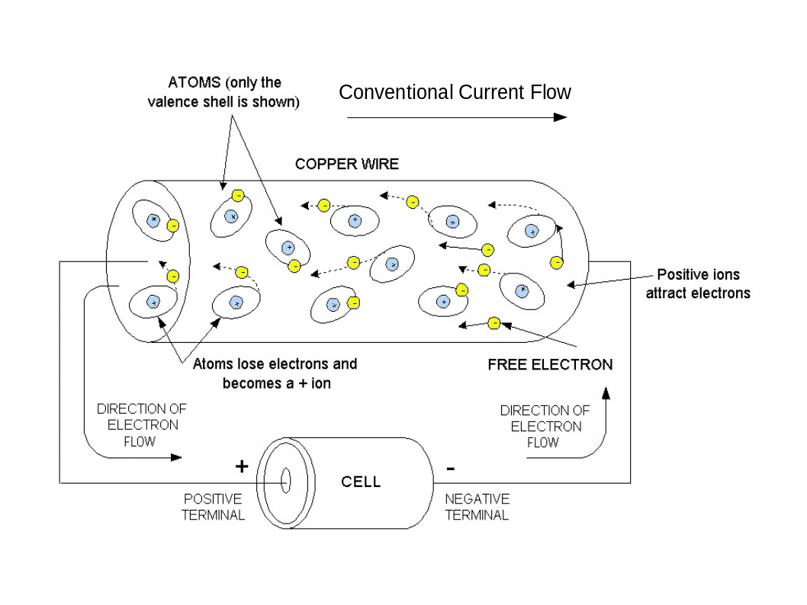



## Physics of Electrical Circuits

Fundamentally, there is the property of matter _Charge_ which is measured in Coulombs (C). Charge is directly related to one of the fundamental building blocks of matter, the electron; the charge of an electron (e) is negative and has a magnitude of ~1.602x10-19.

_From [Nuts & Volts Magazine](https://www.google.com/url?sa=i&rct=j&q=&esrc=s&source=images&cd=&cad=rja&uact=8&ved=0ahUKEwjGm8OL3oHWAhWlx4MKHfokAV4QjhwIBQ&url=http%3A%2F%2Fwww.nutsvolts.com%2Fmagazine%2Farticle%2Fwhich-way-does-current-really-flow&psig=AFQjCNEM48przwI2nCUNyFzAsc-yPaqLLw&ust=1504277839609821)_

## Direct Current Circuit Analysis (DC)

### KCL

## Alternating Current Circuit Analysis (AC)

Electromagnetic (EM) waves behave like all other waves:
* They can be continuous or happen in short bursts
* They propagate in some medium over time and attenuate as they propagate
* They can be absorbed or reflected
* Their paths can be guided

### Transmission Lines

#### Application Examples

* When an ideal driver transmits a voltage into a high-impedance (open) receiver
    - Almost all signal is reflected back creating a 2x driven amplitude (i.e. a 2.5Vpp driver will see a 5Vpp signal amplitude into an open receiver) on the line and, in the ideal case, the signal oscillates back and forth indefinitely

## Components

## Designing Circuits

### Reference Designs

* [Arrow](https://www.arrow.com/en/reference-designs)
* [Texas Instruments](http://www.ti.com/guidedsupport/docs/categoryhome.tsp?categoryId=515)
* [Maxim Integrated](https://www.maximintegrated.com/en/design/overview.html)

### Modeling & SPICE

* [Multisim](https://www.multisim.com/)
