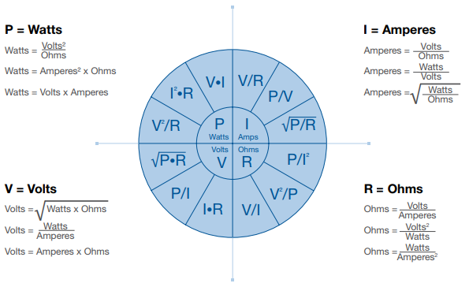
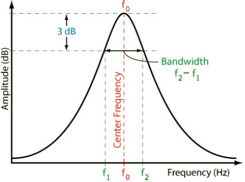
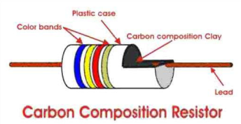
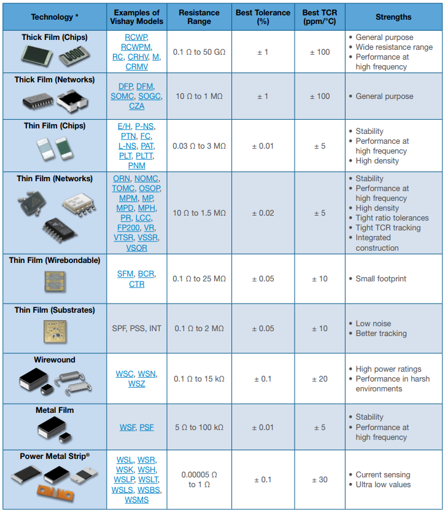
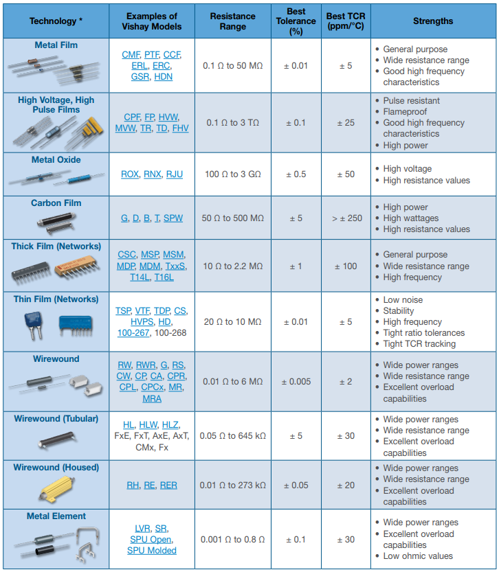
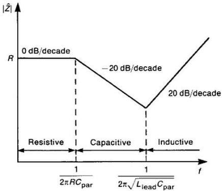
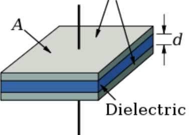
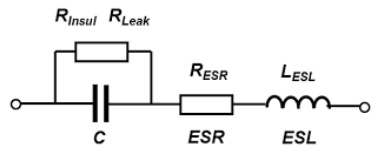

## Physics of Electrical Circuits

Fundamentally, there is the property of matter _Charge_ which measured in Coulombs (C). Charge is directly related to one of the fundamental building blocks of matter, the electron; the charge of an electron (e) is negative and has a magnitude of ~1.602x10-19.

_From [Nuts & Volts Magazine](https://www.google.com/url?sa=i&rct=j&q=&esrc=s&source=images&cd=&cad=rja&uact=8&ved=0ahUKEwjGm8OL3oHWAhWlx4MKHfokAV4QjhwIBQ&url=http%3A%2F%2Fwww.nutsvolts.com%2Fmagazine%2Farticle%2Fwhich-way-does-current-really-flow&psig=AFQjCNEM48przwI2nCUNyFzAsc-yPaqLLw&ust=1504277839609821)_

### Ohm's Law

The fundamental, omnipotent equation in Electrical Engineering is **Ohm's Law** which shows the relationship between the resistance ($$ R $$), voltage ($$ V $$) and current ($$ I $$) through an electrical path:
\$\$ V = I*R \$\$
There are many different relationships that form from this:

_From [Resistors 101- Vishay](https://www.digikey.com/en/pdf/v/vishay/resistors-101)_

## Direct Current Circuit Analysis (DC)

### KCL

## Alternating Current Circuit Analysis (AC)

### RLC Resonant Circuits

Quality factor $$Q$$ is the ratio of energy stored to energy dissipated in a component or circuit:
\$\$ Q = \frac{E_{stored}}{E_{dissipated}} \$\$

The less loss in a device the higher it's quality factor. $$Q$$ can also be determined by measuring the frequency response such that $$ Q = \frac{f_{center}}{\Delta f} $$ where $$ \Delta f $$ is the 3dB bandwidth of the response:

### Bode Plots

Bode plots are logarithmic graphs used to show magnitude (in dB) and phase response (degrees or radians) plotted over frequency ($$f$$ or $$\omega$$). They can be measured or mathematically derived given a transfer function.

## EM
Electromagnetic (EM) waves behave like all other waves:
* They can be continuous or happen in short bursts
* They propagate in some medium over time and attenuate as they propagate
* They can be absorbed or reflected
* Their paths can be guided

### Transmission Lines

#### Application Examples

* When an ideal driver transmits a voltage into a high-impedance (open) receiver
    - Almost all signal is reflected back creating a 2x driven amplitude (i.e. a 2.5Vpp driver will see a 5Vpp signal amplitude into an open receiver) on the line and, in the ideal case, the signal oscillates back and forth indefinitely

## Components

### Passive Components

#### Common Component Factors
- **Power Rating:** depending on the physical size and composition of the component, the power rating is indicative of how much power it can dissipate. Generally, a larger package can handle more power due to a larger surface area. It is generally not advisable to operate right at the nominal power rating of a part and instead operate with some margin due to component derating (see below).
- **Working/Nominal Maximums:** maximum DC or AC (rms) voltage or current that can be continuously applied to the component.
- **Absolute Maximums:** maximum DC or AC (rms) voltage or current that can be tolerated by the component, usually for a very short period of time. **Never design to absolute maximums, always reference the working specifications and leave margin**.
-- **Dielectric Withstanding Voltage:** max voltage that can be applied to component before dielectric breakdown occurs (meaning the insulator is no longer effective and becomes electrically conductive, which can be a safety issue or general failure)
- **Component Derating:** most parts will show one or more curves expressing the relationship between some indpendent variable (e.g. temperature, voltage, current, etc.) and the dependent variable as some suggested derating of an otherwise nominal specification (e.g. rated power handling, maximum input current, etc.). These are critical to pay attention to when designing a system that may be in an environment where these bounds change the specifications significantly; for example derating a certain capacitor could mean limiting the maximum input voltage to the part given an application need to operate in a hot ambient temperature:

- **Reliability:** the probability that the component will fail, or not meet specifications, can be shown as the Mean Time Between Failures (MTBF), failure rate per hours of operation or other statistical measurements. Reliable electronics design is a deep subject and thus [has its own page](reliable_design.html).
- **Temp Coefficient:** the "tempco" of a device is a measure of the variation of a given specification for a given change in temperature from where the specification was recorded. For example, a resistor with a temperature coefficient of resistance (sometimes shown as TCR) of 100 ppm/°C with a specified resistance of 10kΩ at +25°C will change 0.1% with a 10°C change in temperature. Generally, components with low tempco's are beneficial as a design varies less over temperature.
- **Tolerance:** usually shown as a percentage of max deviation of a component from the nominal specification under nominal circumstances (e.g. same temperature and voltage as specification). For example a capacitor with 1% tolerance usually means that any capacitor used- when measured under nominal conditions- should fall within ±1% of the nominal capacitance. Component manufacturers can achieve a certain tolerance by careful material selection or by "binning" where components are tested and then bucketed into groups that meet a certain threshold. Generally, the tighter the tolerance of a component, the more expensive it will be (holding all other factors the same).
- **Standard Values:** for commonality between vendors and component manufacturers, standard values have been adopted for resistors, inductors and capacitors, given a certain tolerance bin. The values follow a logarithmic progression determined by the EIA E Series:
\$\$ value = D * 10^{\frac{i}{N}} \$\$
where _D_ is the decade multiplier (10, 100, 1k, etc.) _N_ is the tolerance series (e.x. 1%=96, 5%=24, 10%=12) and _i_ ranges from 1 to _N_-1. Thus for 10% resistor parts in the 1k decade, the standard values are: 1kΩ, 1.2kΩ, 1.5kΩ, 1.8kΩ, 2.2kΩ, 2.7kΩ, 3.3kΩ, 3.9kΩ, 4.7kΩ, 5.6kΩ, 6.8kΩ, and 8.2kΩ. It can also show that the higher the tolerance bin, the more value options available. Standard values are another factor in design decisions or part value selection since arbitrary values generally cannot be used; for instance, my calculation of a voltage divider calls for a 1.8725kΩ resistor but given standard values (and other factors like stock on hand, supplier/vendor availability, BOM cost, etc.) it's most likely OK to use the standard 1.8kΩ part.

#### Resistors 

Resistors resist or limit the flow of electric current in a circuit. They are commonly used for:
- Voltage dividing
- Current limiting
- Energy absorption

##### Resistor Types
Resistor come in three main types:
- **Fixed Resistors:** where the one stated value of resistance is not intended to change. It's most common that resistors are packaged individually however there are cases where an array makes sense:
  + _Resistor Networks:_ ResNets are an array, or multiple, resistors in a single package and are good for applications needing multiple resistors in close proximity (e.x. voltage dividers, resistor ladders, pull-up/downs for digital I/O, etc.) while also benefitting from better tracking (e.g. same manufacturing process/lot or substrate used leading to less variation between resistors).
- **Variable Resistors:** where the resistance value is changed via some mechanical mechanism (e.x. potentiometers and rheostats)
- **Non-Linear Resistors:** where the resistance value changes significantly with applied voltage (varistors), temperature (thermistors) or light (photoresistors)

Resistors come in a variety of composition types:
- **Carbon:** older, low cost, terrible tempcos but can handle high peak power 
- **Thin/Thick/Metal Film:** modern, tighter tolerances, generally good noise and high-frequency performance, smaller package sizes
- **Wire Wound:** made for very high power applications though drawback is in size and inductance (since wire wounds act like an inductor) 

Resistors also can come in surface mount (SMT) or through-hole (TH) form factors with these different compositions:

_From [Resistors 101- Vishay](https://www.digikey.com/en/pdf/v/vishay/resistors-101)_

##### Non-Idealities

Ideally a resistor has a constant impedance from DC to daylight (frequency independent) however, due to package type and how the signal propagates through the internals of the resistor, a resistor will look capacitive at high-frequency (lowering effective impedance), and then at even higher frequencies, start to look inductive (higher effective impedance):

These non-idealities need to be considered for high-frequency or precision designs.

##### Noise

Resistors exhibit noise

##### Tempco

Resistors follow similar tempco guidance as other components and generally increase in resistance as temperature increases. However, some resistors are specifically designed with large _and negative_ tempcos- like thermistors- to better serve a specific application like temperature compensation or measurement.

##### Voltage Coefficient of Resistance (VCR)

Resistance of a part can change with applied voltage though this property is often not specified for general low/standard voltage work. High-voltage (HV) resistors, though, will show the VCR as it is a concern for HV work.

#### Inductors 

Inductors are reactive devices that store energy in a magnetic field when current flows through and oppose changes in current through them. Commonly they are used in:
- Power supplies
- Tuned circuits & filters
- Transformers

##### Construction

Since the inductance of most solenoid inductors follows the equation:
\$\$ L = \frac{N^{2}\mu_{r}\mu_{0}A}{l} \$\$

Manufacturers have worked to increase the inductance of parts by either:
- Increasing the number of turns ($$N$$)
- Increasing loop area ($$A$$)
- Decreasing the length ($$l$$)
- Using new/ferrous core materials to increase relative permeability $$ \mu_{r} $$

##### Non-Idealities

Ideally an inductor has an impedance which follows the equation $$ Z = j \omega L $$ however due to resistive losses and inter-winding capacitance (self-resonance) an inductor will start to behave as a capacitor past its self-resonant frequency and decrease in impedance.

#### Capacitors 

Capacitors are reactive devices used to hold charge in an electric circuit and are commonly used for:
- Energy storage
- High-frequency paths
- DC-blocking
- Decoupling

Capacitors can be bi-directional (placed in either direction) or polarized (where the cathode is shown as a "+" in the schematic symbol and is polarity sensitive) like in electrolytic capacitors.

##### Construction

Capacitors are still based on the parallel-plate model above where:
\$\$ C = \frac{k \epsilon_{0} A}{d} \$\$ 
so to reduce package size but increase capacitance, manufacturers have played with each variable:
- Increased area ($$A$$) by using multi-layer design techniques
- Reduced plate distance ($$d$$) by reducing the voltage rating (otherwise dielectric breakdown or arcing could occur)
- Utilize advanced dielectrics in between to increase the coefficient $$k$$

##### Non-Idealities

Ideally a capacitor acts as a purely reactive device and follows the well-known capacitor equeation for it's impedance as $$ Z = \frac{1}{j \omega C} $$. However, mainly due to package inductance and resistance, at some higher-frequency of resonance, a capacitor will start having higher impedance as frequency increases as it becomes more inductive. A real capacitor acts like a notch filter.

## Designing Circuits

### Reference Designs

* [Arrow](https://www.arrow.com/en/reference-designs)
* [Texas Instruments](http://www.ti.com/guidedsupport/docs/categoryhome.tsp?categoryId=515)
* [Maxim Integrated](https://www.maximintegrated.com/en/design/overview.html)

### Modeling & SPICE

* [Multisim](https://www.multisim.com/)
