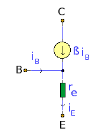
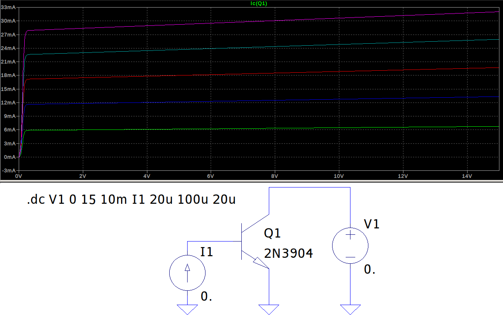
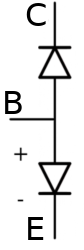
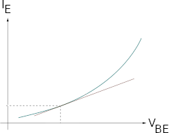
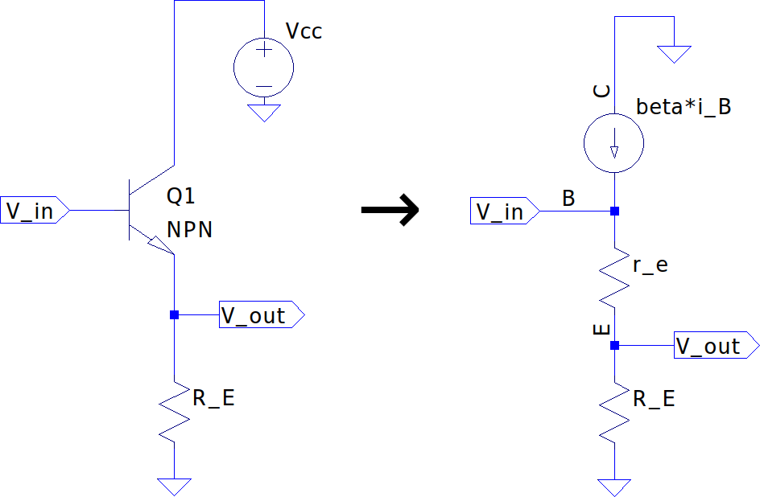

## Physics of Electrical Circuits

Fundamentally, there is the property of matter _Charge_ which measured in Coulombs (C). Charge is directly related to one of the fundamental building blocks of matter, the electron; the charge of an electron (e) is negative and has a magnitude of $$~1.602 \times 10^{-19}$$.

_From [Nuts & Volts Magazine](https://www.google.com/url?sa=i&rct=j&q=&esrc=s&source=images&cd=&cad=rja&uact=8&ved=0ahUKEwjGm8OL3oHWAhWlx4MKHfokAV4QjhwIBQ&url=http%3A%2F%2Fwww.nutsvolts.com%2Fmagazine%2Farticle%2Fwhich-way-does-current-really-flow&psig=AFQjCNEM48przwI2nCUNyFzAsc-yPaqLLw&ust=1504277839609821)_

### Ohm's Law

The fundamental, omnipotent equation in Electrical Engineering is **Ohm's Law** which shows the relationship between the resistance ($$ R $$), voltage ($$ V $$) and current ($$ I $$) through an electrical path:
\$\$ V = I*R \$\$
There are many different relationships that form from this:

_From [Resistors 101- Vishay](https://www.digikey.com/en/pdf/v/vishay/resistors-101)_

## Direct Current Circuit Analysis (DC)

For reference when specifying a DC circuit, use capital letters for voltage ($$V$$), current ($$I$$) and resistance ($$R$$).

### KCL

## Alternating Current Circuit Analysis (AC)

For reference when specifying an AC circuit, use lower case letters for voltage ($$v$$), current ($$i$$) and resistance ($$r$$).

### Impedance

For impedances connected in series, the current through each is the same so the total impedance is the sum of each:

\$\$ Z_{eq} = Z_{1} + Z_{2} + \cdots + Z_{n} \$\$
\$\$ R_{eq} + jX_{eq} = (R_{1} + R_{2} + \cdots + R_{n}) + j(X_{1} + X_{2} + \cdots + X_{n}) \$\$

For impedances connected in parallel, the voltage across each is the same, thus the inverse equivalent impedance is the sum of the inverses of each impedance:

\$\$ \frac{1}{Z_{eq}} = \frac{1}{Z_{1}} + \frac{1}{Z_{2}} + \cdots + \frac{1}{Z_{n}} \$\$
A simplified version for the two element case is:
\$\$ Z_{eq} = \frac{Z_{1}Z_{2}}{Z_{1}+Z_{2}} \$\$

### RLC Resonant Circuits

Quality factor $$Q$$ is the ratio of energy stored to energy dissipated in a component or circuit:
\$\$ Q = \frac{E_{stored}}{E_{dissipated}} \$\$

The less loss in a device the higher it's quality factor. $$Q$$ can also be determined by measuring the frequency response such that $$ Q = \frac{f_{center}}{\Delta f} $$ where $$ \Delta f $$ is the 3dB bandwidth of the response:

### Bode Plots

Bode plots are logarithmic graphs used to show magnitude (in dB) and phase response (degrees or radians) plotted over frequency ($$f$$ or $$\omega$$). They can be measured in a real circuit, mathematically derived given a transfer function, or analyzed using CAD/SPICE software for a given circuit.

#### Drawing Bode Plot Manually

For quick response analysis of a given circuit it's useful to be able to quickly draw the bode plot and transfer function. For example, given the following RC filter:

## EM
Electromagnetic (EM) waves behave like all other waves:
* They can be continuous or happen in short bursts
* They propagate in some medium over time and attenuate as they propagate
* They can be absorbed or reflected
* Their paths can be guided

### Transmission Lines

#### Application Examples

* When an ideal driver transmits a voltage into a high-impedance (open) receiver
    - Almost all signal is reflected back creating a 2x driven amplitude (i.e. a 2.5Vpp driver will see a 5Vpp signal amplitude into an open receiver) on the line and, in the ideal case, the signal oscillates back and forth indefinitely

## Components

### Common Component Factors
- **Power Rating:** depending on the physical size and composition of the component, the power rating is indicative of how much power it can dissipate. Generally, a larger package can handle more power due to a larger surface area. It is generally not advisable to operate right at the nominal power rating of a part and instead operate with some margin due to component derating (see below).
- **Working/Nominal Maximums:** maximum DC or AC (rms) voltage or current that can be continuously applied to the component.
- **Absolute Maximums:** maximum DC or AC (rms) voltage or current that can be tolerated by the component, usually for a very short period of time. **Never design to absolute maximums, always reference the working specifications and leave margin**.
-- **Dielectric Withstanding Voltage:** max voltage that can be applied to component before dielectric breakdown occurs (meaning the insulator is no longer effective and becomes electrically conductive, which can be a safety issue or general failure)
- **Component Derating:** most parts will show one or more curves expressing the relationship between some independent variable (e.g. temperature, voltage, current, etc.) and the dependent variable as some suggested derating of an otherwise nominal specification (e.g. rated power handling, maximum input current, etc.). These are critical to pay attention to when designing a system that may be in an environment where these bounds change the specifications significantly; for example derating a certain capacitor could mean limiting the maximum input voltage to the part given an application need to operate in a hot ambient temperature:

- **Reliability:** the probability that the component will fail, or not meet specifications, can be shown as the Mean Time Between Failures (MTBF), failure rate per hours of operation or other statistical measurements. Reliable electronics design is a deep subject and thus [has its own page](reliable_design.html).
- **Temp Coefficient:** the "tempco" of a device is a measure of the variation of a given specification for a given change in temperature from where the specification was recorded. For example, a resistor with a temperature coefficient of resistance (sometimes shown as TCR) of 100 ppm/°C with a specified resistance of 10kΩ at +25°C will change 0.1% with a 10°C change in temperature. Generally, components with low tempco's are beneficial as a design varies less over temperature.
- **Tolerance:** usually shown as a percentage of max deviation of a component from the nominal specification under nominal circumstances (e.g. same temperature and voltage as specification). For example a capacitor with 1% tolerance usually means that any capacitor used- when measured under nominal conditions- should fall within ±1% of the nominal capacitance. Component manufacturers can achieve a certain tolerance by careful material selection or by "binning" where components are tested and then bucketed into groups that meet a certain threshold. Generally, the tighter the tolerance of a component, the more expensive it will be (holding all other factors the same).
- **Standard Values:** for commonality between vendors and component manufacturers, standard values have been adopted for resistors, inductors and capacitors, given a certain tolerance bin. The values follow a logarithmic progression determined by the EIA E Series:
\$\$ value = D * 10^{\frac{i}{N}} \$\$
where $$D$$ is the decade multiplier (10, 100, 1k, etc.), $$N$$ is the tolerance series (e.x. 1%=96, 5%=24, 10%=12) and $$\{ i \mid 1..N-1\}$$. Thus for 10% resistor parts in the 1k decade, the standard values are: 1kΩ, 1.2kΩ, 1.5kΩ, 1.8kΩ, 2.2kΩ, 2.7kΩ, 3.3kΩ, 3.9kΩ, 4.7kΩ, 5.6kΩ, 6.8kΩ, and 8.2kΩ. It can also show that the higher the tolerance bin, the more value options available. Standard values are another factor in design decisions or part value selection since arbitrary values generally cannot be used; for instance, my calculation of a voltage divider calls for a 1.8725kΩ resistor but given standard values (and other factors like stock on hand, supplier/vendor availability, BOM cost, etc.) it's most likely OK to use the standard 1.8kΩ part.

### Resistors 

Resistors resist or limit the flow of electric current in a circuit. They are commonly used for:
- Voltage dividing
- Current limiting
- Energy absorption

#### Resistor Types
Resistor come in three main types:
- **Fixed Resistors:** where the one stated value of resistance is not intended to change. It's most common that resistors are packaged individually however there are cases where an array makes sense:
  + _Resistor Networks:_ ResNets are an array, or multiple, resistors in a single package and are good for applications needing multiple resistors in close proximity (e.x. voltage dividers, resistor ladders, pull-up/downs for digital I/O, etc.) while also benefitting from better tracking (e.g. same manufacturing process/lot or substrate used leading to less variation between resistors).
- **Variable Resistors:** where the resistance value is changed via some mechanical mechanism (e.x. potentiometers and rheostats)
- **Non-Linear Resistors:** where the resistance value changes significantly with applied voltage (varistors), temperature (thermistors) or light (photoresistors)

Resistors come in a variety of composition types:
- **Carbon:** older, low cost, terrible tempcos but can handle high peak power

- **Thin/Thick/Metal Film:** modern, tighter tolerances, generally good noise and high-frequency performance, smaller package sizes
- **Wire Wound:** made for very high power applications though drawback is in size and inductance (since wire wounds act like an inductor)

Resistors also can come in surface mount (SMT) or through-hole (TH) form factors with these different compositions:

_From [Resistors 101- Vishay](https://www.digikey.com/en/pdf/v/vishay/resistors-101)_

#### Non-Idealities

Ideally a resistor has a constant impedance from DC to daylight (frequency independent) however, due to package type and how the signal propagates through the internals of the resistor, a resistor will look capacitive at high-frequency (lowering effective impedance), and then at even higher frequencies, start to look inductive (higher effective impedance):

These non-idealities need to be considered for high-frequency or precision designs.

#### Noise

Resistors exhibit **[Johnson-Nyquist Noise](https://en.wikipedia.org/wiki/Johnson%E2%80%93Nyquist_noise)** which is caused by thermal agitation of charge carriers within the resistor. This noise is independent of applied voltage but rather dependent on temperature and bandwidth. Johnson-Nyquist Noise is present, and has constant power spectral density, across frequencies (approximately white noise) and is defined by:
\$\$ v_{noise} = \sqrt{4 k T R B} \xrightarrow[noise]{current} i_{noise} = \sqrt{\frac{4 k T B}{R}} \$\$

Where $$k$$ is **[Boltzmann Constant](https://en.wikipedia.org/wiki/Boltzmann_constant)** (about $$1.380649 \times 10^{-23} J/K$$), $$T$$ is absolute temperature in Kelvin, $$R$$ is resistance Ohms and $$B$$ is bandwidth in Hz. Given nominal characteristics (e.g. room temperature and Boltzmann Constant), the rule of thumb noise voltage is:
\$\$ V_{rms} = 1.3 \times 10^{-10} \sqrt{RB} \$\$

Bandwidth is not a single frequency but rather a range of frequencies (hence Band- _width_) that is relevant to the application of noise analysis. This also means that the frequency of operation, or center frequency for instance, does not matter since the noise is constant throughout the frequency spectrum; again, what matters is the bandwidth of operation. For example the Johnson-Nyquist noise power spectral density (and resulting noise voltage) with a bandwidth of 1 MHz is equivalent whether the band is centered at 10 MHz or 1 GHz.

Ideal inductors and capacitors do not exhibit noise, but their non-ideal/real-life models do exhibit resistance in some fashion; however, one can generally ignore these noise sources since the equivalent resistances present are typically negligible.

Since noise from different sources (e.g. two discrete resistors in series) are uncorrelated and independent (it's statistically unlikely that the random fluctuations of both resistors will be exactly the same- in power and in phase at any given time- even at the same temperature or process), the noise must be added in [RMS](https://en.wikipedia.org/wiki/Root_mean_square):
\$\$ v_{noise total} = \sqrt{(v_{noise 1})^{2} + (v_{noise 2})^{2}} \$\$

#### Tempco

Resistors follow similar tempco guidance as other components and generally increase in resistance as temperature increases. However, some resistors are specifically designed with large _and negative_ tempcos- like thermistors- to better serve a specific application like temperature compensation or measurement.

#### Voltage Coefficient of Resistance (VCR)

Resistance of a part can change with applied voltage though this property is often not specified for general low/standard voltage work. High-voltage (HV) resistors, though, will show the VCR as it is a concern for HV work.

### Inductors 

Inductors are reactive devices that store energy in a magnetic field when current flows through and oppose changes in current through them. Commonly they are used in:
- Power supplies
- Tuned circuits & filters
- Transformers

#### Construction

Since the inductance of most solenoid inductors follows the equation:
\$\$ L = \frac{N^{2}\mu_{r}\mu_{0}A}{l} \$\$

Manufacturers have worked to increase the inductance of parts by either:
- Increasing the number of turns ($$N$$)
- Increasing loop area ($$A$$)
- Decreasing the length ($$l$$)
- Using new/ferrous core materials to increase relative permeability $$ \mu_{r} $$

#### Non-Idealities

Ideally an inductor has an impedance which follows the equation $$ Z = j \omega L $$ however due to resistive losses and inter-winding capacitance (self-resonance) an inductor will start to behave as a capacitor past its self-resonant frequency and decrease in impedance.

### Capacitors 

Capacitors are reactive devices used to hold charge in an electric circuit and are commonly used for:
- Energy storage
- High-frequency paths
- DC-blocking
- Decoupling

Capacitors can be bi-directional (placed in either direction) or polarized (where the cathode is shown as a "+" in the schematic symbol and is polarity sensitive) like in electrolytic capacitors.

#### Construction

Capacitors are still based on the parallel-plate model above where:
\$\$ C = \frac{k \epsilon_{0} A}{d} \$\$ 
so to reduce package size but increase capacitance, manufacturers have played with each variable:
- Increased area ($$A$$) by using multi-layer design techniques
- Reduced plate distance ($$d$$) by reducing the voltage rating (otherwise dielectric breakdown or arcing could occur)
- Utilize advanced dielectrics in between to increase the coefficient $$k$$

#### Non-Idealities

Ideally a capacitor acts as a purely reactive device and follows the well-known capacitor equation for it's impedance as $$ Z = \frac{1}{j \omega C} $$. However, mainly due to package inductance and resistance, at some higher-frequency of resonance, a capacitor will start having higher impedance as frequency increases as it becomes more inductive. A real capacitor acts like a notch filter.

### Diodes 

The basic operation of a diode is to conduct current in one direction while blocking current in the opposite direction (asymmetric conductance); the ideal diode has zero resistance in one direction and infinite resistance in the other. Semiconductor diodes are made with a p-n junction.

There are many different types and constructions of diodes for many applications:

#### Zener
#### Schottky
#### TVS
#### LED

### BJT

The bipolar junction transistor (BJT) were of the first semiconductors (solid state devices) developed to replace old vacuum tubes for purposes of amplification. Solid state devices solved a lot of the issues with large, high-voltage tubes and led to integrated circuits due to their ability to operate at much smaller sizes. However, tubes and other thermionic devices are still better suited for very high power and high frequency operation (e.g. 100kW Klystron or 1 MW Traveling Wave Tube) for purposes of Radar or other applications.

The _bipolar_ in the name is in regards to the two complimentary doped semiconductors used to create the transistor- two PN junctions, almost like two diodes squished together at either end depending on the type. However, the devices are unipolar in that they are intended to operate actively with a certain polarity of input voltages:
- **NPN:** requires $$ + V_{base-emitter} , + V_{collector-base} $$
- **PNP:** requires $$ - V_{base-emitter} , - V_{collector-base} $$

This also means signals like zero-offset sinusoids cannot just be plugged into the base of either (since sinusoids oscillate between positive and negative voltages); for this reason, most AC BJT circuits require a **bias** circuit to bring the DC offset/operating-point of the signal within the proper range required.

A mnemonic key to remember the difference in symbology is NPN has the arrow **N**ot **P**ointing i**N** (where as PNP has the arrow pointing towards its base).

Transistors can operate in three main modes:
- Cutoff
- Saturation
- Active

#### $$r_{e}$$ / 'T' Model

The _T_ or $$ r_{e} $$ model is a simple model for a BJT which is great for quickly characterizing a BJT circuit's behavior for low to mid frequencies. It is modeled as a three-terminal device, with a dynamic resistance $$r_{e}$$ and a simple, linear current-dependent current-source with gain $$\beta$$ (given from the BJT's datasheet) on base current $$i_{b}$$; by KCL, this simply means the total emitter current is $$ i_{e} = (\beta + 1)i_{b} \approx \beta i_{b} $$. _NOTE:_ the simplification of $$ i_{c} \equiv i_{e} $$ is valid for most analog analysis since the gain $$\beta$$ is large- between 100 and 300- such that removing the one extra base current $$i_{b}$$ term is $$< 1\%$$ error. The NPN model is explained here but the PNP is the same with only a difference in polarity.

The collector terminal in the model is an ideal current source since a BJT operating in it's active region has nearly similar characteristics; the collector current $$i_{c}$$ is nearly independent of the collector voltage $$v_{ce}$$ (assuming $$v_{ce}$$ is high enough that BJT is not in saturation).

This also follows the ideal current source characteristic of having nearly infinite output impedance:
\$\$ \frac{v}{i}=r \rightarrow  \frac{\Delta v_{ce} \to \infty}{\Delta i_{c} \to 0} \approx \boxed{ r_{o} = \infty \Omega } \$\$

##### Emitter Impedance $$r_{e}$$

The base emitter junction has a dynamic impedance $$r_{e}$$ that is given from the relationship of $$ \frac{v_{be}}{i_{e}} $$. Given the BJT can be seen as a forward biased diode from base to emitter, the Shockley diode equation can show the relationship between $$v_{be}$$ and $$i_{e}$$.

\$\$ i_{e} = I_{s}(e^{\frac{v_{be}}{V_{T}}} - 1) \$\$

Where $$ V_{T} = \frac{nKT}{q} $$ and $$n$$ is device parameter (~1), $$K$$ is Boltzmann constant, $$T$$ is absolute temp and $$q$$ is electron charge; at 25°C, $$ V_{T} \approx 26 mV $$. $$I_{s}$$ is saturation current ($$\approx 10^{-12}$$). So since $$\frac{v_{be}}{i_{e}}$$ is not linear, and a fixed $$r_{e}$$ is ideal for our simple model, we can pick a value of $$i_{e}$$ on the curve that is nominal for the application at hand and make linear by taking the derivative of the Shockley diode equation w.r.t. $$v_{be}$$:
\$\$ \frac{\partial }{\partial v_{be}} \left [ I_{s}(e^{\frac{v_{be}}{V_{T}}} - 1) \right ] \Rightarrow \frac{I_{s}}{V_{T}}e^{\frac{v_{be}}{V_{T}}} \approx \frac{i_{e}}{V_{T}} \$\$
\$\$ \frac{i_{e}}{V_{T}} = \frac{1}{r_{e}} \therefore \boxed{ r_{e} = \frac{V_{T}}{i_{e}} }\$\$

With this equation, quick estimates of emitter impedance can be made; for instance, at room temperature and with a design specification of $$i_{e}=1mA$$, the emitter resistance is $$ \frac{26 mV}{1 mA} = 26 \Omega $$.

##### Input Impedance

To get the input impedance of the BJT model looking into the base terminal, we can express as $$Z_{in} = \frac{v_{in}}{i_{in}} = \frac{v_{be}}{i_{b}}$$. The base-emitter voltage $$v_{be}$$ can be expressed as the voltage created by the emitter current $$i_{e}$$ through the previously calculated emitter impedance $$r_{e}$$ (using a specified collector current), and simplified to be a function of base current $$i_{b}$$:
\$\$ v_{be} = i_{e}r_{e} \Rightarrow (i_{b}+i_{c})r_{e} \Rightarrow (i_{b}+ \beta i_{b})r_{e} \Rightarrow i_{b} (\beta + 1)r_{e} \$\$
\$\$ \therefore Z_{in} = \frac{i_{b}(\beta + 1)r_{e}}{i_{b}} \Rightarrow \boxed{ Z_{in} = (\beta + 1)r_{e} } \$\$

Plugging the value of $$\beta$$ in for the same specified collector current- usually given in a datasheet- gives the resultant input impedance; this also means the variations in $$\beta$$ (over process, temperature and collector current) have a direct impact on input impedance as well.

##### Voltage Gain & Output Impedance

_Common Emitter_

For a simple common emitter configuration where the output voltage comes from the collector node- note, the DC bias circuit is not present but for instructional sake, ignore for now- the voltage gain can be found using similar parameters above (given specified $$i_{c}$$, $$\beta$$ and $$r_{e}$$) using small-signal analysis (note also setting DC voltage sources like $$V_{CC} \rightarrow 0V$$):

Voltage gain is given by: 
\$\$ A_{v} = \frac{v_{out}}{v_{in}} = \frac{v_{c}}{v_{b}} \$\$

Collector voltage is negative due to grounding the $$V_{CC}$$ and current flowing towards the emitter such that:
\$\$ v_{c} = -i_{c}R_{c} = -\beta i_{b}R_{c} \$\$

Base voltage is produced by the emitter current $$i_{e}$$ through the equivalent series resistance of $$r_{e} + R_{e}$$ but is simplified in terms of $$i_{b}$$ (given relationship with current gain $$\beta$$) such that we can simplify the voltage gain equation:
\$\$ v_{b} = i_{e}(r_{e} + R_{e}) \Rightarrow i_{b}(\beta + 1)(r_{e} + R_{E}) \$\$
\$\$ \therefore A_{v} = \frac{v_{c}}{v_{b}} \Rightarrow \frac{-\beta i_{b}R_{c}}{i_{b}(\beta + 1)(r_{e} + R_{E})} \$\$

Since we already approximated $$ \beta \approx \beta + 1 $$, the voltage gain can be further simplified with little error to:
\$\$ \frac{-\beta i_{b}R_{c}}{i_{b}(\beta + 1)(r_{e} + R_{E})} \approx \frac{-\beta i_{b}R_{c}}{\beta i_{b}(r_{e} + R_{E})} \Rightarrow A_{v} = -\frac{R_{c}}{r_{e}+R_{e}} \$\$

Furthermore, since usually the emitter resistor component $$ R_{e} \gg r_{e} $$ (e.g. given a nominal $$r_{e}=26 \Omega$$ at room temp and $$i_{c}=1 mA$$ and $$R_{e} > 1 k\Omega$$), $$r_{e}$$ can often be ignored with reasonable error such that:
\$\$ \boxed { A_{v} \approx -\frac{R_{c}}{R_{e}}, when (R_{e} \gg r_{e}) } \$\$

What's also powerful about this simplification is that the ideal voltage gain is independent of device characteristics like $$\beta$$.

When looking at the output impedance of the $$r_{e}$$ model of a common emitter configuration, the external resistor $$R_{c}$$ is in parallel with the series combination of the current source impedance $$Z_{c}$$, $$r_{e}$$ and external resistor $$R_{e}$$:
\$\$ Z_{out} = R_{c} \parallel (Z_{c} + r_{e} + R_{e}) \$\$

However, since in this model we are using an ideal current source, the impedance $$Z_{c} = \infty$$. Thus, the added resistances $$r_{e}$$ and $$R_{e}$$ are insignificant and the series impedance is $$\infty$$, and since this looks like an open circuit in parallel with $$R_{c}$$, the output resistance is simply $$R_{c}$$:
\$\$ Z_{out} = R_{c} \parallel \infty \Rightarrow \boxed { Z_{out} = R_{c} } \$\$

_Common Collector_

For a common collector configuration, the output voltage comes from the emitter node.

Thus $$v_{out}$$ is produced from the current through external resistor $$R_{e}$$ such that:
\$\$ v_{out} = i_{e}R_{e} \$\$

The base voltage at the input is the emitter current through the series resistance of $$r_{e}$$ and $$R_{e}$$:
\$\$ v_{in} = v_{b} = i_{e}(r_{e} + R_{e}) \$\$
\$\$ A_{v} = \frac{v_{out}}{v_{in}} = \frac{i_{e}R_{e}}{i_{e}(r_{e}+R_{e})} = \frac{R_{e}}{(r_{e}+R_{e})} \approx \frac{R_{e}}{R_{e}}, when (R_{e} \gg r_{e}) \$\$
\$\$ \boxed { \therefore A_{v} \approx 1 } \$\$

The common collector's near unity gain is why this configuration is also called a Voltage Follower as the output voltage closely follows the input voltage.

The output impedance for a common collector is a little less apparent though; since it's known that the ideal current source has $$\infty$$ impedance, the whole collector node looks like an open circuit and thus one would reason that $$ Z_{out} = R_{e} \parallel (r_{e} + R_{b}) $$ (note an added base resistance to illustrate the point). However, this is not true as the **current through $$r_{e}$$ and $$R_{b}$$ are not the same!** To solve this, we know that the emitter current $$ i_{e} = i_{b}(\beta + 1)$$ thus we treat the current as a ratio of $$ i_{b} : i_{b}(\beta + 1) $$ through $$R_{b}$$ and $$r_{e}$$ respectively. This means the current through $$R_{b}$$ is $$\beta + 1$$ times less than through the emitter so we can treat the base resistance as effectively equalling $$R_{b}'=\frac{R_{b}}{\beta + 1}$$.

\$\$ \therefore Z_{out} = R_{e} \parallel (r_{e} + R_{b}') \Rightarrow \boxed { Z_{out} = R_{e} \parallel (r_{e} + \frac{R_{b}}{\beta + 1}) } \$\$

This effective scaling of the base-emitter impedances through the BJT is known as the **base-emitter reflection rule** and means that impedances at the emitter appear $$\beta + 1$$ times _larger_ when looking in through the base and, inversely, base impedances appear $$\beta + 1$$ times _smaller_ when looking through the emitter.

#### BJT Biasing

Since the AC performance or application of BJT circuits is highly dependent on collector current $$I_{C}$$ and other DC operating points- as well as fundamentally keeping a BJT in its active region, for instance- the need for proper biasing circuitry around a BJT circuit is critical to the overall design. A DC bias circuit may also contend with circuit/environment variables such as:
- Ambient temperature changes
- Part/process variation (resulting in changes to $$\beta$$ for instance)
- Resistor tolerances
- Power dissipation

For example, DC bias of an NPN BJT should generally achieve:
- $$V_{CE}$$ high enough that the BJT is operating in its Active region (out of saturation)
- Base-emitter voltage $$V_{BE} > 0V$$
- Base-collector voltage $$V_{BC} < 0V$$

#### BJT Component Characteristics

There are a couple things to note when dealing with real (non-ideal) BJTs, for example for a `2N3904` device:
- **Breakdown Voltages:** While BJTs can usually handle a fairly high potential at the collector terminal, the base terminal should not be reverse biased too far; for instance, in the `2N3904`, if the emitter is grounded, the voltage at the base should not go below $$-6 V$$ or one risks breaking the device:

- **Beta:** the gain of the BJT is very variable (almost 3x between minimum and maximum values!) and depends on a lot of factors. Thus don't rely too much on a single beta value without giving much room for margin:

- **Thermal Runaway:** besides the usual derating curves and operating points for given system temperatures, BJTs also can suffer from a phenomenon known as thermal runaway; when BJTs start to heat up, temperature dependent characteristics cause even more power to be dissipated, which in turn, cause even more heat. For instance with increased temperature, base-emitter voltage decreases ($$\Delta V_{be} \approx -2.2mV/^{\circ}C$$), $$\beta$$ increases, and emitter current increases (in aforementioned Shockley diode equation, saturation current $$I_{S}$$- though small- nearly doubles ever +10°C). **Thermal junction resistance $$R_{\theta J}$$** is usually given to show the increase in temperature of the device for a given power dissipation through the device; for instance, the `2N3904` has a $$R_{\theta JA}$$ (junction-to-Ambient, means no heatsink, just nominal air flow) of $$200^{\circ}C/W$$, which means for every Watt of power dissipated, the part will increase temperature by roughly 200°C.

## Designing Circuits

### Reference Designs

* [Arrow](https://www.arrow.com/en/reference-designs)
* [Texas Instruments](http://www.ti.com/guidedsupport/docs/categoryhome.tsp?categoryId=515)
* [Maxim Integrated](https://www.maximintegrated.com/en/design/overview.html)

### Modeling & SPICE

SPICE is an acronym for Simulation Program with Integrated Circuit Emphasis which was originally made to model ICs and their behaviors. A popular tool is [LTSpice](https://www.analog.com/en/design-center/design-tools-and-calculators/ltspice-simulator.html) (developed by Linear Tech which is now owned by Analog Devices) which has a simple interface and lots of capabilities such as [Monte Carlo analysis](https://en.wikipedia.org/wiki/Monte_Carlo_method) (useful for modeling impact of component tolerances), parametric analysis and noise analysis. Note the Windows version is the most full featured so if installing on MacOS or Linux use [Wine](https://www.winehq.org/) Windows emulator. [Multisim](https://www.multisim.com/) is another tool from NI.

Some main analysis types that are commonly used are:
- **DC:** computes the DC operating point of a circuit given system conditions (e.g. input voltages and DC characteristics) and is required for other analysis types.
- **AC/Small Signal:** performs frequency sweeps across the circuit to do frequency domain analysis, however care should be taken since results are linearized about given DC operating point. Valid for small signal analysis.
- **Transient/Time Domain:** simulation done over a time period to see effects of given events, for example power supply transient response to load step. Valid for large signal analysis.
- **Noise Analysis:** simulation of system effect of various noise sources in schematic.
