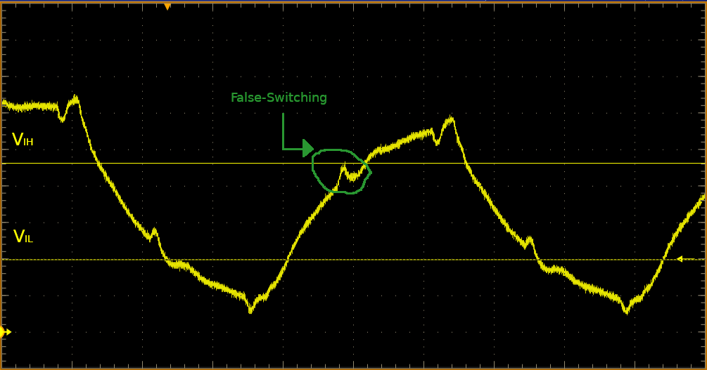



## Overview

The goal: to build devices that go faster, are more precise and further push the boundaries of what's been done before. High-speed designs are those where we care about very fast rise and fall times (edge rates) and track lengths due to reduced setup and hold times. There have been a couple rules of thumb as to when we consider a signal "high-speed" such as if:
* $$ T_{rise} < \frac{1}{10*f_{clock}} $$
* $$ T_{rise} < 3*T_{delay} $$
    - $$ T_{delay} $$ (line delay) can be generalized to 150ps/in for microstrip and 180ps/in for stripline paths
* $$ l_{line} < \frac{1}{10}*\lambda $$
    - note that with conductors, wave speed is less than _c_

However, we can generalize a high-speed signal to be:

> If the total round trip time of the signal (signal path and back through return path or ground) is equal to or greater than the rise/fall time, then the signal is considered high-speed.

With these higher speeds and shorter track lengths, we need to focus on signal integrity on lines as issues like reflections, overshoot, crosstalk/coupled signals and greater electromagnetic radiation.

As devices get smaller and faster, and with edge speeds in the nanosecond to hundreds of picoseconds becoming the norm, high-speed design is becoming even more critical to even basic devices nowadays.

### Signal Integrity

Due to faster and faster edge rates, signal integrity is crucially important across component variation, temperature and power supply voltages. Signal integrity issues can be caused by:
* _Reflected Signals_: non-ideal drivers and recievers (mismatched impedances, output resistance, input capacitance, and other transmission line effects, etc.) causes overshoot and ringing
* _Coupled Signals_: causes crosstalk
* _Rapid Changes in Power Draw_: causes power plane and ground bounce

Signal integrity issues can result in problems such as:
* _False Switching_: caused by reduced noise margins and level thresholds
* _High EMI Radiation_

 #TODO add Tek SI fundamentals here  

### Factors of High-Performance/High-Speed Design

* Driver edge speeds
* Track length
* Track impedance control
* Component placement
* Power distribution and decoupling
* Ground plane integrity
* Crosstalk
* PCB stack-up

## References

* [Analog Dialogue- Technical Papers from ADI](http://www.analog.com/en/analog-dialogue.html)
