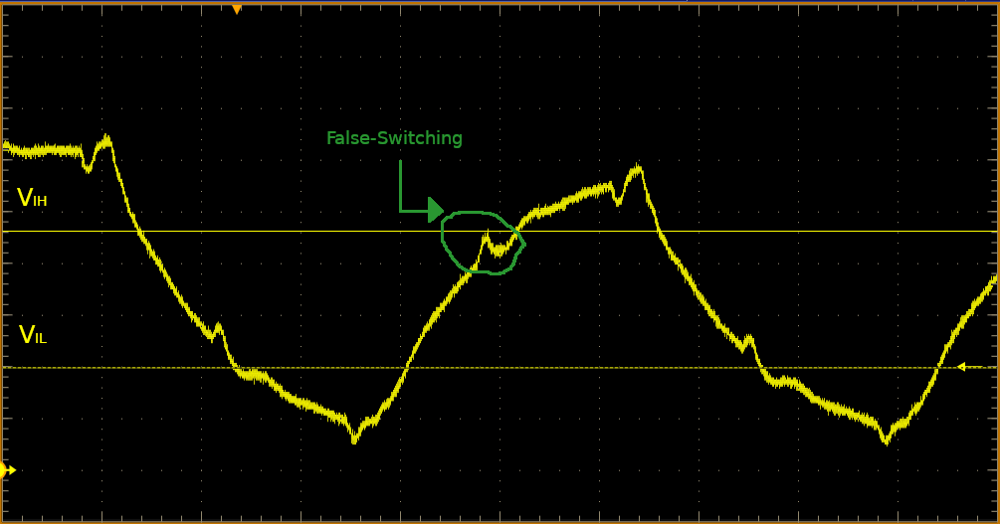
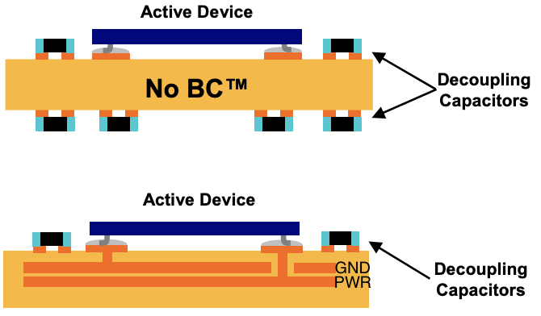

## Overview

As time progresses, designers look to build devices that go faster, are more precise and further push the boundaries of what's been done before. However, in order to go faster, digital systems must have faster edge rates to keep up with growing bit rates; and because of this, higher and higher frequency content is contained in a digital signal and the properties of the digital systems cannot simply be thought of as 1's and 0's.

_Fourier series showing summed, odd harmonics to build up a progressively faster edged square wave- by [Thenub314](https://commons.wikimedia.org/w/index.php?title=User:Thenub314&action=edit&redlink=1)_

High-speed designs are those where we care about very fast rise ($$ t_{rise} $$) and fall ($$ t_{fall} $$) times (e.g. edge rates). There have been a couple rules of thumb as to when we consider a signal "high-speed" such as if: $$ \; t_{rise} < \frac{1}{10*f_{clock}}\; $$ or $$ \; t_{rise} < 3*t_{delay} \; $$ ($$ t_{delay} $$ - line delay - can be generalized to 150ps/in for microstrip and 180ps/in for stripline paths) or when $$ \; l_{line} < \frac{1}{10}*\lambda \; $$ (note that with real conductors, wave speed is always less than _c_).

However, we can generalize the classification of a high-speed signal to:
> If the total round trip time of the signal (starting from transmission through signal path and back through return path or ground) is equal to or greater than the rise/fall time, then the signal is considered high-speed.

Given this, when we consider a signal low speed (i.e. signal rise/fall time is much greater than propagation time) the circuit effects are similar to [basic circuit theory](fundamentals.html); here traditional AC or DC circuit analysis can explain the happenings of signals in the system given basic RLC (resistance, inductance and capacitance) properties of the circuit. For example, when looking at the rising edge (digital transition from a low/`0` to high/`1` logical level) of a low speed digital signal through a transmission line, the time-variant properties, such as rise time, are dominated by the resistance and capacitance of the path and can usually be estimated by the resultant [RC time constant](https://en.wikipedia.org/wiki/RC_time_constant) ($$ \tau $$) of the circuit.

Conversely, in a high-speed/high-frequency situation (i.e. signal rise/fall time is fast enough that a signal can change logic states in shorter time than it takes for the signal to propagate to a receiver and back through a return path) electromagnetic wave properties must be considered to fully explain the effects of the circuit and how the wave propagates.

As devices get smaller and faster, and with edge speeds in the nanosecond to picosecond range becoming the norm, high-speed design is becoming even more critical to even basic devices nowadays. Thus, with these higher speeds, designers need to focus on signal integrity on lines as issues like reflections, overshoot, crosstalk/coupled signals and greater electromagnetic radiation will appear.

### Factors Affecting High-Speed Design

The majority of high-speed circuit effects are directly related to the high-frequency content of signals passing through it. As detailed previously, when a circuit is considered high-speed, a designer needs to pay more attention to board factors such as:
* Driver edge rates
* Signal propagation length
* Variations over Process, Voltage or Temperature (PVT)
* Trace impedance and reflections over entire length
* Trace, via and component placement on the PCB
* Power distribution and decoupling
* Ground plane integrity and self-inductance
* Immunity, neighboring devices and coupled offending signals
* PCB stack-up and materials

Ignorance of these effects in high-speed designs can cause signal integrity issues (SI). These SI issues can result in problems such as:
* _False Switching:_ caused by reduced noise margins and level thresholds which can lead to data errors or even device failure.
* _High EMI Radiation:_ caused by high-frequency energy escaping and causing failures in compliance or other emission standards.

### High-Speed Digital Design vs RF Design

Given that High-Speed Digital Design deals with very fast signals (sometimes with signals having a fundamental frequency in the "RF" range, for instance 10GbE) there begs the question "what's the difference between RF design and high-speed digital design?" While they have some similarities there are some notable differences in what each design space cares about:

| Factor | RF Design | High-Speed Digital Design |
| ------ | --------- | ------------------------- |
| Nominal Signal Types | Sinusoidal, narrowband/modulated | square/trapezoidal waves, pulses |
| Frequency of Interests | Band of frequency usually atop some carrier frequency | Broadband ("DC to daylight") |
| Typical Coupling | AC (+ filtering) | DC |
| Information Encoding | Modulation of carrier (AM, FM, PSK, etc.) | Voltage level transitions |
| Figures of Merit for Designs | Power transfer and small-signal behavior | Voltage transfer and large-signal behavior |

## Signal Integrity (SI) / Power Integrity (PI)

## Layout Considerations

### Stackup

A [rule of thumb to estimate the number of signal routing layers required to fully break out a dense, BGA part](https://docs.amd.com/r/en-US/ug1099-bga-device-design-rules/Layer-Count-Estimation-and-Optimization) can be seen as:
$$ \text{Layers} = \frac{\text{Signals}}{\text{Routing Channels} * \text{Routes per Channel}} $$

#### Plane Capacitance

The use of plane capacitance as part of your stackup can reduce the number of needed decoupling capacitors, and provide an overall decrease in power plane inductances (and an increase in plane capacitance, thereby a total reduction of impedance). For instance, this can be achieved with the [Buried Capacitance®](https://www.sanmina.com/pdf/solutions/pcbres/buried_capacitance_technical_0106.pdf) fabrication available from Sanmina:

## Checklists

### Schematic

### Layout

### Board Bring-Up

1. Visual inspection
2. Check for shorts with DMM
3. Connect bench DC power supply and check for proper voltages (and load steps/responses/ripple).
4. Measure oscillators.
5. Start digital bringup (JTAG, FW loading, etc.).

For more, see [9 Steps to bring up a freescale board](https://fedevel.com/blog/9-steps-to-bring-up-a-freescale-i-mx6-board-to-life).

## References

* [PCB Design Guides - Sierra Circuits](https://www.protoexpress.com/pcb/resources/pcb-design-guides/)
* [Isola PCB Selection for HS Digital Designs](http://www.isola-group.com/wp-content/uploads/PCB-Material-Selection-for-High-speed-Digital-Designs-1.pdf)
* [Sam Palermo - ECEN 720: High-Speed Links Circuits and Systems](https://people.engr.tamu.edu/spalermo/ecen720.html)
* [Recommended Design Rules and Strategies for BGA Devices User Guide (UG1099)](https://docs.amd.com/r/en-US/ug1099-bga-device-design-rules/)
* [Robert Feranec YouTube Channel](https://www.youtube.com/@RobertFeranec): YT creator with many videos on signal & power integrity.

### Conferences

* [DesignCon](https://www.designcon.com/en/home.html)

