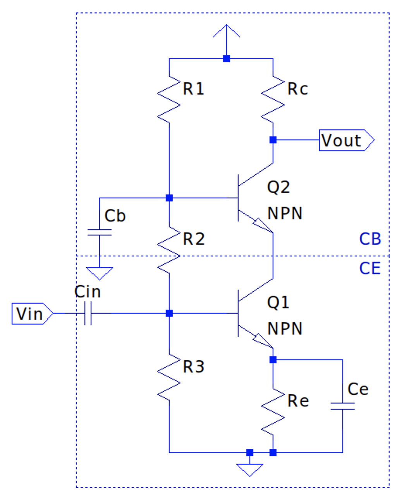

## Bipolar Junction Transistor (BJT) Design

### $$r_{e}$$ / 'T' Model

The _T_ or $$ r_{e} $$ model is a simple model for a BJT which is great for quickly characterizing a BJT circuit's behavior for low to mid frequencies. It is modeled as a three-terminal device, with a dynamic resistance $$r_{e}$$ and a simple, linear current-dependent current-source with gain $$\beta$$ (given from the BJT's datasheet) on base current $$i_{b}$$; by KCL, this simply means the total emitter current is $$ i_{e} = (\beta + 1)i_{b} \approx \beta i_{b} $$. _NOTE:_ the simplification of $$ i_{c} \equiv i_{e} $$ is valid for most analog analysis since the gain $$\beta$$ is large- between 100 and 300- such that removing the one extra base current $$i_{b}$$ term is $$< 1\%$$ error. The NPN model is explained here but the PNP is the same with only a difference in polarity.

The collector terminal in the model is an ideal current source since a BJT operating in it's active region has nearly similar characteristics; the collector current $$i_{c}$$ is nearly independent of the collector voltage $$v_{ce}$$ (assuming $$v_{ce}$$ is high enough that BJT is not in saturation).

This also follows the ideal current source characteristic of having nearly infinite output impedance:
\$\$ \frac{v}{i}=r \rightarrow  \frac{\Delta v_{ce} \to \infty}{\Delta i_{c} \to 0} \approx \boxed{ r_{o} = \infty \Omega } \$\$

#### BJT Output Impedance: Early Effect

As shown above though, a real transistor does not exhibit perfectly constant (zero slope) output impedance in the curve above. Instead, there is a property called the **Early Effect** which describes the increase of depletion regions within the transistor with a correlation to increased bias voltage across the collector-emitter junction:

This Early Voltage is denoted by the device parameter $$V_{A}$$ which is an imaginary intercept along the negative voltage axis which is shown to follow the slopes of resulting active region plots. The Early voltage of a device is usually around 100V, with higher values indicating higher output impedance numbers. The Early Effect and subsequent changes in depletion regions can more accurately model the collector current and output impedances knowing the Early Voltage of the device and the collector-emitter bias voltage:
\$\$ I_{C} = I_{B} \beta (1 + \frac{ V_{CE} }{ V_{A} } ) \$\$
\$\$ r_{o} = \frac{ V_{A} + V_{CE} }{ I_{C} } \$\$

Output impedance of a BJT can also be specified by the BJT's datasheet as output admittance $$h_{oe}$$ in $$\mho$$ (Mhos), the inverse of which gives the output impedance of the BJT as $$r_{o}$$.

#### Emitter Impedance $$r_{e}$$

The base emitter junction has a dynamic impedance $$r_{e}$$ that is given from the relationship of $$ \frac{v_{be}}{i_{e}} $$. Given the BJT can be seen as a forward biased diode from base to emitter, the Shockley diode equation can show the relationship between $$v_{be}$$ and $$i_{e}$$.

\$\$ i_{e} = I_{s}(e^{\frac{v_{be}}{V_{T}}} - 1) \$\$

Where $$ V_{T} = \frac{nKT}{q} $$ and $$n$$ is device parameter (~1), $$K$$ is Boltzmann constant, $$T$$ is absolute temp and $$q$$ is electron charge; at 25°C, $$ V_{T} \approx 26 mV $$. $$I_{s}$$ is saturation current ($$\approx 10^{-12}$$). So since $$\frac{v_{be}}{i_{e}}$$ is not linear, and a fixed $$r_{e}$$ is ideal for our simple model, we can pick a value of $$i_{e}$$ on the curve that is nominal for the application at hand and make linear by taking the derivative of the Shockley diode equation w.r.t. $$v_{be}$$:
\$\$ \frac{\partial }{\partial v_{be}} \left [ I_{s}(e^{\frac{v_{be}}{V_{T}}} - 1) \right ] \Rightarrow \frac{I_{s}}{V_{T}}e^{\frac{v_{be}}{V_{T}}} \approx \frac{i_{e}}{V_{T}} \$\$
\$\$ \frac{i_{e}}{V_{T}} = \frac{1}{r_{e}} \therefore \boxed{ r_{e} = \frac{V_{T}}{i_{e}} }\$\$

With this equation, quick estimates of emitter impedance can be made; for instance, at room temperature and with a design specification of $$i_{e}=1mA$$, the emitter resistance is $$ \frac{26 mV}{1 mA} = 26 \Omega $$.

### Input Impedance

To get the input impedance of the BJT model looking into the base terminal, we can express as $$Z_{in} = \frac{v_{in}}{i_{in}} = \frac{v_{be}}{i_{b}}$$. The base-emitter voltage $$v_{be}$$ can be expressed as the voltage created by the emitter current $$i_{e}$$ through the previously calculated emitter impedance $$r_{e}$$ (using a specified collector current), and simplified to be a function of base current $$i_{b}$$:
\$\$ v_{b} = i_{e}r_{e} \Rightarrow (i_{b}+i_{c})r_{e} \Rightarrow (i_{b}+ \beta i_{b})r_{e} \Rightarrow i_{b} (\beta + 1)r_{e} \$\$
\$\$ \therefore Z_{in} = \frac{v_{b}}{i_{b}} = \frac{i_{b}(\beta + 1)r_{e}}{i_{b}} \Rightarrow \boxed{ Z_{in_{BJT}} = (\beta + 1)r_{e} } \$\$

Plugging the value of $$\beta$$ in for the same specified collector current- usually given in a datasheet- gives the resultant input impedance; this also means the variations in $$\beta$$ (over process, temperature and collector current) have a direct impact on input impedance as well.

This same calculation follows for input impedance when resistance is added to the emitter (e.g. emitter resistor $$R_{E}$$) in a common emitter design such that the base voltage is still dependent on the current flow through the total resistance at the emitter. Thus, this can also be expressed as:
\$\$ Z_{in} = (\beta + 1)(r_{e} + R_{E}) \$\$

Furthermore, the bias resistors $$R1$$ and $$R2$$ in an amplifier stage (explained more below) can be factored into the input impedance as being in parallel with this adjusted BJT impedance:

\$\$ Z_{in_{amp}} = R1 \parallel R2 \parallel Z_{in_{BJT}} \$\$

Again, input impedance of the BJT is directly related to $$\beta$$ but overall input impedance, due to the parallel nature of the bias resistors, is dominated by the least resistance, commonly the $$R2$$ bottom leg resistor.

### Voltage Gain & Output Impedance

#### Common Emitter

For a simple common emitter configuration where the output voltage comes from the collector node- note, the DC bias circuit is not present but for instructional sake, ignore for now- the voltage gain can be found using similar parameters above (given specified $$i_{c}$$, $$\beta$$ and $$r_{e}$$) using small-signal analysis (note also setting DC voltage sources like $$V_{CC} \rightarrow 0V$$):

Voltage gain is given by: 
\$\$ A_{v} = \frac{v_{out}}{v_{in}} = \frac{v_{c}}{v_{b}} \$\$

Collector voltage is negative due to grounding the $$V_{CC}$$ and current flowing towards the emitter such that:
\$\$ v_{c} = -i_{c}R_{c} = -\beta i_{b}R_{c} \$\$

Base voltage is produced by the emitter current $$i_{e}$$ through the equivalent series resistance of $$r_{e} + R_{e}$$ but is simplified in terms of $$i_{b}$$ (given relationship with current gain $$\beta$$) such that we can simplify the voltage gain equation:
\$\$ v_{b} = i_{e}(r_{e} + R_{e}) \Rightarrow i_{b}(\beta + 1)(r_{e} + R_{E}) \$\$
\$\$ \therefore A_{v} = \frac{v_{c}}{v_{b}} \Rightarrow \frac{-\beta i_{b}R_{c}}{i_{b}(\beta + 1)(r_{e} + R_{E})} \$\$

Since we already approximated $$ \beta \approx \beta + 1 $$, the voltage gain can be further simplified with little error to:
\$\$ \frac{-\beta i_{b}R_{c}}{i_{b}(\beta + 1)(r_{e} + R_{E})} \approx \frac{-\beta i_{b}R_{c}}{\beta i_{b}(r_{e} + R_{E})} \Rightarrow A_{v} = -\frac{R_{c}}{r_{e}+R_{e}} \$\$

Furthermore, since usually the emitter resistor component $$ R_{e} \gg r_{e} $$ (e.g. given a nominal $$r_{e}=26 \Omega$$ at room temp and $$i_{c}=1 mA$$ and $$R_{e} > 1 k\Omega$$), $$r_{e}$$ can often be ignored with reasonable error such that:
\$\$ \boxed { A_{v} \approx -\frac{R_{c}}{R_{e}}, when (R_{e} \gg r_{e}) } \$\$

What's also powerful about this simplification is that the ideal voltage gain is independent of device characteristics like $$\beta$$.

When looking at the output impedance of the $$r_{e}$$ model of a common emitter configuration, the external resistor $$R_{c}$$ is in parallel with the series combination of the current source impedance $$Z_{c}$$, $$r_{e}$$ and external resistor $$R_{e}$$:
\$\$ Z_{out} = R_{c} \parallel (Z_{c} + r_{e} + R_{e}) \$\$

However, since in this model we are using an ideal current source, the impedance $$Z_{c} = \infty$$. Thus, the added resistances $$r_{e}$$ and $$R_{e}$$ are insignificant and the series impedance is $$\infty$$, and since this looks like an open circuit in parallel with $$R_{c}$$, the output resistance is simply $$R_{c}$$:
\$\$ Z_{out} = R_{c} \parallel \infty \Rightarrow \boxed { Z_{out} = R_{c} } \$\$

However, the current source in our model may not _always_ be able to be treated as having infinite output impedance due to the contribution of $$r_{o}$$ depending on collector current (or more accurately the [Early Effect](#bjt-output-impedance-early-effect)):

This value is highly dependent on base current (see varying $$I_{C}$$ vs $$V_{CE}$$ slopes [discussed previously](#r_e--t-model)) but is sometimes large enough to be a factor in computing output impedance such that:
\$\$ \boxed{ Z_{out} \approx r_{o} \parallel R_{C} } \$\$

When the series combination of $$r_{e} + R_{E}$$ is negligible compared to $$r_{o}$$, which is often the case.

This inclusion of $$r_{o}$$ can affect voltage gain as well if it's in the same order of magnitude as $$R_{C}$$; both are in parallel with each other so a more precise output voltage at the collector would be the potential across both. Thus CE voltage gain can be given as:
\$\$ A_{v} = -\frac{R_{C} \parallel r_{o}}{r_{e} + R_{E}} \$\$

#### Common Collector

For a common collector configuration, the output voltage comes from the emitter node.

Thus $$v_{out}$$ is produced from the current through external resistor $$R_{e}$$ such that:
\$\$ v_{out} = i_{e}R_{e} \$\$

The base voltage at the input is the emitter current through the series resistance of $$r_{e}$$ and $$R_{e}$$:
\$\$ v_{in} = v_{b} = i_{e}(r_{e} + R_{e}) \$\$
\$\$ A_{v} = \frac{v_{out}}{v_{in}} = \frac{i_{e}R_{e}}{i_{e}(r_{e}+R_{e})} = \frac{R_{e}}{(r_{e}+R_{e})} \approx \frac{R_{e}}{R_{e}}, when (R_{e} \gg r_{e}) \$\$
\$\$ \boxed { \therefore A_{v} \approx 1 } \$\$

The common collector's near unity gain is why this configuration is also called a Voltage Follower as the output voltage closely follows the input voltage.

The output impedance for a common collector is a little less apparent though; since it's known that the ideal current source has $$\infty$$ impedance, the whole collector node looks like an open circuit and thus one would reason that $$ Z_{out} = R_{e} \parallel (r_{e} + R_{b}) $$ (note an added base resistance to illustrate the point). However, this is not true as the **current through $$r_{e}$$ and $$R_{b}$$ are not the same!** To solve this, we know that the emitter current $$ i_{e} = i_{b}(\beta + 1)$$ thus we treat the current as a ratio of $$ i_{b} : i_{b}(\beta + 1) $$ through $$R_{b}$$ and $$r_{e}$$ respectively. This means the current through $$R_{b}$$ is $$\beta + 1$$ times less than through the emitter so we can treat the base resistance as effectively equalling $$R_{b}'=\frac{R_{b}}{\beta + 1}$$.

\$\$ \therefore Z_{out} = R_{e} \parallel (r_{e} + R_{b}') \Rightarrow \boxed { Z_{out} = R_{e} \parallel (r_{e} + \frac{R_{b}}{\beta + 1}) } \$\$

This effective scaling of the base-emitter impedances through the BJT is known as the **base-emitter reflection rule** and means that impedances at the emitter appear $$\beta + 1$$ times _larger_ when looking in through the base and, inversely, base impedances appear $$\beta + 1$$ times _smaller_ when looking through the emitter.

### Current Gain

Current gain, $$A_{i}$$, is simply output current divided by input current, so simplifying further, we can see current gain is the voltage gain multiplied by the ratio of input impedance to output impedance:
\$\$ A_{i} = \frac{i_{o}}{i_{i}} = \frac{v_{o}/Z_{o}}{v_{i}/Z_{i}} = \frac{v_{o}}{v_{i}}*\frac{Z_{i}}{Z_{o}} \$\$

\$\$ \boxed{ \therefore A_{i} = A_{v}\frac{Z_{in}}{Z_{out}} } \$\$

The current gain of a particular BJT can also be used to determine how many "stages" of BJT amplifiers are required to meet a system level gain specification. For example, if a system specification called for a current gain of 10,000 it would be hard for a single BJT circuit to meet that, given the typical device current gain is $$ 100 < \beta < 300 $$. Since current gain is usually multiplicative with each BJT stage, we can take the _n_-th root of the system current gain specification (where _n_ would be the number of BJT stages) until the value is below a typical device $$\beta$$. For instance, if we take the square root of the specification of 10,000 we get $$\sqrt{10,000} = 100 $$ which is the typical current gain for a BJT, so two stages would likely satisfy the requirement.

#### Common Emitter

With common CE circuits, this current gain is similar to the $$\beta$$ of the BJT used. So if a system needs a current gain that is $$ \gg \beta$$, than one knows multiple stages will be required to meet that spec.

#### Common Collector

Since the voltage gain for a CC stage is about unity, the current gain is $$A_{i} \approx \frac{Z_{in}}{Z_{out}}$$. From previous, we know the output impedance is (when DC bias resistors are used and $$R_{b}=R_{1}\parallel R_{2}$$):
\$\$ Z_{out} = R_{e} \parallel (r_{e} + \frac{R_{1}\parallel R_{2}}{\beta + 1}) \$\$

And we know the input impedance to be:
\$\$ Z_{in} = R1 \parallel R2 \parallel (\beta + 1)(r_{e} + R_{E}) \$\$

\$\$ \therefore \boxed {A_{i} = \frac{R1 \parallel R2 \parallel (\beta + 1)(r_{e} + R_{E})}{R_{e} \parallel (r_{e} + \frac{R_{1}\parallel R_{2}}{\beta + 1})} } \$\$

This current gain is nominally $$A_{i} \approx \beta^{2}$$ which makes the CC amplifier a great buffer.

### BJT Biasing for AC Circuits

Since the AC performance or application of BJT circuits is highly dependent on collector current $$I_{C}$$ and other DC operating points- as well as fundamentally keeping a BJT in its active region, for instance- the need for proper biasing circuitry around a BJT circuit is critical to the overall design. A DC bias circuit may also contend with circuit/environment variables such as:
- Ambient temperature changes
- Part/process variation (resulting in changes to $$\beta$$ for instance)
- Resistor tolerances
- Power dissipation (self-heating affecting tempco similarly to ambient temperature changes)

For example, DC bias of an NPN BJT should generally achieve the following to operate adequately:
- $$V_{CE}$$ high enough that the BJT is operating in its Active region (out of saturation)
- Base-emitter voltage $$V_{BE} > 0V$$
- Base-collector voltage $$V_{BC} < 0V$$

#### Standard Voltage-Divider Bias Circuit

To specify a standard voltage-divider bias network for an NPN BJT, there are some general steps one can take:
1. **Set $$V_{C} = \frac{V_{cc} - V_{ee}}{2}$$:** this allows the most voltage swing at the collector, equally in both directions. If the rail voltages are fairly low, the drop across $$R_{E}$$ can be accounted for by setting:
\$\$ V_{C} = \frac{V_{cc} - V_{E}}{2} \$\$
Since for NPN transistors to function, $$V_{CE}$$ must be positive, so any drop across $$R_{E}$$ is not available as voltage swing at the collector.
2. **Set Collector Current $$I_{C}$$ large enough for required output current:** make sure the intended collector current isn't too high that the BJT is dissipating too much power but also high enough that the current gain $$\beta$$ is high enough for good high frequency performance; this is commonly in the range of 0.1mA to 10 mA.
3. **Set Emitter Voltage $$V_{E}$$ slightly above $$V_{ee}$$:** since we want the largest output voltage swing range at the collector, we relatively want the emitter voltage to be close to the negative rail. However, we also want to account for changes in emitter voltage due to temperature; given a constant $$V_{B}$$, the drop $$V_{be}$$ has a tempco of around -2mV/°C, so for every +1°C increase in temperature, the emitter voltage $$V_{E}$$ increases by +2mV, thereby increasing $$I_{E}$$. So for instance, if $$V_{ee} = GND (0V)$$, set $$V_{E} = 1V$$ so changes in $$V_{be}$$ do not affect emitter current too greatly, while also not wasting too much power across $$R_{E}$$. If temperature stability is desired though- at the cost of decreased output range- one can increase $$V_{E}$$ so that the change in $$V_{be}$$ is even less noticeable.
4. **Set Emitter Resistor $$R_{E}$$:** with a target $$V_{E}$$, and the assumption that $$ I_{E} \approx I_{C} $$ for large $$\beta$$, we can set the emitter resistor knowing the potential across it and the current through it:
\$\$ R_{E} = \frac{V_{E} - V_{ee}}{I_{C}} \$\$
5. **Set Collector Resistor $$R_{C}$$:** given the intended DC operating point of $$I_{C}$$ and $$V_{C}$$, the resistor can simply be calculated by:
\$\$ R_{C} = \frac{V_{cc} - V_{C}}{I_{C}} \$\$
6. **Specify $$V_{B} = V_{E intended} + V_{be}$$:** with an intended emitter potential of 1V and $$V_{be} \approx 0.7V$$, the base voltage should be set to 1.7V. This will be achieved by the voltage divider of $$V_{cc}$$ with $$R1$$ & $$R2$$. The simple resistive voltage divider does not provide tightly controlled line regulation (e.g. doesn't compensate for changes in $$V_{cc}$$) nor load regulation (e.g. doesn't compensate for changes in load current) but is adequate for most designs. However, the selection of these resistors cannot be arbitrary as they also control the base current $$I_{B}$$.
7. **Target $$I_{B}$$ given expected BJT current gain:** use the typical current gain $$\beta$$ of the BJT used to calculate the target base current given the collector current specified. Note $$\beta$$ is also dependent on collector current $$I_{C}$$ and temperature:
\$\$ I_{B} = \frac{I_{C}}{\beta_{typ}} \$\$
8. **Set Voltage Divider Resistors:** A rule of thumb in this design is to have the current through the voltage divider be about 10x that which flows into the base of the BJT; this is a compromise between a low impedance circuit with high base current (which provides more stable bias but also causes a lot of current to divert from the transistor leading to more static power consumption) and a higher impedance circuit with low base current (which is more susceptible to fluctuations in collector voltage due to changes in $$\beta$$). Thus, the bottom leg of the divider can be found by:
\$\$ R_{2} = \frac{V_{B} - V_{ee}}{10 * I_{B}} \$\$
Similarly the top leg is found by accounting for the extra base current pulled through the same resistor (current entering base node is equal to current flowing out to BJT + current flowing through bottom resistor leg):
\$\$ R_{1} = \frac{V_{cc} - V_{B}}{11 * I_{B}} \$\$

The capacitors $$C_{IN}$$ and $$C_{C}$$ are used to isolate the bias circuit from external DC disturbance or loading while allowing AC voltages to pass. $$C_{e}$$ is chosen to bypass the emitter resistor at operating frequencies to allow full AC gain.

Deviations from these design parameters due to process (min/max device $$\beta$$) or temperature (change in $$\beta$$ and $$V_{be}$$) can be calculated by:
1. Computing new values of base current (due to changes in $$\beta$$ for a target $$I_{C}$$) and base voltage given the thevenin equivalent circuit of the resistor divider network:
\$\$ V_{B} = V_{cc}(\frac{R_{2}}{R_{1} + R_{2}}) - (\frac{I_{C}}{\beta})R_{1}\parallel R_{2} \$\$
2. Calculating any changes in circuit due to system changes (e.g. $$V_{be}$$ changes with temperature).
3. Using any changes to potential $$V_{E}$$ over $$R_{E}$$ to calculate changes in emitter current, which we can equate to changes in collector current since $$I_{E} \approx I_{C}$$.
4. If there's a large change in calculated $$I_{C}$$ than what was assumed in Step 1, recalculate steps 1-3 until the change is minimal (the values considered converged).
5. Calculate output voltage at the collector knowing the positive rail voltage and current through $$R_{C}$$:
\$\$ V_{C} = V_{cc} - I_{C}R_{C} \$\$

In general this bias design uses a fair amount of components but can maintain $$\approx 10\%$$ of output across a range of temperature and $$\beta$$ fluctuations.

### Common Emitter Amplifier Design

#### Improving Voltage Gain

As noted earlier in [standard bias circuit design](#standard-voltage-divider-bias-circuit), the existence of the emitter capacitor $$C_{E}$$ is used to help bypass the emitter resistor $$R_{E}$$ at operating frequencies. This is because we don't want to mess with the DC bias resistors we setup for stability but we usually want improved voltage gain over the [standard CE voltage gain](#voltage-gain--output-impedance) given by $$A_{v} = -\frac{R_{C} \parallel r_{o}}{r_{e} + R_{E}}$$; for instance with $$R_{C} = 1.4k\Omega$$, $$R_{E} + r_{e} = 100\Omega$$ and $$r_{o} \gg R_{C}$$, the gain is only 14.

_Full Bypass_

With a capacitor $$C_{E}$$ directly in parallel with $$R_{E}$$, the external emitter resistance is completely shorted at high frequencies (or large enough for a given range of frequency operation) which leads to maximum gain due to being only limited by the BJT's internal emitter resistance:

\$\$ A_{v} = -\frac{R_{C} \parallel r_{o}}{r_{e} + R_{E}} \overset{R_{E}=0}{\rightarrow} A_{v} = -\frac{R_{C} \parallel r_{o}}{r_{e}} \approx \boxed{ -\frac{R_{C}}{r_{e}}, (r_{o} \gg R_{C}) } \$\$

_Partial Bypass_

However, in most systems we want to control the actual amount of gain in a given CE amplifier which means we only want to short _some_ of the emitter resistance, but not all. This leads to a common configuration where the DC emitter resistance found from standard bias calculations is split into two resistors, with the bottom leg being shorted at high-frequencies (there is another configuration where the second resistor follows the capacitor but involves heavier math- parallel resistance with $$R_{E}$$- with little benefit):

Where the top resistor $$\hat{R_{E}}$$ that is always present is simply the calculated DC Bias emitter resistor $$R_{E}$$ subtracted by the series resistor $$R_{es}$$ which is shorted at high frequencies:
\$\$ \hat{R_{E}} = R_{E} - R_{es} \$\$

So at high frequencies, the voltage gain is given by:
\$\$\ A_{v} = -\frac{R_{C} \parallel r_{o}}{r_{e} + \hat{R_{E}}} \approx \boxed{ -\frac{R_{C}}{r_{e} + \hat{R_{E}}}, (r_{o} \gg R_{C}) } \$\$

And, given an already calculated $$R_{C}$$ from the bias circuit, and a calculated $$r_{e}$$, one can find $$\hat{R_{E}}$$ and $$R_{es}$$ from:
\$\$ \hat{R_{E}} = \frac{R_{C} \parallel r_{o}}{A_{v_{target}}} - r_{e} \$\$
\$\$ R_{es} = R_{E_{DC Bias}} - \hat{ R_{E} } \$\$

This addition of the emitter capacitor means that the [BJT input impedance we calculated earlier](#input-impedance) needs to be adjusted for:
\$\$ Z_{in_{BJT}} = (\beta + 1)(r_{e} + Z_{emitter}) \$\$

With no $$\hat{R_{E}}$$, thus maximum gain, the input impedance is very low which can lead to voltage divider errors at the input (ideally we want as high input impedance as possible for voltage amplifiers). The more voltage gain, the lower the input impedance.

As mentioned before, current gain $$A_{i}$$ is mainly dependent on device $$\beta$$, and it is largely independent of the emitter capacitance added to bypass the emitter resistor. As the voltage gain $$A_{v}$$ is nearly inversely related to input impedance $$Z_{in}$$, when $$A_{v}$$ rises with added bypass in the emitter circuit, $$Z_{in}$$ drops at a similar rate.

#### Isolating Output Load

Since we don't want the DC bias circuit to be affected by a load connected at the output, it's common to add a series, DC-blocking, output capacitor $$C_{out}$$ to isolate the CE circuit from the load.

However, this has consequences on the AC circuit response as the load is in parallel with the $$r_{e}$$ small signal BJT model (shown w/o emitter capacitor):

This leads to the collector voltage being $$v_{c} = -i_{c}(r_{o} \parallel R_{C} \parallel Z_{load})$$. Therefore, the voltage gain equation, with an emitter capacitor from above, can be expanded with a load attached as:
\$\$ A_{v} = -\frac{R_{C}}{r_{e} + \hat{R_{E}}} \overset{w/load}{\rightarrow} \boxed{ A_{v} = -\frac{(r_{o} \parallel R_{C} \parallel Z_{load})}{r_{e} + \hat{R_{E}}} } \$\$

This means that to preserve a target voltage gain, ideally the load impedance $$Z_{L} \gg (r_{o} \parallel R_{C})$$ (and since $$r_{o}$$ is usually much greater than $$R_{C}$$, we can usually simplify that we want load impedance to be much more greater than $$R_{C}$$). Thus, with light loads relative to the collector resistance, the voltage gain drops below specification.

#### Frequency Response & Capacitor Selection

Nominally, a BJT CE amplifier circuit will not operate from DC to Daylight but instead in a certain band of frequencies. The 3dB bandwidth has many factors. The low frequency cutoff is mainly a function of the input & output DC coupling capacitors and the emitter capacitor (if used for higher gain). The high frequency cutoff is dependent upon the BJT's specifications- a BJT only has a certain bandwidth itself- and the capacitance of the connected load. To acheive a certain low & high frequency cutoff, we must choose the emitter, input and output capacitors.

_Emitter Capacitor Selection- Full Bypass_

In a full-bypass emitter configuration for a CE amplifier, the capacitor is in parallel with $$R_{E}$$ and we already know the gain is given by $$ A_{v} = - \frac{R_{C}}{r_{e} + Z_{E}} $$. To expand this, the emitter impedance is $$Z_{E} = R_{E} \parallel X_{C_{E}} = \frac{R_{E}}{1 + j\omega R_{E}C_{E}} $$. Thus the full derivation of gain is:
\$\$ A_{v} = -\frac{R_{C}}{r_{e} + \frac{R_{E}}{1 + j\omega R_{E}C_{E}}} \$\$

As before, when the input frequency is well above the lower cutoff frequency $$\omega_{c}$$, the gain can be simplified to:
\$\$ A_{v} \mid_{ \omega \gg \omega_{c}} \approx -\frac{R_{C}}{r_{e}} \$\$

So if we desire to find the lower frequency cutoff point, the gain will be 3dB lower than the midband gain leading or $$A_{v}\times\frac{1}{\sqrt{2}}$$. So setting the two gain equations equal to each other can solve for the desired emitter capacitor using the magnitude of the reactive impedance:
\$\$ -\frac{R_{C}}{\sqrt{2}r_{e}} = -\frac{R_{C}}{r_{e} + \frac{R_{E}}{1 + j\omega_{c} R_{E}C_{E}}} \$\$
\$\$ \frac{1}{\sqrt{2}r_{e}} = \left | \frac{1 + j\omega_{c} R_{E}C_{E}}{r_{e}(1 + j\omega_{c} R_{E}C_{E}) + R_{E}} \right | \rightarrow \frac{1}{\sqrt{2}r_{e}} = \frac{\sqrt{1^{2} + (\omega_{c} R_{E}C_{E})^{2}}}{\sqrt{(r_{e}+R_{E})^{2}+(\omega_{c} R_{E}C_{E})^{2}}} \$\$
\$\$ \frac{1}{2r_{e}^{2}} = \frac{1 + (\omega_{c} R_{E}C_{E})^{2}}{(r_{e}+R_{E})^{2}+(\omega_{c} R_{E}C_{E})^{2}} \$\$
\$\$ \dots \$\$
\$\$ C_{E}^{2} = \frac{(R_{E} + r_{e})^{2} - 2 r_{e}^{2}}{r_{e}^{2}\omega_{c}^{2}R_{E}^{2}} \$\$

When BJT internal emitter resistance $$r_{e}$$ is $$\ll R_{E}$$- which is often the case- the numerator of the equation above can reduce yeilding a much simpler, and logical, representation of required capacitance as essentially a time constant $$\tau$$ related to $$r_{e}$$:
\$\$ R_{E} \gg r_{e} \implies C_{E}^{2} = \frac{R_{E}^{2}}{r_{e}^{2}\omega_{c}^{2}R_{E}^{2}} \rightarrow \boxed{ C_{E}=\frac{1}{r_{e}\omega_{c}} } \$\$

_Emitter Capacitor Selection- Partial Bypass_

A similar derivation as above can be performed (equating mid-band gain equation at -3dB with the full voltage gain equation with emitter capacitor reactance to solve for emitter capacitance at a certain frequency) and is very lengthy and leads to:

$$ C_{E} = \frac{ \sqrt{ R_{es}^{2} - (r_{e} + \hat{R}_{E})^{2} + 2(r_{e} + \hat{R}_{E})R_{es} }}{\omega_{c}(r_{e} + \hat{R}_{E})R_{es}} $$

But this is not intuitive and can be approximated into a time constant like equation above based on the nearly equivalent resistance of $$R_{es} \parallel (r_{e} + \hat{R}_{E})$$:

$$ \boxed{ C_{E} \approx \frac{1}{[R_{es} \parallel (r_{e} + \hat{R}_{E})]\omega_{c}} } $$

_Input Capacitor Selection_

Given we know the [total input impedance of a CE circuit](#input-impedance) to be $$ R_{1} \parallel R_{2} \parallel Z_{in_{BJT}} $$, we can assume that any emitter capacitor has impedance $$X_{C_{E}}=0$$ such that the input capacitor is chosen for a given low frequency cutoff $$\omega_{c}$$ as:
\$\$ \boxed{ C_{in} = \frac{1}{\omega_{c}(R_{1} \parallel R_{2} \parallel Z_{in_{BJT}})} } \$\$

_Output Capacitor Selection_

Similarly to the input capacitor selection, the output capacitor forms a time constant $$\tau$$ with the output impedance- which we [know previously to be](#voltage-gain--output-impedance) $$Z_{out} = r_{o} \parallel R_{C}$$- and the load impedance (which could be a nominal/specified load or the input impedance of the following amplifier stage):
\$\$ \boxed{ C_{out} = \frac{1}{\omega_{c}[(r_{o} \parallel R_{C}) + Z_{Load}]} } \$\$

In general, the computed capacitor values can be rounded up to the next largest standard value to ensure the lower frequency cutoff specification is met or exceeded given the other system variables and component tolerances.

### Common Collector Amplifier Design

Common Collector (CC) amplifiers are useful circuit building blocks in that they provide high input impedance (which presents less of a load to a previous stage/input) and low output impedance (less voltage divider error to following stage, assuming it has high input impedance) while having a voltage gain $$A_{v} \approx 1$$; this unity gain is useful in seperating stages and using a CC amplifier as a buffer (or impedance transformer) as well as the fact that they [have very large current gain](#common-collector-1) usually with $$A_{i} \approx \beta^{2}$$.

The biasing design [is similar to a CE stage](#standard-voltage-divider-bias-circuit) however:
* The Collector is tied directly to $$V_{cc}$$ (no collector resistor needed).
* Output is taken from the emitter node so set the DC bias halfway between the rail voltages $$V_{E}=\frac{V_{cc}-V_{ee}}{2}$$ to maximize output voltage swing.

### Common Base Amplifier Design

In a common base (CB) BJT amplifier, the output is taken at the collector and the input is applied to the emitter through an AC coupling capacitor $$C_{in}$$ to protect the DC bias. The DC bias is similar to the CE circuit, however the emitter resistor can be replaced with a generic current source and $$V_{E}$$ is highly application dependent.

The input impedance (ignoring the source impedance connected in the diagram) looking into the emitter is simply the parallel combination of $$r_{e}$$ and $$Z_{E}$$, where $$Z_{E}$$ can be either a standard emitter resistor $$R_{E}$$ or the impedance of a current source (e.g. $$r_{o}$$):
\$\$ Z_{in} = r_{e} \parallel Z_{E} \$\$

Output impedance looking into the collector is similarly the parallel resistance of the collector resistor and the inverse of the BJT admittance $$h_{OE}$$:
\$\$ Z_{out} = R_{C} \parallel r_{o} \rightarrow Z_{out} \approx R_{C}, when \frac{1}{h_{OE}} \gg R_{C} \$\$

The voltage gain can be given by finding the ratio of collector voltage to emitter voltage:
\$\$ v_{out} = -i_{c}(r_{o} \parallel R_{C}) = -i_{b}\beta (r_{o} \parallel R_{C}) \$\$
\$\$ v_{in} = -i_{b}(\beta + 1)(R_{s} + r_{e}) \$\$
\$\$ A_{v} \triangleq \frac{v_{i}}{v_{o}} = \frac{-i_{b}\beta (r_{o} \parallel R_{C})}{-i_{b}(\beta + 1)(R_{s} + r_{e})} \approx \boxed{ \frac{r_{o} \parallel R_{C}}{R_{s} + r_{e}} } \$\$

The current gain defined as $$A_{i} \triangleq A_{v}\frac{Z_{in}}{Z_{out}}$$ can be found as:
\$\$ A_{i} = (\frac{r_{o} \parallel R_{C}}{R_{s} + r_{e}})(\frac{r_{e} \parallel Z_{E}}{R_{C} \parallel r_{o}}) \rightarrow \frac{r_{e} \parallel Z_{E}}{R_{S} + r_{e}} \$\$
This can be further reduced if $$Z_{E} \gg r_{e}$$ and no source connected so $$R_{S} = 0$$:
\$\$ A_{i} \approx \frac{r_{e}}{r_{e}} \rightarrow \boxed{ A_{i} \approx 1 } \$\$

This makes sense that current gain is about unity since $$I_{C} \approx I_{E}$$. Thus the CB amplifier can be used as a current gain buffer.

### BJT High-Frequency Response

#### Gain-Bandwidth Product

The main figure of merit for high-frequency response of a BJT is it's current [gain-bandwidth product](https://en.wikipedia.org/wiki/Gain%E2%80%93bandwidth_product) (GBW) which is usually given in datasheets as $$f_{T}$$ or it's transition frequency.

This transition frequency is the extrapolated product of the low frequency current gain and the high cutoff frequency (-3dB point) as it is representative of the frequency at which the current gain would drop to unity (gain of 1, or 0dB). This also means that there is a direct tradeoff between gain and bandwith; the higher the magnitude of the gain $$|A_{v}|$$, the lower the high-frequency 3dB cutoff point $$f_{B}$$ occurs:
\$\$ f_{B} = \frac{f_{T}}{|A_{v}|} \$\$

$$f_{T}$$ also increases with collector current $$I_{C}$$ so running a BJT hotter can increase its effective BW (up to a certain point).

#### Miller Effect

Another primary factor in the high-frequency BW limit of BJTs in large, inverting gain configurations (e.g. CE amplifiers) is due to the [Miller effect](https://en.wikipedia.org/wiki/Miller_effect) which effectively multiplies the stray input capacitance of the BJT by the voltage gain. The miller capacitance can be shown with an ideal inverting voltage amplifier with gain $$A_{v}$$ ($$\therefore V_{o}=-A_{v}V_{i}$$) and reactive impedance $$Z=X_{Cm}$$:

Given an ideal amplifier, the amplifier input draws no current ($$\infty$$ input impedance) so all the current goes through $$Z$$ leading to an input impedance inversely related to gain:
\$\$ I_{i}=\frac{V_{i}-V_{o}}{Z}=\frac{V_{i}(1+A_{v})}{Z} \rightarrow Z_{in}=\frac{V_{i}}{I_{i}}=\frac{Z}{1+A_{v}} \$\$
With $$Z=X_{C}=\frac{1}{j\omega C_{in}}$$, we can see where the multiplicative effect of gain on input capacitance $$C_{in}$$ comes from and the effective miller capacitance $$C_{m}$$ is derived by the below Miller equation:
\$\$
  Z_{in} = \frac{1}{j\omega C_{in}(1+A_{v})} \rightarrow \boxed { \therefore C_{m}=(1+A_{v})C_{in} }
\$\$

For a BJT there exists two main stray capacitances: input capacitance (between base and emitter) and output capacitance (between collector and base). The miller capacitance $$C_{m}$$ (which is a product of voltage gain $$A_{v}$$ and $$C_{cb}$$) is added to the input stray capacitance

Thus, given an input impedance of the BJT circuit and the source impedance of an input voltage source, there exists a pole from the time constant $$\tau = RC$$ formed which gives the dominant high-frequency cutoff point $$f_{H,1}$$:
\$\$
  f_{H,1} = \frac{1}{2\pi(Z_{source} \parallel Z_{in})(C_{be} + (1-A_{v})C_{cb})}
\$\$
There also exists another HF pole $$f_{H,2}$$ given from the output capacitance & output impedance, however it's usually much higher frequency than the input capacitance (assuming no external load capacitance):
\$\$ f_{H,2} = \frac{1}{2\pi Z_{out}C_{out}} \$\$
Note, $$C_{out} \approx \frac{A_{v}+1}{A_{v}}C_{cb}$$.

### Cascaded CE Amplifiers

Since we know that there's a tradeoff between gain and bandwidth in a BJT amplifier, what if we wanted the best of both worlds? That's where cascading one or more CE amplifiers to the output of a CE stage may help. For instance, if we need to hit system gain $$A$$, but need higher BW, we could use two CE stages, each with a gain of $$\sqrt{A}$$ to achieve more BW in each stage (due to constant gain-bandwidth product). For voltage stages, we ideally want high input impedance and low output impedance to minimize voltage divider losses to each stage.

There are two main methods to calculate system gain of a cascaded CE that produce similar results:
1. Compute unloaded gain $$G$$, $$Z_{in}$$ and $$Z_{out}$$ for each stage and cascade the transfer functions. Then correct for voltage divider loss between stages.
2. Compute the loaded gain of each stage by including the load resistance in the gain calculation. Then cascade transfer functions.

For example, with the following cascaded CE circuit, method #1 can be used to find the system gain:

- **Stage 1 Properties**
  + Base voltage: $$V_{B}=V_{cc}(\frac{R_{12}}{R_{11}+R_{12}}) \approx 1.7V$$
  + Emitter voltage: $$V_{E}=V_{B}-v_{be} \approx 1.0V$$
  + Device Current: $$I_{E}=\frac{V_{E}}{R_{e1}} = 1.0mA \rightarrow \approx I_{C}$$
  + BJT internal resistance: $$r_{e}=\frac{V_{T}}{I_{E}} = 26\Omega$$
  + Device $$\beta$$ @ $$I_{C}=1.0mA \rightarrow \beta = 120$$
  + Inverse output admittance @ $$ I_{C}=1mA \rightarrow r_{o} = 120k\Omega$$
  + Input Impedance: $$Z_{in1} = R_{11} \parallel R_{12} \parallel (\beta + 1)r_{e} = 2.7k\Omega$$
  + Voltage Gain: $$A_{v}=-\frac{R_{c1}}{r_{e}} = -230$$
  + Output Impedance: $$Z_{out1} = r_{o} \parallel R_{c1} \approx 6k\Omega$$
- **Stage 2 Properties**
  + Base voltage: $$V_{B}=V_{cc}(\frac{R_{22}}{R_{21}+R_{22}}) \approx 1.8V$$
  + Emitter voltage: $$V_{E}=V_{B}-v_{be} \approx 1.1V$$
  + Device Current: $$I_{E}=\frac{V_{E}}{R_{e2}} \approx 5.0mA \rightarrow \approx I_{C}$$
  + BJT internal resistance: $$r_{e}=\frac{V_{T}}{I_{E}} \approx 5\Omega$$
  + Device $$\beta$$ @ $$I_{C}=5.0mA \rightarrow \beta = 150$$
  + Inverse output admittance @ $$ I_{C}=5mA \rightarrow r_{o} = 42k\Omega$$
  + Input Impedance: $$Z_{in2} = R_{21} \parallel R_{22} \parallel (\beta + 1)r_{e} = 680\Omega$$
  + Voltage Gain: $$A_{v}=-\frac{R_{c2}}{r_{e}} = -230$$
  + Output Impedance: $$Z_{out2} = r_{o} \parallel R_{c2} \approx 1k\Omega$$

Given these properties of each stage, we can build a representative circuit of voltage dependent voltage sources (voltage gain of each stage) to compute the effects of the input voltage dividers and output load on the effective system gain:

\$\$ v_{in1}=v_{i}\frac{2.7k\Omega}{50\Omega + 2.7k\Omega} = 0.98v_{i} \$\$

\$\$ v_{in2}=-230*v_{in1}\frac{680\Omega}{680\Omega + 6k\Omega} = -23v_{i} \$\$

\$\$ v_{out}=-230*v_{in2}\frac{1k\Omega}{1k\Omega + 1k\Omega} = 2645v_{i} \$\$

\$\$ \boxed{ A_{v_{total}} = 2645 (68.4dB)} \$\$

### BJT Noise Model

BJTs inherent noise can be modeled by both current and voltage noise sources coinciding as separate sources.

From both noise sources, there exists a resistive noise parameter $$R_{N}$$ that is developed from device theory (not a lumped component) equivalent to the square root of $$\beta$$ and internal emitter resistance:
\$\$ R_{N} = \frac{v_{n}}{i_{n}} = \boxed{ \sqrt{\beta}*r_{e} } \$\$

The use of $$R_{N}$$ in noise analysis results in a conservative, or pessimistic, evaluation of noise levels of a given circuit (roughly 4-5 times greater than theoretical low-noise BJT levels) that are good enough for initial analysis. The noise voltage and current sources- in RMS since random, uncorrelated sources- can be defined as:
\$\$ v_{n_{(RMS)}} = \sqrt{4kTR_{N}B} \$\$
\$\$ i_{n_{(RMS)}} = \sqrt{\frac{4kTB}{R_{N}}} \$\$

Since $$R_{N} = \sqrt{\beta}*r_{e} $$, we can control noise levels with choice of circuit emitter/collector current since $$r_{e}=\frac{V_{T}}{I_{E}}$$ (e.g. higher emitter current leads to lower noise).

Noise is often referred to the input of a device as Referenced To Input, or **RTI**. Noise Referenced To Output, or **RTO**, can be found by multiplying the RTI noise by the voltage gain $$A_{v}$$.

#### BJT Circuit Noise Analysis

The total noise of a BJT circuit can be found by analyzing the individual noise sources and combining them into a total noise contribution. Importantly, the analysis should be done for a given operational bandwidth (either theoretical or dictated by band-limiting filtering or other system effects) and a given operational temperature (assume room temp if not specified) as both directly contribute to the magnitude of noise seen (e.g. higher system bandwidth, higher noise voltage).

1. First, the transistor noise resistance $$R_{N} = \sqrt{\beta}*r_{e}$$ should be found.
2. The transistor voltage noise ($$v_{n,Q}$$) and current noise ($$i_{n,Q}$$) can be found by:
\$\$ v_{n,Q} = \sqrt{4kTR_{N}B} \$\$
\$\$ i_{n,Q} = \sqrt{\frac{4kTB}{R_{N}}} \$\$
3. Find the [Johnson noise](fundamentals.html#noise) of the resistors $$R1$$ & $$R2$$ as they form parallel current noise sources with the BJT current noise source $$i_{n,Q}$$, where the current noise can be found with a resistance $$Rx$$ as:
\$\$ i_{n,Rx} = \sqrt{\frac{4kTB}{Rx}} \$\$
4. The total parallel current noise can then be found by combining the RMS current noise sources as:
\$\$ i_{n,Q total} = \sqrt{i_{n,R1}^{2} + i_{n,R2}^{2} + i_{n,Q}^{2} } \$\$
5. The equivalent input resistance can be used to express the combined current noise as a voltage noise across the equivalent resistance at the base, and in the above circuit, the BJT input resistance $$R_{in,Q}$$ is equivalent to $$(\beta + 1)r_{e}$$ since the emitter is fully bypassed by the emitter capacitor $$C_{E}$$ at operating frequency:
\$\$ R_{eq} = R_{s} \parallel R_{1} \parallel R_{2} \parallel R_{in,Q} \$\$
\$\$ \therefore v_{n,Q total} = i_{n,total} * R_{eq} \$\$
6. The source voltage noise $$v_{n,s}$$ can be found by the Johnson equation:
\$\$ v_{n,R_{s}} = \sqrt{4kTR_{s}B} \$\$
7. The Johnson noise contribution from the collector resistor $$R_{C}$$ is applied to the output (assuming CE amplifier) so, as mentioned above, we can have noise referred to the input by dividing by voltage gain $$A_{v}$$. In a CE configuration like above with a fully bypassed emitter, $$A_{v} \approx -\frac{R_{C}}{r_{e}} $$ when $$r_{o} \gg R_{C}$$.
\$\$ v_{n,R_{C}(RTI)} = \frac{v_{n,R_{C}(RTO)}}{| A_{v} |} \$\$
8. Similarly, the Johnson noise from the emitter resistance $$R_{E}$$ has to change from RTO to RTI noise (if even a contributing source at all and not fully bypassed like above!). However, the [voltage gain at the emitter is about unity](#common-collector) so dividing by 1 means the RTI noise voltage can be considered equivalent to the RTO Johnson noise:
\$\$ v_{n,R_{E}(RTI)} \approx v_{n,R_{E}(RTO)} \$\$
9. Finally the total noise voltage seen at the input can be found by the RMS combination of all RTI noise sources:
\$\$ v_{n,total} = \sqrt{v_{n,Q}^{2} + (i_{n,Q total}*R_{eq})^{2} + v_{n,R_{E}}^{2} + v_{n,R_{C}}^{2} + v_{n,R_{s}}^{2} } \$\$

Note, a calculation simplification for systems at room temperature is $$\sqrt{4kT}=1.3 \times 10^{-10}$$ so this can be pulled out of the sqaure root in voltage and current noise equations.

As well, an interesting outcome in some CE designs is that the input noise voltage is dominated by the source impedance, so the lower that can become, the lower the input noise voltage!

#### Noise Matching

One way to minimize total system noise is to set BJT noise equal to source noise. To do this, set $$R_{N} = \sqrt{\beta}*r_{e} = R_{s}$$ such that- given $$r_{e} = \frac{V_{T}}{I_{E}}$$- you try to find the best value of emitter current to match:
\$\$ r_{e} = \frac{R_{s}}{\sqrt{\beta}} \rightarrow \frac{V_{T}}{I_{E}}=\frac{R_{s}}{\sqrt{\beta}} \rightarrow \frac{V_{T}\sqrt{\beta}}{R_{s}} = I_{E} \$\$

Since device $$\beta$$ is highly dependent on collector current (and $$I_{C} \approx I_{E}$$), you may have to make a couple interations (using a typical $$\beta$$ value, then seeing what $$I_{E}$$ results, and then checking what value of $$\beta$$ corresponds to that emitter current) until the values converge. After convergence, follow [standard bias design](#standard-voltage-divider-bias-circuit) to match the calculated $$I_{E}$$.

#### Cascaded Noise

For multi-stage noise analysis, each stage's noise is computed seperately and then combined in an RMS fashion to find total system noise:

However, like we saw above, the output noise RTO is related back to the input (RTI) by dividing by the voltage gain $$A_{v}$$, thus in this two stage amplifier above, the total system noise would be:
\$\$ v_{n,total} = \sqrt{ v_{n1}^{2} + (\frac{v_{n2}}{A_{v1}})^{2} } \$\$

This same effect can be applied across multiple stages where:

\$\$ v_{n3,stage} = \sqrt{ v_{n3}^{2} + (\frac{v_{n4}}{A_{v3}})^{2} } \$\$
\$\$ v_{n2,stage} = \sqrt{ v_{n2}^{2} + (\frac{v_{n3}}{A_{v2}})^{2} } \$\$
\$\$ v_{n1,total} = \sqrt{ v_{n1}^{2} + (\frac{v_{n2}}{A_{v1}})^{2} } \$\$

This divide-by-gain effect means that for low noise design, one really need only care about creating a high-gain & low-noise first stage; each stage after has less and less contribution to overall noise in the system compared to the first input stage.

To help quanitify a system and the contribution of each of it's stages to overall noise, there is the figure-of-merit specifications of **Noise Figure** ($$NF$$) and **Noise Factor** ($$F$$); NF is the logarithmic noise power (dB) that is added to a system with respect to source impedance. Thus $$NF=0 dB$$ means a completely noiseless system or stage. Noise Factor $$F$$ is the linear equivalent of $$NF$$ and is thus the ratio of added noise to source noise. Noise Factor can then be used to describe cascaded noise within a system given each stage's Noise Factor $$F_{i}$$ and each stage's gain $$G_{i}$$ such that:

\$\$ F_{system} = F_{1} + \frac{F_{2}-1}{G_{1}} + \frac{F_{3}-1}{G_{1}G_{2}} + \dotsb + \frac{F_{N}-1}{\displaystyle\prod_{i=1}^{n-1} G_{i}} \$\$

Noise Figure $$NF$$ can be found from the system by:
\$\$ NF = 10*\log_{10}\left(\frac{v_{n,source}^{2} + v_{n,total}^{2}}{v_{n,source}^{2}} \right) \$\$

BJT datasheet NF can also be used to verify calculations or use in system analysis.

### Direct-Coupled BJT Circuits

In previous sections, the use of inter-stage AC coupling capacitors are used to isolate each stage/circuit from DC pertrubutions. However, the cons of using them for each stage are:
* Large capacitors take up board real estate as well as added to system cost as they are needed at least once per stage.
* Obviously, the very intention of blocking DC interaction between stages means BJT circuits with interstage capacitors will not work at DC.

Thus, circuits which can share components between stages in a "direct coupled" fashion are ideal in many practical systems.

#### CE-CC Amplifier

The first stage is a standard CE amplifier configuration & bias design. However, the second stage CC/voltage-follower eliminates the need of $$R1$$ and $$R2$$ by sharing the first stage's collector resistor $$R_{C}$$ (as well as removing the interstage capacitor). This also has the advantage of maintaining the voltage gain of the first CE stage while also having the current gain of the second CC stage. The buffering action of the second CC stage also acts in providing enough current drive capacity to- in most systems- prevent negatively loading the CE stage, which would otherwise cause a reduction in overall voltage gain (since the voltage gain of an otherwise vanilla CE amplifier is $$A_{v} \approx -\frac{R_{C} \parallel R_{L}}{r_{e}}$$).

To design a CE-CC amplifier:
1. Since directly coupled, notice that the collector voltage/output of the CE input stage, $$V_{C1}$$, directly sets the base voltage of the second CC stage. If following standard bias, the output of the first stage is set to $$V_{C1} \approx V_{cc}/2$$ which, since the output voltage of the second stage is only a diode drop, means the output of the second stage should be roughly halfway between the supply rails as well. Thus the emitter resistor of the second CC stage is found by dividing the voltage seen at the emitter (a BJT base-emitter voltage drop from the collector voltage of stage 1), $$V_{E2}$$, by the desired emitter current for the design:
\$\$ R_{E2} = \frac{V_{C1} - V_{be2}}{I_{E2 specified}} \$\$
2. Next, we want to set the collector current of the first stage, $$I_{C1}$$, large enough in comparison to the second stage input base current that the second stage does not negatively affect the bias design of the first stage. A good rule of thumb is to have $$I_{C1} \geq 10*I_{B2}$$. Also, since the base current required for the second stage is determined by the current gain of $$Q2$$ and the desired bias current, we calculate this minimum required current for $$I_{C1}$$ using the minimum specified $$\beta$$ for $$Q2$$ (given the desired bias current $$I_{C2} \approx I_{E2}$$) such that we guarantee that even with the worst case device, the specified current will be enough:
\$\$ I_{C1min} \geq 10*\frac{I_{C2}}{\beta_{2min}} \$\$
Note that setting the collector current of $$Q1$$ also plays a role in its input impedance since $$Z_{in} \approx (\beta_{1}+1)r_{e1}$$, so setting the first stage bias current arbitrarily high may have a negative impact to input impedance.
3. From here, one should have enough information to create the [standard bias circuit](#standard-voltage-divider-bias-circuit) for the input CE stage.

Input impedance [is calculated similar to a typical CE stage](#input-impedance) and output impedance is similar to a [standard CC stage output impedance calculation](#common-collector) where the base-emitter reflection reduces the impedance (looking in through the output of the second stage) of the output impedance of the first CE stage which is then $$ Z_{out1} \approx \frac{R_{C1}\parallel r_{o1}}{\beta_{2}}$$.

The voltage gain is the loaded gain (the load being the second CC stage on the input CE stage) of the CE input stage given by the following for a fully emitter bypassed CE design:
\$\$ A_{v1} \approx -\frac{R_{C1} \parallel r_{o1} \parallel R_{Q2}}{r_{e1}} \$\$
Where $$ R_{Q2} = (\beta_{2} + 1)(r_{e2} + R_{E2}) $$. The [voltage gain of a CC](#common-collector) is $$\approx 1$$ so the total voltage gain is equal to the first stage loaded voltage gain.

#### Cascode (CE-CB) Amplifier

Since CE amplifiers suffer from bandwidth limitations due to [the Miller Effect](#miller-effect), the cascode amplifier increases the bandwidth of a stage by inserting a CB circuit into the collector of a CE circuit. The main reason this happens is the CB amplifier has [a very low input impedance of $$ \approx r_{e} $$](#common-base-amplifier-design) which reduces the gain seen at the collector of the CE stage (since the gain is directly related what would be the collector resistor $$R_{C}$$ but is now the CB $$Z_{in}$$), thereby negating the Miller Effect (which increases input capacitance linearly with inverting voltage gain). Like a standard CB circuit, the base of the upper stage is grounded at frequency via a coupling capacitor $$C_{b}$$.

Even though this may seem like this negatively affects overall voltage gain, the small signal model of the Cascode configuration can show how the system voltage gain, though, is preserved since the current through the CB stage is about equal through the lower CE stage, thus producing a similar output voltage through the collector resistor in the CB stage. So given equivalent transistors ($$\beta$$ roughly equivalent in both) and similar base currents, we can see:

\$\$ A_{v} = \frac{v_{out}}{v_{in}} = \frac{v_{c2}}{v_{b1}} \$\$
\$\$ v_{c2} = -i_{c2}R_{C} = -\beta_{2}i_{b2}R_{C} \$\$
\$\$ v_{b1} = i_{e1}r_{e1} = i_{b1}(\beta_{1} + 1)r_{e1} \$\$
\$\$ \therefore A_{v} = -\frac{\beta_{2}i_{b2}R_{C}}{i_{b1}(\beta_{1} + 1)r_{e1}} \approx \boxed{ -\frac{R_{C}}{r_{e1}} } \$\$

Input and Output Impedance of the Cascode design is similar to CE calculations since the base of the upper transistor is grounded.

##### Cascode Bias Design

1. Decide on the overall bias current $$I_{C} = I_{E}$$ as this will set the bias current of both transistors.
2. Set the emitter voltage of the CE stage $$V_{E1} = 1V$$ similar to standard bias design, and set the emitter resistance in typical fashion as:
\$\$ R_{E} = \frac{V_{E}}{I_{E}} \$\$
3. Given we want to have equal base currents for each transistor, the base currents can be found with typical $$\beta$$ (given the bias current) as:
\$\$ I_{B1} = I_{B2} = \frac{I_{C}}{\beta_{typ}} \$\$
4. The base voltage of the bottom stage $$V_{B1}$$ is set similarly to standard bias design, nominally 1.7V as a standard diode drop above the emitter voltage:
\$\$ V_{B1} = V_{E1} + v_{be} \$\$
5. Next to set the emitter voltage of the second stage, which is the same node as the collector voltage of the first/bottom stage, we want to ensure with our bias design that we keep the transistor $$Q1$$ out of saturation and in a constant, active mode. To do this, you must reference the BJT datasheet for the $$V_{CE}$$ cutoff voltage, below which the BJT operates in a non-linear saturation mode. Leave some voltage margin for device & system variations; for instance, if the minimum collector-emitter voltage across a BJT is 0.4V to be in an active mode, round up to 1V. Thus, the second stage emitter voltage- and thereby the second stage base voltage by adding a standard diode drop to that potential- is set by:
\$\$ V_{E2} = V_{E1} + V_{CE min Q1} \$\$
\$\$ V_{B2} = V_{E2} + v_{be} \$\$
6. Since we know the required base currents for each transistor, and that they are treated as equivalent $$I_{B}$$, we can find the three bias resistor values by maintaining at least 10x base current through the bias resistors as well as creating the current division such that a single base current is peeled off at each stage:
\$\$ R_{3} = \frac{ V_{B1} }{ 10 * I_{B} }, R_{2} = \frac{ V_{B2} - V_{B1} }{ 11 * I_{B} }, R_{1} = \frac{ V_{cc} - V_{B2} }{ 12 * I_{B} } \$\$
7. Similarly to the above step of setting the second stage emitter voltage to keep $$Q1$$ out of saturation, we must bias $$Q2$$ for the same reason by setting $$V_{C2}$$ appropriately. The minimum and maximum collector voltages are dictated by the added collector-emitter potential to the second stage emitter voltage, and the supply rail, respectively:
\$\$ V_{C2 min} = V_{E2} + V_{CE min Q2} \$\$
\$\$ V_{C2 max} = V_{cc} \$\$
To have a symmetric output voltage swing, we find the midway point of these two extremes and add the minimum DC voltage bias to keep $$Q2$$ active to find the collector bias as:
\$\$ V_{C2} = \frac{ V_{C2 max} - V_{C2 min} }{2} + V_{C2 min} \$\$
8. From the above collector voltage calculation, we can find the collector resistor by finding the voltage across it and dividing by our amplifier bias current:
\$\$ R_{C} = \frac{ V_{cc} - V_{C2} }{ I_{C} } \$\$

#### Differential Amplifier (Long-Tailed Pair)

##### Background

For most of the previous BJT circuits and configurations, an emitter capacitor $$C_{E}$$ was used to bypass the emitter degeneration resistor $$R_{E}$$ to:
1. Acheive high voltage gain at AC/operating frequencies as $$C_{E}$$ shorts $$R_{E}$$
2. Maintain stable DC bias as $$C_{E}$$ acts as an open circuit in parallel with $$R_{E}$$ at DC

However, the cons of this approach is that:
1. The circuit- by design of using this emitter capacitor- cannot operate at DC
2. $$C_{E}$$ is usually a very large capacitor component in order to hit the low frequency operation for applications like audio amplifiers.

An alternative configuration is the **Long Tailed Pair** (LTP) which acheives the same objectives of the emitter capacitor by replacing it with a PN junction. This also removes the negative side affects of the emitter capacitor- the PN junction can work at DC and takes up much less space/cost as a large capacitor- while necessating the use of a negative power supply rail, $$V_{ee}$$, in place of what would usually be ground:

The PN junction- represented by diode $$D1$$ in the diagram- is forward biased by the negative supply rail $$V_{ee}$$ and has the familiar dynamic impedance of $$r_{d1} = \frac{V_{T}}{I_{D}}$$. Assuming the PN junction properties of this diode and $$Q1$$ are similar, and that the current through both is approximately the same, then we can say $$r_{eQ1} \approx r_{d1}$$ and the voltage gain will then be:
\$\$ A_{v} = \frac{v_{out}}{v_{in}} = \frac{v_{c}}{v_{b}} = -\frac{i_{c}R_{C}}{i_{e}(r_{eQ1} + R_{E} \parallel r_{d1})} = -\frac{R_{C}}{r_{eQ1} + R_{E} \parallel r_{d1}} \$\$
And if the dynamic PN junction resistances of the transistor and the diode are much smaller than the external emitter resistor $$R_{E}$$ (which is often the case), and both are similar in value to each other, voltage gain of the LTP can be simplified to:
\$\$ A_{v} = -\frac{R_{C}}{r_{eQ1} + r_{d1}} = \boxed{ -\frac{R_{C}}{2r_{e}} } \$\$
So the voltage gain is about half that of a CE configuration using a capacitor.

Again, a fundamental assumption here is that the PN junction represented by a diode is matched to the PN junction in the transistor. However, an external discrete diode may not work as good as an actual similar BJT; remember that an NPN BJT is basically composed of two back-to-back diodes or PN junctions. Therefore, we can convert another BJT into an equivalent diode to match the properties of the first transistor by shorting the collector to the base, creating a **diode-connected transistor**:

Note this only works well when shorting the BE junction, rather than the BC junction, as the BC junction is usually manufactured in a way that doesn't behave in the way we intend here- basically as a diode.

The use of this second BJT is the motivation behind the final topology of the LTP Differential amplifier:

The output can be taken from either collector, or the difference of both, and the inputs can be single-ended or differential. This is a fundamental building block for linear integrated circuits like opamps. Most all voltage feedback designs use an LTP topology at the input stage.

**NOTE:** for designs which take output voltage at only one output, one need not have a collector resistor on the other leg; small signal current is still present but an output voltage across a collector resistor does not need to be developed.

##### LTP Small Signal Analysis: Single-Ended Input

For explanation, we'll first consider the single-ended (SE) configuration when the first input has applied signal voltage and the second input is grounded. When $$v_{in}$$ is positive, the current flows through the emitter of the input transistor and into the emitter of the secondary transistor, through its base to ground.

\$\$ v_{ r_{ e1 } } = -v_{ r_{ e2 } } \$\$
\$\$ i_{ r_{ e1 } } = -i_{ r_{ e2 } } \$\$
\$\$ v_{in} = v_{ r_{ e1 } } + v_{ r_{ e2 } } \$\$
Almost no current flows through the tail resistor as usually $$R_{T} \gg r_{e}$$ thus current is shunted between transistors. This also shows that the transistors have equal and opposite AC small signal currents ($$i_{c1}$$ and $$i_{c2}$$ are equal in magnitude, opposite current flow direction), while maintaining equal DC bias currents ($$I_{C1}$$ and $$I_{C2}$$ are equal in both magnitude and direction of current flow). As such, the $$r_{e}$$ of each transistor is the same (given matched transistors) thus the voltage across each is equal in magnitude; this leads to each transistor seeing half of the total input voltage applied.

When $$v_{in}$$ is negative, the same effects can be seen:

Similar to the [proof above](#background), the voltage gain seen at the output (collector) on the same side of the input voltage is:
\$\$ A_{v1} = \frac{ v_{c1} }{ v_{b1} } = \frac{ -i_{b1} \beta_{1} R_{C1} }{ i_{b1} (\beta_{1} + 1)(r_{e1} + r_{e2}) } \approx \boxed { -\frac{ R_{C1} }{ 2r_{e} } } \$\$

Due to the small signal current through each transistor being equal and opposite, this results in the total collector currents in each to slightly increase or decrease, depending on input voltage polarity; this causes the small signal voltages across the collector resistors, and thus the output voltages, to move in equal opposition such that they are also in equal magnitude but opposite polarity (note, this is for the small signal voltages, the DC bias voltages of each should keep the total collector voltage positive enough to keep the transistors active and out of saturation). Thus, the voltage gain at the output of the opposite side of the input voltage is:
\$\$ A_{v2} = -A_{v1} = \boxed{ +\frac{R_{C2}}{2r_{e}} } \$\$

This equal and opposite output voltage at each leg means the differential voltage gain is twice the voltage gain of each leg since:
\$\$ A_{ v_{diff} } = A_{v1} \pm A_{v2} \approx \pm \frac{ R_{C} } { r_{e} } \$\$
Note the polarity of the output voltage/gain depends on how the differential output is defined.

##### LTP Small Signal Analysis: Differential Mode Input

When the inverting/negative terminal of the input voltage is connected directly to the opposite transistor (opposed to the transistor directly connected to the non-inverted/positive terminal of the input voltage), the configuration is defined as a Differential Mode (DM) Input. The voltage gain can be seen to be similar to the SE; if the input voltage has a peak-to-peak amplitude of $$1 V_{pk-pk}$$, then one transistor would, for instance, see an input rise $$1/2 V$$ while the opposite transistor would see a fall of an equal $$ 1/2 V$$. Thus the voltage gain at the output of the non-inverting side can be seen as:
\$\$ v_{c1} = v_{ i_{Q1} } * A_{v1} + v_{ i_{Q2} } * A_{v1} = (+1/2)(-\frac{ R_{C} }{ 2 r_{e} }) + (-1/2)(-\frac{ R_{C} }{ 2 r_{e} }) = -\frac{ R_{C}} { 2 r_{e} } \$\$
And the ouput of the inverting side can be seen similarly as:
\$\$ v_{c2} = v_{ i_{Q2} } * A_{v2} + v_{ i_{Q1} } * A_{v2} = (-1/2)(-\frac{ R_{C} }{ 2 r_{e} }) + (+1/2)(-\frac{ R_{C} }{ 2 r_{e} }) = +\frac{ R_{C}} { 2 r_{e} } \$\$
Thus the differential output gain can be seen as (again depending on polarity defined):
\$\$ \boxed{ A_{ v_{diff} } = \pm \frac{ R_{C} }{ r_{e} } } \$\$

The input impedance can be seen as:
\$\$ Z_{in} = \frac{ v_{i} }{ i_{i} } = \frac{ v_{b} }{ i_{b} } \$\$
\$\$ v_{b} = i_{e} ( r_{e1} + r_{e2} \parallel R_{T} ) \approx i_{b} (\beta + 1)( r_{e1} + r_{e2} ) \$\$
\$\$ \therefore Z_{in} \approx (\beta + 1)( 2r_{e} ) \$\$

##### LTP Small Signal Analysis: Common Mode Input

Common Mode (CM) is defined as when both inputs (e.g. positive & negative, or inverting and non-inverting terminals) see the same signal/voltage simultaneously. In the case of an LTP configuration, this means that the input base voltages to the transistors increase/decrease by the same amount. Therefore, in a matched/ideal design, the emitter voltages of both transistors are always at equal potential, thus no small signal current flows between them like in previous configurations. This means, for analysis purposes, each side can be treated separately, but with $$1/2$$ the bias current (or equally twice the tail resistance seen) for each leg in a **Half-Pair Model**:

Thus, similar to a standard CE configuration, the voltage gain of each leg can be seen as:
\$\$ A_{ v_{CM} } = -\frac{ R_{C} }{ r_{e} + 2R_{T} } \$\$

Since most designs do not want to have large CM gain (usually CM voltages are seen as coupled noise or other unintended voltage sources) but rather reject common mode voltages, it's desired for CM gain to be as low as possible relative to differential mode gain. This figure of merit if called **Common Mode Rejection Ratio (CMRR)** and is the ratio of DM to CM gain in dB:
\$\$ CMRR = 20 * log_{10} \left( \frac{ A_{ v_{DM} } }{ A_{ v_{CM} } } \right) \$\$
CMRR in LTP designs can often be improved by replacing the discrete tail resistor $$R_{T}$$ with a current source.

The input impedance of each leg can be seen similarly to a CE configuration as:
\$\$ Z_{in1} \approx (\beta + 1)( r_{e} + 2R_{T} ) \$\$ 
And since the same input voltage is seen simultaneously to each leg, the total input impedance is the parallel impedance of each leg:
\$\$ Z_{in} = Z_{in1} \parallel Z_{in2} \$\$

##### LTP Increases Bandwidth

A single-ended mode LTP is an effective means of cancelling out the [Miller Effect](#miller-effect) as it negates the two necessary contributors to the effect:
* _Inverting Gain:_ we saw above we can achieve a non-inverting gain by taking the output voltage on the opposite side of the input voltage.
* _Large Voltage Gain:_ Since we only need to have a collector resistor (or current mirror) on the opposite collector side to develop an output voltage, the collector of the input transistor can be tied directly to the positive supply rail, effectively creating a voltage gain of 0 at that collector, further negating the Miller Effect.

#### Current Mirrors

In linear circuit design, a common circuit used is the **Current Mirror** and as the name implies the output current is a "mirror" of the input current. It can be used to make an exact copy of sensed current or a scaled version at the output. Current mirrors can also be used to replace collector load resistors, or other resistors, in transistor circuit designs, and in integrated circuit design, transistors can be more advantageous than discrete resistors as they take up less real estate and can be more accurate.

The basic design is to take two matched transistors (nearly identical $$V_{be}$$) and make the first transistor as a "diode-connected transistor" and the reference current can be set with a programming resistor $$R_{prog}$$:

\$\$ I_{ref} = \frac{ V_{cc} - V_{be1} }{ R_{prog} } \$\$

$$Q_{2}$$ must be matched (matched-pair design on same piece of silicon where the base-emitter voltages track over temperature and have the same characteristics) so it senses $$V_{be1}$$ and generates an equal current in $$Q_{2}$$ since the device characteristics are near identical. If devices are not matched, the difference in base-emitter voltages $$\Delta V_{be}$$ can cause large base currents in $$Q_{2}$$ which can lead to even larger collector currents in $$Q_{2}$$. **Compliance** of a current source is the min/max range of voltages over which it will operate.

For example, to replace the tail resistor in a LTP configuration, a current mirror can be placed in the emitter:

Current mirrors can also be used to replace the collector resistors in CE & LTP configurations, which allows for large gain without the need for emitter bypass capacitors:

For instance, total gain can be seen as:
\$\$ A_{v} = -\frac{ R_{C} }{ 2r_{e} } = -\frac{ r_{o2} \parallel r_{o6} }{ 2r_{e} } \$\$

##### Current Mirror: High Output Impedance

The choice of which transistor to short base-to-emitter (e.g. to create a diode-connected transistor) depends on which output voltage one wants to take (which also depends on wanting inverting or non-inverting polarity output). When the output voltage is taken at the same side as the diode-connected transistor tying- for instance the output of a LTP using a Current Mirror in place of Collector Resistors at $$Q_{5}$$ above- the impedance is looking into the base terminal of both transistors in parallel:

\$\$ Z_{out} = Z_{ 5 base } \parallel Z_{ 6 base } = ( \beta_{5} + 1) r_{e5} \parallel ( \beta_{6} + 1) r_{e6} \approx \frac{ (\beta + 1) r_{e} }{2} \$\$

This usually means a much higher input impedance than desired so most designs take the output voltage on the opposite leg of the diode-connected transistor:

Even higher output impedance (e.g. $$> 100 M\Omega$$) can be found using matched transistors such as the [MAT-14](https://www.analog.com/en/products/mat14.html#product-overview) (which also provide much more accurate operation) in a configuration such as:

Again, as shown above, the replacement of collector resistors with a super high output impedance current mirros can lead to much larger voltage gain in a LTP design.

##### CMRR Improvement in LTP

Given CMRR is the ratio of differential to common-mode gain, we can make a rough approximation that CMRR is directly related to $$R_{T}$$:
\$\$ \frac{ A_{ v_{DM} } }{ A_{ v_{CM} } } = \frac{ -\frac{ R_{C} }{ 2r_{e} } }{ \frac{ R_{C} }{ r_{e} + 2R_{T} } } \approx \frac{ R_{T} }{ r_{e} } \$\$
Thus the implication is that to increase CMRR, a designer has two options:
1. Decrease $$r_{e}$$
2. Increase $$R_{T}$$

It's often difficult to decrease $$r_{e}$$ as it requires an increase in bias current- which directly relates to increased power consumption- and there is often an upper limit to how low this resistance can go. Thus the second option is often more effective as the tail resistance can be increased much more by replacing the discrete tail resistor with a current mirror source; in the figure above, the output impedance of the transistor $$Q3$$, $$r_{o3} \gg R_{T}$$ for the same bias current setup. For example, for a bias setup of $$I_{bias}= 1 mA$$ , a tail resistor is calculated as:
\$\$ R_{T} = \frac{ ( V_{b1} - V_{be1} ) - V_{ee} }{ 2 * I_{bias} } \approx 7.2 k\Omega \$\$

Compare that value to the equivalent output resistance of $$Q_{3}$$ (e.g. a 2N3904 BJT) when programming the current mirror to 2 mA (1 mA bias current for each leg):
\$\$ Z_{mirror} = r_{o3} = \frac{1}{ h_{OE @ 2mA} } \approx 83 k\Omega \$\$

Compared to the tail resistor, this results in around a 21 dB increase in CMRR.

##### Common Collector Distortion Improvement

The [Common Collector](#common-collector-amplifier-design) can be improved by replacing the emitter degredation resistor with a current mirror. Since the goal of a CC amplifier stage is to provide unity gain and isolate a stage from a load (or other lower input impedance stage), we ideally want a CC's input impedance to be as high as possible. For example, for a 1 mA bias with a 6V emitter voltage, $$R_{E} = 6 k\Omega$$. Since $$Z_{in} = (\beta + 1)(r_{e} + R_{E})$$, $$Z_{in} \approx 720 k\Omega$$ for a typical Beta of around 120. Compare to the input impedance when replacing $$R_{E}$$ with a CM:

The output impedance of the current mirror is $$ \approx 120k\Omega$$ for 1 mA bias, so multiplied by $$\beta = 120$$, the input impedance has increased 20x to $$\approx 14M\Omega$$!

The other great improvement of using a CM instead of a discrete resistor in the emitter of a CC is a much improved distortion performance; since CC voltage gain is $$ A_{v} \triangleq \frac{ R_{E} }{ r_{e} + R_{E}} $$, and $$ r_{e} \triangleq \frac{V_{T}}{I_{C}} $$, it can be seen that changes in collector current- caused by changes in emitter/output voltage in large signal operation over the constant emitter resistor- can change the values of $$r_{e}$$ which can distort the output voltages in a non-linear fashion. For instance, over a 1V to 10V large signal output voltage range, the output voltage gain can vary by ~2%:

| $$V_{E}$$ | $$I_{E}$$ | $$r_{e}$$ | $$A_{v}$$ |
| -- | -- | -- | -- |
| 1V | 0.17 mA | 156 Ω | **0.975** |
| 6V | 1 mA | 26 Ω | **0.996** |
| 10V | 1.7 mA | 16 Ω | **0.997** |

Compare this to the constant current source a current mirror provides; irregardless of emitter/output voltage, the emitter current doesn't change, leading to a constant $$r_{e}$$. Furthermore, the output impedance of the current mirror is much larger than the discrete resistor so, even if $$r_{e}$$ did vary, it contributes much less to the voltage gain equation. Thus output distortion for a CC is much improved.

#### DC Level Shifting

Since the basic principle of base voltage being a diode drop away from the emitter ($$V_{be} \approx 0.7 V$$), this property can be exploited to do a variety of things, for instance chaining diode-connected transistors together to create a larger voltage drop from some input voltage:

\$\$ V_{out} = V_{in} - [ (n + 1)V_{be} ] \$\$

### Output Stages & Classes

The Output Stage is designated as the final stage in an amplifier circuit or chain. Whereas previous stages handled input coupling and amplification, the main function of an output stage is to drive an load (e.g. speaker, antenna, other device, etc.). One of the main figures of merit for amplifier designs is it's efficiency, where a more efficient amplifier, which wastes less power, is usually more desirable. Efficiency $$\eta$$ is simply the ratio of output power (for AC circuits, the RMS power delivered to a load) to input power (the DC power required to operate the amplifier design):
\$\$ \eta = \frac{ P_{out} }{ P_{in} } \$\$

#### Class A

The basic configuration that has mainly been shown is classified as **Class A**; in these circuits, the transistor is always biased to be on (in its active region, conducting and dissipating DC power) which means power is being dissipated whether an input signal is present or not. Because of this, Class A is the least power efficient. For instance, for a basic design below, the input power can be seen to be dominated by the magnitude of supply voltage:

\$\$ P_{in} = V_{cc} I_{C} = V_{cc} \frac{ V_{cc} - V_{C} }{ R_{C} } \$\$
Assuming $$ V_{C} = V_{CC} / 2$$:
\$\$ P_{in} = \frac{ V_{cc}^{2} }{ 2 R_{C} } \$\$

In an ideal case in this configuration, an output transistor can swing from the positive supply rail all the way to ground, meaning the peak-to-peak voltage out is approximately $$V_{cc} / 2$$. Converting to RMS by dividing by the square root of 2, $$V_{out_{RMS}} = \frac{ V_{cc} }{ 2 \sqrt{2} } $$. Thus the output power can be defined as:
\$\$ P_{out} = V_{ out_{ RMS } } I_{ out_{ RMS } } = \frac{ V_{cc} }{ 2 \sqrt{2} } \frac{ V_{cc} }{ 2 \sqrt{2} R_{L} } = \frac{ V_{cc}^{2} }{ 8 R_{L} } \$\$

Thus the ideal efficiency can be seen as:
\$\$ \eta_{ideal} = \frac{ P_{out} }{ P_{in} } = \frac{ V_{cc}^{2} }{ 8 R_{L} } \frac{ 2 R_{C} }{ V_{cc}^{2} } = \frac{ R_{C} }{ 4 R_{L} } \$\$
Since the load current is less than the DC supply current, we can assume $$R_{C} < R_{L}$$, meaning in general for class A, $$\eta_{ideal} \leq 25\% $$

#### Class B
