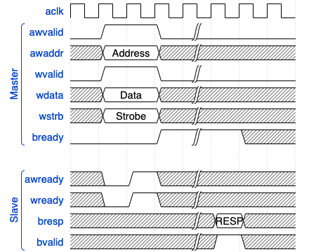

## AXI

### AXI-4 Memory Mapped

#### Signaling

| Signal | Source | AXI-Full | AXI-Lite | Description |
| -----: | :----: | :------: | :------: | :---------- |
| `awid` | Master | ✓ | ✘ | Write address ID |

#### AXI-4 Lite

### AXI-4 Stream

### AXI References & Specifications

* [AMBA AXI and ACE Protocol Specification AXI3, AXI4, and AXI4-Lite ACE and ACE-Lite (ARM rev. E)](https://developer.arm.com/documentation/ihi0022/e/Preface?lang=en)
* [AMBA 4 AXI4-Stream Protocol Specification (ARM rev. A)](https://developer.arm.com/documentation/ihi0051/a?lang=en)
* [Xilinx AXI Reference Guide - UG1037](https://www.xilinx.com/support/documentation/ip_documentation/axi_ref_guide/latest/ug1037-vivado-axi-reference-guide.pdf)

