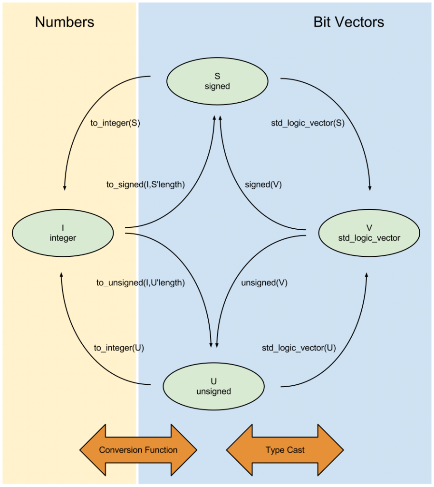

## Overview

For digital implementation languages, see [VHDL and Verilog](hdl.html) page. Also for background/theory on following DSP implementations see the [DSP Page](/kb/signals-systems-comms/digital_signal_processing.html). Most of this page has references and example code for VHDL, though the underlying concepts apply to all Hardware Description Languages (HDL), as the architectures are applicable to many digital processing & [hardware accelerated systems](https://en.wikipedia.org/wiki/Hardware_acceleration), like [FPGAs](fpga.html), ASICs, and even SW-programmable [DSP processors](https://en.wikipedia.org/wiki/Digital_signal_processor).

### Why Learn Low-Level DSP Design for Digital Systems? 

Knowing low-level design & implementation of Digital Signal Processing (DSP) for Digital Systems can be valuable for a number of applications. For instance high-level synthesis (HLS) has made great progress in recent years, and can lead to very quick implementations, however it is not universally applicable to every scenario. HLS may not be as performant/resource-efficient as HDL crafted "by-hand" either.

Similarly, it's important to realize from the beginning that there are scenarios where just directly porting an algorithm to an FPGA is **not faster** than the same algorithm running in software (SW) on a CPU. For one, FPGAs are generally clocked much slower than CPUs (e.x. FPGA fabric runs in the 100's of MHz vs modern CPUs in the GHz range). Second, SW compilers- and processing libraries with optimized code- have become great at creating applications that efficiently use modern computer architecture features such as [cache memory](https://en.wikipedia.org/wiki/Cache_(computing)), parallel-processing/threading and [SIMD vector extensions](https://en.wikipedia.org/wiki/SIMD).

Put simply, **FPGAs and Digital Hardware offer a different processing & design paradigm than SW** so there are some basic tenets to keep in mind when designing for high-throughput processing performance:
- **Design for data and process parallelism over a single-threaded-execution model:** due to completely distinct logic blocks, digital implementations should aim to process multiple samples of data per clock cycle in parallel, rather than a single sample per cycle.
- **Know the strengths & weaknesses of data movement to, from and within Digital Systems/SoCs:** moving data to/from an accelerator (e.g. FPGA) from/to main memory (e.g. over DMA) can be costly in terms of latency for some applications compared to SW algorithms which are cache-optimized; even in DMA offload blocks which have optimizations like pre-fetching descriptors, data still has to move from memory to the digital logic and back. However in other applications, Digital Systems like FPGAs are valuable in that they can directly interface with sensors and other system I/O; here, processing can be brought to the data, rather than moving data to the processing.
- **Think in data flow rather than sequential processing:** as an extension to data parallelism, digital HW algorithms can easily implement [processing pipelines](https://en.wikipedia.org/wiki/Instruction_pipelining) which can perform different stages of processing concurrently (e.g. at the same time- rather than waiting for the current processing chain to finish before starting the next processing chain). Keep the execution pipeline full to achieve maximum throughput of your algorithms. [Dataflow](https://en.wikipedia.org/wiki/Dataflow), or [Stream Processing](https://en.wikipedia.org/wiki/Stream_processing), can be applied to systems which exhibit:
  + _Compute Intensity:_ where there is a large ratio of the number of arithmetic operations per I/O or global memory reference.
  + _Data Parallelism:_ which exists in a kernel if the same function is applied to all records of an input stream and a number of records can be processed simultaneously without waiting for results from previous records (e.x. digitized RF samples in a wireless processing system).
  + _Data Locality:_ a specific type of temporal locality where data is produced in a stream, with intermediate streams passed between kernels.
- **Understand the entire system to apply the right tool at the right time:** Similar to the applicability of data movement, there may be scenarios where parts of your algorithm should be done in software, while other parts are accelerated by FPGA fabric; often this is done in tandem where the FPGA & CPU are working simultaneously. FPGAs are not the answer for every application, so the wise Digital Engineer should recognize, and understand, processing software to determine an overall processing architecture given system constraints (e.x. Size, Weight and Power, plus Cost (SWaP-C)).


## Basic Operations

### Numeric Representations

#### Integer Representations

There are a few different integer number representations when working with digital logic:
- **Unsigned:** the direct numeric representation of a binary number, assuming no sign or negative numbers. For an $$N$$ bit unsigned integer, the range of representable values is $$ [0 .. 2^{N}-1] $$.
- **Signed:** there are two main representations for integers containing both negative and positive values:
  + _[One's Complement](https://en.wikipedia.org/wiki/Ones%27_complement):_ the one's complement of a number (or negation of a signed integer) is simply the negation (inversion) of all bits (see table below). It is not very popular due to issues such as the offset representation of -1, negating zero gives another -0 pattern, and less simplicity with [carry logic](https://en.wikipedia.org/wiki/Carry_(arithmetic)). One's complement has a range of $$[-(2^{N-1}-1) .. 2^{N-1} - 1]$$.
  + _[Two's Complement](https://en.wikipedia.org/wiki/Two%27s_complement):_ Two's complement is the prevailing signed integer representation used in digital logic and computer systems. Besides not having the same issues as One's complement, arithmetic logic & operations are also identical for use with unsigned and two's complement numbers, so designs can be shared between numeric representations. The two's complement of a number is essentially the bitwise inverse of a number, and then a one added to that. Two's complement has a range of $$[-2^{N-1} .. 2^{N-1}-1]$$

| Binary Value | One's Complement Interpretation | Two's Complement Interpretation | Unsigned Interpretation |
| ------------ | ------------------------------- | ------------------------------- | ----------------------- |
| 00000000     | 0         | 0           | 0          |
| 00000001     | 1         | 1           | 1          |
| $$\vdots$$   | $$\vdots$$| $$\vdots$$  | $$\vdots$$ |
| 01111110     | 126       | 126         | 126        |
| 01111111     | 127       | 127         | 127        |
| 10000000     | -127      | -128        | 128        |
| 10000001     | -126      | -127        | 129        |
| 10000010     | -125      | -126        | 130        |
| $$\vdots$$   | $$\vdots$$| $$\vdots$$  | $$\vdots$$ |
| 11111110     | -1        | -2          | 254        |
| 11111111     | -0        | -1          | 255        |


##### VHDL Integer Type

Note that VHDL has a standard `integer` type, however caution should sometimes be used as most synthesis tools infer full 32-bit wide resources for unconstrained integer signals. Therefore, when dealing with integers it's best to:
1. Constrain the intended range of an integer signal:
```vhdl
signal my_int : integer range -4 to 7;
```
2. Primarily use integers as constants or literals:
```vhdl
Y <= X + 7;
```

##### Type Conversions

Since VHDL is [strongly typed](https://www.techopedia.com/definition/24434/strongly-typed), integer types need to be converted to and from each other, as well as between `std_logic_vector`, with the following functions:

<center></center>
<center><i><a href="https://www.bitweenie.com/listings/vhdl-type-conversion/">Source: VHDL Type Conversion- Bitweenie</a></i></center>

For instance, to convert a `std_logic_vector` signal `A` to a signed integer signal `B`:
```vhdl
signal A : std_logic_vector(3 downto 0) := "1111";
signal B :           signed(3 downto 0);
-- ...
B <= signed( A ); -- B = -1 (decimal)
```


#### Fixed Point

#### Floating Point


## Integer and Fixed-Point Operations

### Addition and Subtraction

In VHDL, addition operands on the right-hand side must be equal in size as the assignment result on the left-hand side; what this means is that, in order to accommodate any overflow from the addition or subtraction operation, it's best practice to have the output result to have a bit width equal to the largest operand, plus one. Using the [numeric_std](https://www.csee.umbc.edu/portal/help/VHDL/numeric_std.vhdl) `resize(arg, new_size)` function, signed and unsigned types can be easily resized, with sign extension, to create the necessary intermediate operands for bit growth:

```vhdl
signal A : signed(5 downto 0); -- 6 bit
signal B : signed(3 downto 0); -- 4 bit
signal C : signed(6 downto 0); -- length = max_length(A,B) + 1 = 7 bit
-- ...
C <= resize( A, C'length ) + resize ( B, C'length );
```


### Multiply

When multiplying two integers together, the output bit width is the sum of each operand's bit width:

```vhdl
signal A : signed( 7 downto 0); -- 8 bit Input
signal B : signed( 3 downto 0); -- 4 bit Input
signal C : signed(11 downto 0); -- 8 + 4 = 12 bit Output
-- ...
C <= A * B;
```

### Complex Multiply

#### Direct Implementation

Given two complex signals of $$ a = a_{r} + ja_{i} $$ and $$ b = b_{r} + jb_{i} $$, the complex product of $$ p = a \times b $$ can be implemented directly using four multipliers and two add/sub operations:
\$\$ p_{r} = a_{r}b_{r} - a_{i}b_{i} \$\$
\$\$ p_{i} = a_{r}b_{i} + a_{i}b_{r} \$\$

#### Reduced Resource Implementation

A reduction in multiplier resources can be made by rearranging common terms in the real and imaginary product so that only three multipliers are needed:
\$\$ p_{r} = a_{r}b_{r} - a_{i}b_{i} = a_{r}(b_{r}+b_{i}) - (a_{r} + a_{i})b_{i} \$\$
\$\$ p_{i} = a_{r}b_{i} + a_{i}b_{r} = a_{r}(b_{r}+b_{i}) + (a_{i} - a_{r})b_{r} \$\$

Three pre-combining adders are necessary (which in Xilinx DSP48 slices are built-in) which also results in increased multiplier word length. Another tradeoff is that, since the three multiplier utilizes more slice resources, the three multiplier design has a lower maximum achievable clock frequency than the four multiplier implementation.


### Transcendental Functions

[Transcendental functions](https://en.wikipedia.org/wiki/Transcendental_function) are simply functions which cannot be completely expressed in terms of algebraic operations (e.g. addition, subtraction, multiplication, division, raising to a power or root extraction). For example, exponential, logarithmic and trigonometric functions are transcendental.

#### CORDIC

[CORDIC (**CO**ordinate **R**otation **D**igital **C**omputer)](https://en.wikipedia.org/wiki/CORDIC) was developed by Jack Volder in 1959 as an _<ins>iterative</ins>_ algorithm to convert between polar and cartesian coordinates using shift, add and subtract operations only.
* Thus the algorithm is very popular since it requires no inherent multiplications and can therefore be used to save computing resources or be used on low power devices such as microcontrollers.
* Can also compute hyperbolic, linear and logarithmic functions as well
* CORDIC algorithms generally produce one additional bit of accuracy for each **iteration** taken


## Processing Architectures

### Kahn Network Descriptions

https://en.wikipedia.org/wiki/Kahn_process_networks

### Systolic Arrays

https://en.wikipedia.org/wiki/Systolic_array


## Tools

### RFNoC

* [Getting Started with RFNoC - Ettus Research](https://kb.ettus.com/Getting_Started_with_RFNoC_in_UHD_4.0)


## References

* [VHDL Math Tricks of the Trade- SynthWorks](https://www.synthworks.com/papers/vhdl_math_tricks_mapld_2003.pdf)

