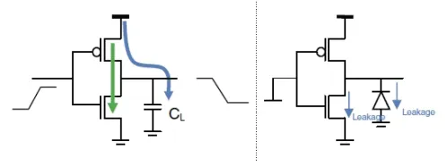

## Overview

> People who are really serious about software should make their own hardware- Alan Kay

One of the keys to digital design when working with HDL languages is "what will this synthesize to in real hardware?"

In general, digital design can take a lot of cues from SW: code reviews, tooling, algorithms, etc. especially for Continuous Integration (CI) as the same needs as SW are present (automated regression tests, automated builds, hooks with Git repo, etc.); thus, testbenches (unit level or BFM) that are not self-checking are not useful for these CI tests, or even a new reader of the design (e.g. self-documenting code).

## Resets

I/O resets are asynchronous (for safety in case no clocks), but everything internal should be synchronous, especially since how FPGAs define FFs now

## Timing

* Setup & Hold Times
* Routing vs logic delay
  - High routing delay indicative of high design congestion (e.g. an FPGA design > 80% utilization)
* Minimizing Levels of Logic (LoL) and fanout
* Place-and-Route (PaR) tools optimize the hardest ("critical") paths first. So even highly registered logic in other places in a design can fail (e.g. due to high routing delay) when other paths with high LoL are prioritized first.
  - Different synthesis & PaR strategies to help

## Designing for Performance

+ **Pipeline early & often:** in modern digital targets (like FPGAs), flip-flops are likely the cheapest resource in the programmable fabric. Thus while designing, err on the side of more inferred registers; this increases your chances on meeting static timing the first time. Worst case, further optimization can remove unnecessary FFs. Remember that  premature optimization is a folly in engineering design.
  - When working with large RAM primitives that span multiple blocks (e.x. multiple block RAMs (BRAM) chained together to create large FIFOs/tables), registering between RAM blocks can help meet timing if the read/write latency can tolerate it.

## Designing for Power

CMOS digital circuits dissipate power in three main ways: dynamic, short circuit, and leakage power. Of note to the digital designer, dynamic power consumption.

## Digital Design Process & Tools

### FPGA Prototyping

See [this page on FPGA tools & design](./fpga.html).

### Simulation

See [this page on verification & testing of HDL/RTL designs](./rtl_verif.html).

### Documentation/Modeling

- [WaveDrom](https://wavedrom.com/editor.html) online digital waveform diagraming tool with an easy to use syntax.

## References

* [Low-Power Design (LPD) - Eduardo Boemo](https://www.eurasip.org/Seminars/EURASIPLowPowerSeminar_talk1.pdf)

