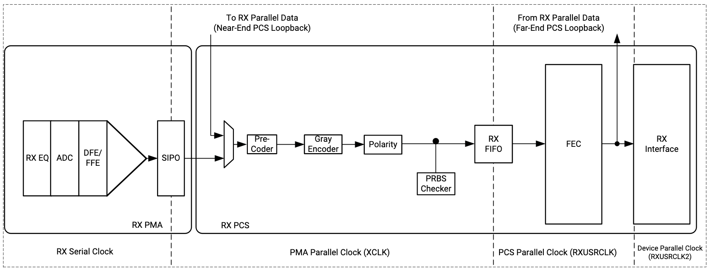
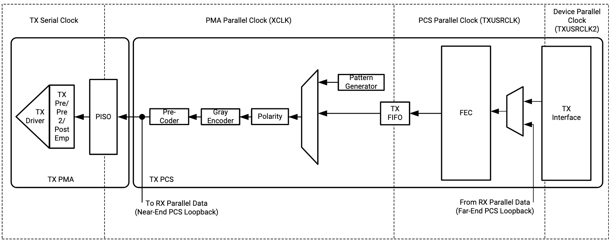

## High-Speed Ethernet L1 & L2 Overview

As a quick refresher, Ethernet (and other high-speed serial protocols) define intermediate layers to their bottom two [OSI layers](https://en.wikipedia.org/wiki/OSI_model) (images of [Versal GTM Architecture](https://www.xilinx.com/support/documentation/user_guides/ug581-ultrascale-gtm-transceivers.pdf)):

For Ethernet, these sublayers are described as (from lowest to highest layer):

1. **L1 - Physical Layer (PHY):**
    1. [Physical Medium Dependent (PMD)](https://en.wikipedia.org/wiki/Physical_medium_dependent) - Sublayer for the physical transceiver in/out of a medium (e.x. optical transceiver to go between electrical lanes & fiber)
        1. The trailing number in a given Ethernet flavor defines the number of PMD lanes, or commonly, **how many fibers or lanes across a medium**. For example, in 100GBASE-LR<ins><b>4</b></ins> there are 4x PMD lanes (each at 25Gb/s NRZ) over the [optical transceiver module](https://www.fs.com/products/39025.html).
    2. Physical Medium Attachment (PMA) - mainly the SERDES logic & equalization/pre-emphasis, etc. but also plays a part in **how many electrical interface lanes** are used by a given standard to interact with the PMD layer. For example, in [100GBASE-DR1](https://www.fs.com/products/97849.html), the transceiver module gearboxes 4x 25Gb/s NRZ electrical lanes (PMA) to a single-mode fiber (SMF) 1x 100Gb/s PAM-4 optical signal.
    3. [Physical Coding Sublayer (PCS)](https://en.wikipedia.org/wiki/Physical_coding_sublayer) - line encoding (64b/66b, 256b/257b), Forward Error Correction (FEC), (de)scrambling, lane alignment, link establishment, etc. but commonly used to describe the **channel bonding across PMA lanes to form a synchronous Ethernet Interface**
        1. The starting number in a given Ethernet standard defines the overall data rate of an Ethernet link, to a single MAC/L2 interface. For example, in <ins><b>100G</b></ins>BASE-LR4, the post-PCS (e.g. w/o line encoding overhead) data rate is 100Gb/s, which is achieved through lane alignment across 4x PMA lanes.
2. **L2 - Data Link Layer:**
    1. Reconciliation Sublayer (RS) - Handle PHY local/remote fault handshake messaging (PHY link establishment)
    2. [Medium Access Control (MAC)](https://en.wikipedia.org/wiki/Medium_access_control)- Sublayer for Ethernet framing and insertion of Frame Check Sequence (FCS, CRC-32 on MAC frame) calculation/checking, Start of Frame Delimiter (SFD) & preamble, Inter-Packet Gap (IPG) padding and enforcement, etc.
    3. [Logical Link Control (LLC)](https://en.wikipedia.org/wiki/Logical_link_control) - Interface between MAC & Network layers, commonly [EthernetII format](https://en.wikipedia.org/wiki/Ethernet_frame#Ethernet_II)

There are several physical signaling standards at the PMD layer with high-speed Ethernet for individual lanes:

* **50G PAM-4:** 53.125 G[Baud](https://en.wikipedia.org/wiki/Baud) (100Gb/s post-encoding) [AN 835: PAM-4 Signaling Fundamentals](https://www.intel.com/content/dam/www/programmable/us/en/pdfs/literature/an/an835.pdf)
  + [Brief Discussion: PAM4 vs. NRZ Signaling - YouTube](https://www.youtube.com/watch?v=KlF7qKCQ9Ps)
  + [PAM4-Signaling-in-High-Speed-Serial-Technology_55W-60273.pdf](https://download.tek.com/document/PAM4-Signaling-in-High-Speed-Serial-Technology_55W-60273.pdf)
* **25G PAM-4:** 26.5625 GBaud (50Gb/s post-encoding) PAM-4 Modulation
* **25G NRZ:** 26.5625 GBaud (25Gb/s post-encoding) [NRZ Modulation](https://en.wikipedia.org/wiki/Non-return-to-zero)

### Low Latency Transceiver

[In some devices](https://www.xilinx.com/developer/articles/low-latency-transceiver-designs-for-fintech.html), RX and TX buffers can be bypassed, and a DPLL can be used to lock the receive clock to the transmit clock to remove clock domain crossing (CDC) latency.

### Cabling

[Everything You Always Wanted to Know About Optical Networking- But Were Afraid to Ask](https://www.nanog.org/sites/default/files/2_Steenbergen_Tutorial_New_And_v2.pdf)

## Eye Diagrams & Measurements

### References

* [Xilinx In-System IBERT for Eye Analysis (PG246)](https://www.xilinx.com/support/documents/ip_documentation/in_system_ibert/v1_0/pg246-in-system-ibert.pdf)
* [AN687: A Primer on Jitter, Jitter Measurement, and Phase-Locked Loops - SkyWorks](https://www.skyworksinc.com/-/media/Skyworks/SL/documents/public/application-notes/AN687.pdf)

## References

* [ ] [High-Speed Serial I/O Made Simple - AMD-Xilinx Book](https://www.xilinx.com/publications/archives/books/serialio.pdf)
* [ ] [Sam Palermo Courses - Texas A&M](https://people.engr.tamu.edu/spalermo/teaching.html)
  + [Sam Palermo - ECEN 720: High-Speed Links Circuits and Systems](https://people.engr.tamu.edu/spalermo/ecen720.html)
    - [ECEN 689: Older Course](https://people.engr.tamu.edu/spalermo/ecen689_spring2010.html)
  + [RX DFE Equalization](https://people.engr.tamu.edu/spalermo/ecen689/lecture19_ee689_rx_dfe_eq.pdf)
* [ ] [High Speed Communications - Alphawave Semi YouTube Playlist](https://www.youtube.com/playlist?list=PLXWdf7T6k6P38IYQHRfp-gYC0oOJSy_6m)
* [DC Blocking Capacitors](http://www.sigcon.com/Pubs/news/7_08.htm)

