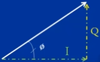

## Overview

### I & Q Data

Given the [trigonometric identity](https://en.wikipedia.org/wiki/Trigonometry): \$\$ \cos(\alpha)\cos(\beta) = \cos(\alpha)\cos(\beta) - \sin(\alpha)\sin(\beta) $$

We can describe a sinusoidal signal in component parts as: \$\$ A\cos(2\pi f t + \phi) = A\cos(2\pi f t)\cos(\phi) - A\sin(2\pi f t)\sin(\phi) $$

Setting **I** (the amplitude of the **I**n-Phase carrier) and **Q** (the amplitude of the **Q**uadrature-phase carrier) allows us to describe the magnitude and phase (polar coordinate) of a sinusoid by the simple amplitudes:
\$\$ I = A\cos(\phi) \$\$
\$\$ Q = A\sin(\phi) \$\$
\$\$ A\cos(2\pi f t + \phi) = I\cos(2\pi ft) - Q\sin(2\pi ft)\$\$

From the Euler identity of a sinusoidal signal $$ e^{\pm j \phi}=\cos \phi \pm j\sin \phi$$, we can see the relationship between the polar coordinate phasor notation of a signal vector (e.g. a signal described by its amplitude and phase) and its cartesian coordinate equivalent when described in the complex 2D plane, which shows the I/Q data format is the real and imaginary parts, respectively, of a given sinusiod:

<i><a href="https://web.archive.org/web/20200415113535/www.ni.com/tutorial/4805/en/">Source: What is I/Q Data?- NI</a></i>

The benefit of I/Q data, and why its a popular data representation when working with RF systems (e.x. communications devices), is that it makes phase modulated signals easier to work with; because a sine wave with a -90 degree phase offset is equal to a cosine wave, the above I/Q relationships mean that the same carrier can be used for both I & Q (just simply phase shifted for Q) _and_ that phase modulation can be achieved by simply modulating the amplitude of I & Q. This is much simpler (e.g. cost effective & performant) in real, digital implementations than direct phase modulation of a signal. For instance, a simple and common way to transform I/Q to RF can be shown in the following block diagram:

<i><a href="https://web.archive.org/web/20200415113535/www.ni.com/tutorial/4805/en/">Source: What is I/Q Data?- NI</a></i>

I/Q data can also be represented by a [Constellation Diagram](https://en.wikipedia.org/wiki/Constellation_diagram) which provides an intuitive mapping between a set of digital bits and I/Q symbols for a given modulation scheme, for example [16-ary Quadtrature Amplitude Modulation (QAM)](https://en.wikipedia.org/wiki/Quadrature_amplitude_modulation):

<i><a href="https://en.wikipedia.org/wiki/Constellation_diagram">Source: Constellation Diagram- Wikipedia</a></i>

## SDR Hardware

### RTL-SDR

#### RTL-SDR Installation

- **[RTL-SDR Quick Start Guide](https://www.rtl-sdr.com/rtl-sdr-quick-start-guide/):** general guides to RTL-SDR features and dipole antenna usage.
- **[RTL-SDR for Linux Quick Start Guide](https://ranous.wordpress.com/rtl-sdr4linux/):** installation instructions for necessary drivers and libraries to get up and running.

## References

