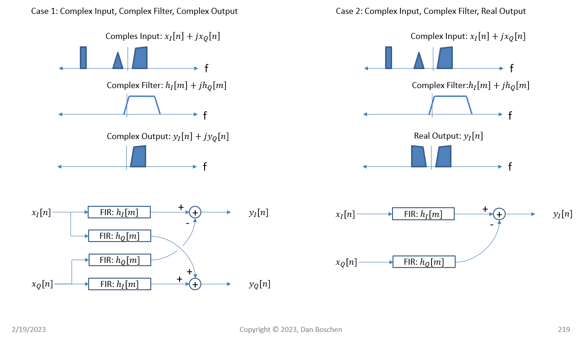
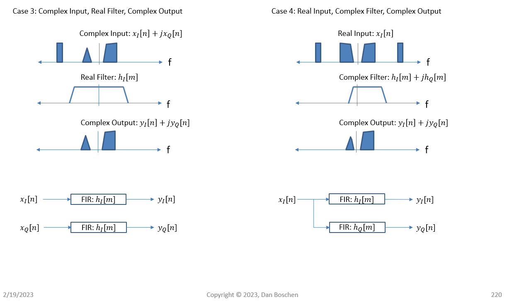

[](https://colab.research.google.com/github/JohnnyGOX17/john-gentile-website/blob/master/./kb/dsp/Filtering_Fundamentals.ipynb)


## Filter Design

### Complex-Valued Filters




- [ ] [Complex Filter Design](https://dsp.stackexchange.com/a/53248)

### References

- [SciPy Signal - Filter Design Methods](https://docs.scipy.org/doc/scipy/reference/signal.html#filter-design)

## Parallel/Vectorized Filter/Convolution


```python

```
