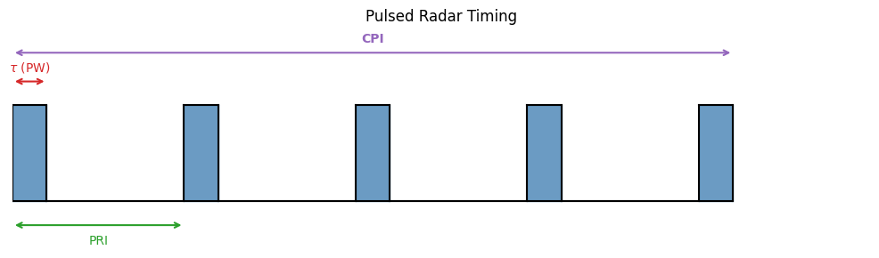
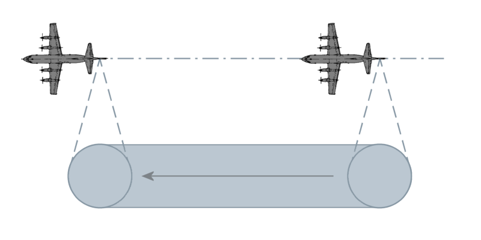
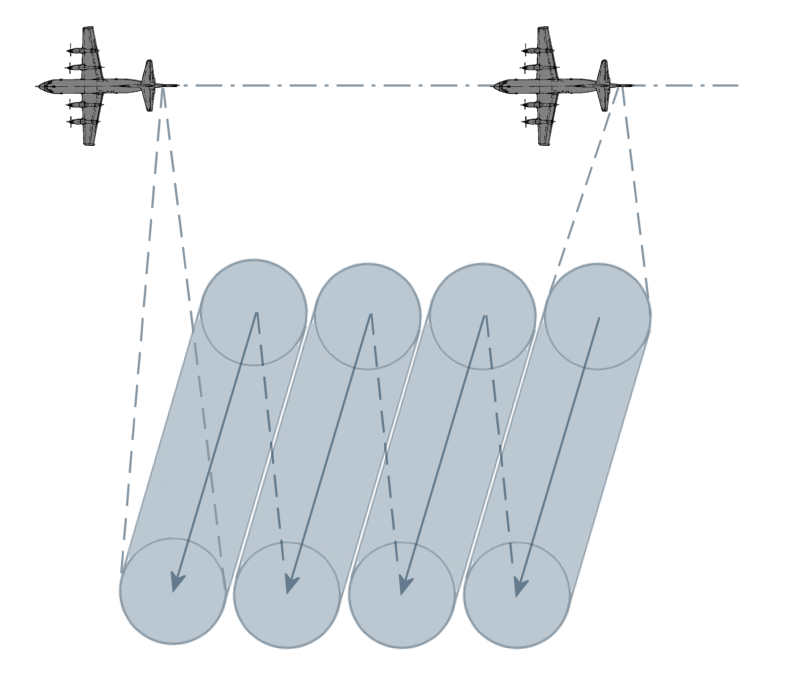
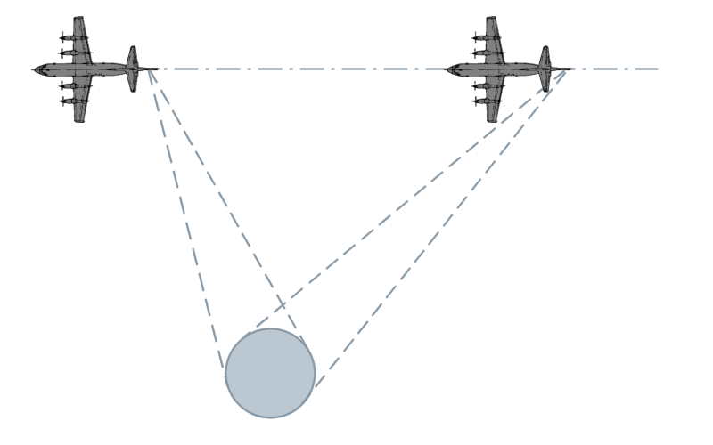
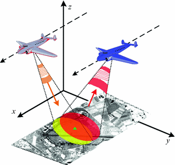
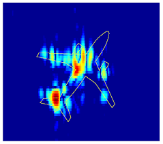
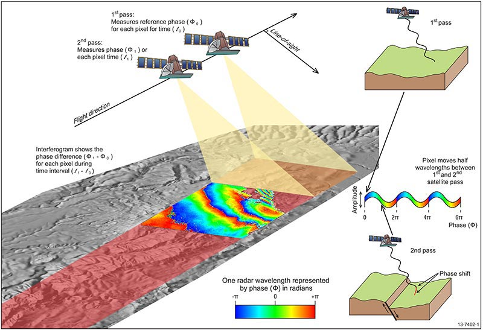
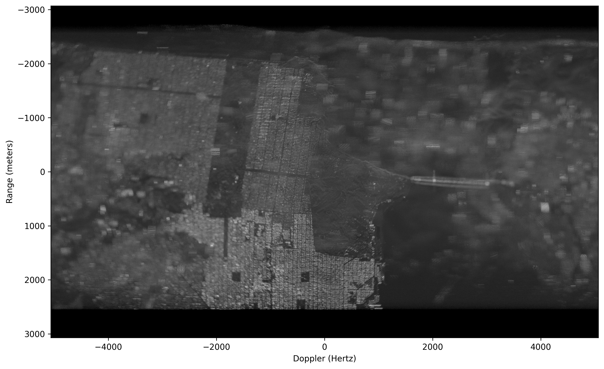

[](https://colab.research.google.com/github/JohnnyGOX17/john-gentile-website/blob/master/./kb/dsp/Radar.ipynb)


```python
import numpy as np
import matplotlib.pyplot as plt
from sarpy.io.phase_history.cphd import CPHDReader

from numpy.fft import fftshift, ifftshift
from scipy.fftpack import fft, ifft

from IPython.display import YouTubeVideo
```

## Fundamentals

### Radar Range Equation

The **radar range equation** describes the relationship between transmitted power, target characteristics, and the received signal power for a monostatic radar (co-located transmitter and receiver):


$$
P_r = \frac{P_t G^2 \lambda^2 \sigma}{(4\pi)^3 R^4 L}
$$


where:

| Variable | Description |
|----------|-------------|
| $$P_r$$ | Received signal power (W) |
| $$P_t$$ | Transmitted power (W) |
| $$G$$ | Antenna gain (linear) |
| $$\lambda$$ | Wavelength of the transmitted signal (m) |
| $$\sigma$$ | Radar cross-section (RCS) of the target (m$$^2$$) |
| $$R$$ | Range to the target (m) |
| $$L$$ | System losses (linear, $$\geq 1$$) |

The $$R^4$$ dependence is a key characteristic: the signal must travel to the target _and_ back, suffering $$1/R^2$$ free-space path loss in each direction. This means that doubling the range requires 16$$\times$$ (roughly +12 dB) the transmit power to maintain the same received signal level.

For detection, $$P_r$$ must exceed the receiver noise floor by some minimum signal-to-noise ratio (SNR). Rearranging for maximum detectable range:


$$
R_{\max} = \left[ \frac{P_t G^2 \lambda^2 \sigma}{(4\pi)^3 k T_s B_n \cdot \text{SNR}_{\min} \cdot L} \right]^{1/4}
$$


where $$k$$ is Boltzmann's constant, $$T_s$$ is the system noise temperature (K), and $$B_n$$ is the receiver noise bandwidth (Hz).

## Pulsed Radar


```python
fig, ax = plt.subplots(figsize=(10, 3))
ax.set_xlim(0, 10)
ax.set_ylim(-0.5, 1.8)
ax.axis('off')

# Pulse parameters
pw = 0.4        # Pulse Width
pri = 2.0       # Pulse Repetition Interval
num_pulses = 5  # Number of pulses in CPI

# Draw pulses
for i in range(num_pulses):
    x0 = i * pri
    # Rising edge, top, falling edge, baseline to next pulse
    ax.fill_between([x0, x0 + pw], 0, 1, color='steelblue', alpha=0.8)
    if i < num_pulses - 1:
        ax.plot([x0 + pw, (i + 1) * pri], [0, 0], 'k-', lw=1.5)
    # Rising/falling edges
    ax.plot([x0, x0], [0, 1], 'k-', lw=1.5)
    ax.plot([x0 + pw, x0 + pw], [1, 0], 'k-', lw=1.5)
    ax.plot([x0, x0 + pw], [1, 1], 'k-', lw=1.5)

# Baseline
ax.plot([0, num_pulses * pri - pri + pw], [0, 0], 'k-', lw=1.5)

# PW annotation (on first pulse)
ax.annotate('', xy=(pw, 1.25), xytext=(0, 1.25),
            arrowprops=dict(arrowstyle='<->', color='tab:red', lw=1.5))
ax.text(pw / 2, 1.35, r'$\tau$ (PW)', ha='center', fontsize=10, color='tab:red')

# PRI annotation (between first two pulses)
ax.annotate('', xy=(pri, -0.25), xytext=(0, -0.25),
            arrowprops=dict(arrowstyle='<->', color='tab:green', lw=1.5))
ax.text(pri / 2, -0.45, 'PRI', ha='center', fontsize=10, color='tab:green')

# CPI annotation (full span)
cpi_end = (num_pulses - 1) * pri + pw
ax.annotate('', xy=(cpi_end, 1.55), xytext=(0, 1.55),
            arrowprops=dict(arrowstyle='<->', color='tab:purple', lw=1.5))
ax.text(cpi_end / 2, 1.65, 'CPI', ha='center', fontsize=10, color='tab:purple',
        fontweight='bold')

ax.set_title('Pulsed Radar Timing', fontsize=12)
plt.tight_layout()
plt.show()
```


    

    


## Frequency-Modulated Continuous-Wave (FMCW) Radar

### References

- [FMCW Radar - radartutorial.eu](https://www.radartutorial.eu/02.basics/Frequency%20Modulated%20Continuous%20Wave%20Radar.en.html)
- [FMCW Radar Part 1 - Ranging - Wireless Pi](https://wirelesspi.com/fmcw-radar-part-1-ranging/)
- [FMCW Range Doppler Notebook](https://colab.research.google.com/drive/1lmYojrI1X7sbctWFrS_61IRUMnzKjAsV)


```python
YouTubeVideo('G_tmNtP0gw8')
```


<iframe
    width="400"
    height="300"
    src="https://www.youtube.com/embed/G_tmNtP0gw8"
    frameborder="0"
    allowfullscreen

></iframe>


## Synthetic Aperture Radar (SAR)

Synthetic Aperture Radar (SAR) is the process of using specialized radar processing techniques for imaging. The "Synthetic Aperture" in SAR is so called due to the concept of creating the effect of a very long antenna using signal processing, along with aperture techniques similar to other optical engineering domains.

SAR is popular for remote sensing due to its four distinct principles:
1. An active SAR carries it's own illumination which means it can work equally well day or night.
2. Most common SAR frequencies can pass through clouds, smoke, and precipitation allowing imaging in adverse conditions. As well, some frequencies can even penetrate foliage or other materials.
3. Radio Frequency (RF) energy used in a SAR system scatters off materials in different ways than light; SAR can then be used as a complementary, or more discriminatory, information source with optical imaging.
4. SAR systems rely on complex phase information of the returned signals; not only can images be formed, but other important information such as target motion can be garnered from this data as well.

### SAR History

The most basic form of radar measures _range_ (by measuring time delay between signal transmission and reception of reflection from target/scatterer) and _direction_ (given knowledge of an antenna's pointing angle and directivity). The received Doppler shift can be used to measure a target's relative speed, but it was also found that Doppler could also be used to obtain finer resolution perpendicular to the beam direction. This concept is often credited to Carl Wiley of Goodyear Aerospace in 1951.

Since the raw collected radar data in a SAR system is unfocused, it takes further signal processing to turn into a usable image. Like a hologram, the essential information is contained in the phase of the data (a.k.a. phase history). Early systems used the principles of Fourier optics to transform phase history data recorded on film into images using lens that performed two-dimensional Fourier transforms and focusing. While novel, this analog process has been since replaced with digital processing and collection methods.

### SAR Modes

**NOTE:** images from [Radartutorial website](https://www.radartutorial.eu/20.airborne/ab08.en.html)

- **Stripmap:** Here the antenna is held in a constant pointing direction, usually perpendicular to the path of travel. The beam sweeps across the ground in a contiguous strip. The length of the imaged strip is related to how far the sensor platform moves. The azimuth resolution is directly related to antenna length.

- **Scan:** In this mode, the antenna is scanned (either mechanically or electrically) in range several times during a synthetic aperture. This creates a wider image swath at the cost of degraded azimuth resolution. Azimuth resolution is equal to Stripmap mode's azimuth resolution times the number of swaths scanned.

- **Spotlight:** This is the highest resolution mode, however it images the least area during a given time interval. The azimuth resolution is improved by increasing the angular extent during a synthetic aperture by scanning the antenna to hold on a given area of interest.

- **Bistatic:** When the transmitter and receiver are co-located, or are part of the same platform, this is known as _monostatic_ operation. When the transmitter and receiver are at different locations, or on different platforms, this is known as _bistatic_.

- **Inverse SAR (ISAR):** In the above modes, it's assumed the target is stationary and the SAR platform is moving. However the principles of SAR also work in "inverse" where the target is in motion, while the radar system is static. An example is tracking satellites from a fixed ground-based radar. This can also be generalized to where both target and SAR platform are moving, such as on a ship in heavy seas being imaged by an airborne SAR.

- **Interferometric SAR (InSAR):** here extra post-processing is performed to extract features such as terrain height, or displacement, from complex SAR images. Commonly this is done as two complex SAR images acquired at the same spatial positions (differential InSAR) or slightly different positions (terrain height InSAR). These two complex images are then conjugate multiplied which gives an interferogram with contours of equal displacement/elevation.


### SAR Image Formation

We can use [Compensated Phase History Data (CPHD)](https://nsgreg.nga.mil/doc/view?i=4638), which is the lowest level of processing provided by most SAR satellites, to show image formation techniques. The "compensated" in CPHD means the data has been _motion compensated_ but not yet projected into a rectangular grid, nor image. Commercial providers like [Umbra](https://registry.opendata.aws/umbra-open-data/) and [Capella](https://registry.opendata.aws/capella_opendata/) graciously provide open data for research and testing!

Two very helpful walkthroughs of this same process are:
1. [Using CPHD by Example](https://github.com/capellaspace/jupyter-notebooks/blob/master/CPHD_by_Example.ipynb): Jupyter notebook by Capella Space
2. [Obtain a SAR stripmap image in fast and slow time from CPHD data](https://dsp.stackexchange.com/questions/99604/obtain-a-sar-stripmap-image-in-fast-and-slow-time-from-cphd-data): question in Signal Processing Stack Exchange


```python
import boto3
from botocore import UNSIGNED
from botocore.config import Config
from pathlib import Path

bucket_name = "capella-open-data"
cphd_file = "CAPELLA_C03_SM_CPHD_HH_20211229053627_20211229053631.cphd"
object_key_cphd = f"data/2021/12/29/{Path(cphd_file).stem}/{cphd_file}"

# Avoid re-downloading the ~1.3 GB CPHD if it's already on disk (local iteration
# or restored from the GitHub Actions cache). Capella's open bucket is anonymous.
if not Path(cphd_file).exists():
    s3 = boto3.client('s3', config=Config(signature_version=UNSIGNED))
    resp = s3.head_object(Bucket=bucket_name, Key=object_key_cphd)
    print(f"Downloading {resp['ContentLength'] / 1e6:.1f} MB from s3://{bucket_name}/{object_key_cphd}")
    s3.download_file(bucket_name, object_key_cphd, cphd_file)
else:
    print(f"Using cached local file: {cphd_file}")
```

<p style="font-family:monospace; white-space:pre-wrap">
Using cached local file: CAPELLA_C03_SM_CPHD_HH_20211229053627_20211229053631.cphd
</p>


Here we can use the helpful [SarPy Python library](https://github.com/ngageoint/sarpy) provided by the [National Geospatial-Intelligence Agency](https://www.nga.mil/) to read in and parse the CPHD file and it's metadata:


```python
cphd = CPHDReader(cphd_file)
```


```python
# full size of data in CPHD
cphd.data_size[0]
```


<p style="font-family:monospace; white-space:pre-wrap">
40290
</p>


```python
# The XML data w/in the CPHD.
xml = cphd.cphd_meta.to_dict()

# The number of channels.
num_chan = xml['Data']['NumCPHDChannels']

if num_chan > 1:
    raise ValueError('I assume a channel index of zero in the code below.')

# The number of samples and pulses in the data.
Nrf = xml['Data']['Channels'][0]['NumSamples']
Npulse = xml['Data']['Channels'][0]['NumVectors']

# Get the PVP parameters.
pvp = {}
pnames = list( xml["PVP"].keys() )
for ii in pnames:
    pvp[ii] = np.ascontiguousarray(cphd.read_pvp_variable(ii, 0))

# Read in the phase history data.
mcph = cphd.read_chip()
    
# Get the SRP for the center pulse. We will motion
# compensate to this point.
srp0 = pvp['SRPPos'][Npulse//2,:].reshape((1,3))

# Compute the difference in delay between the SRP used on each pulse and new
# new motion compensation point. This ignores atmoshperic delays, details of
# which can be found in the CPHD documentation.
c0 = 299792458.0
delay_old = (np.sqrt(np.sum((pvp['TxPos'] - pvp['SRPPos'])**2, axis=1)) + np.sqrt(np.sum((pvp['RcvPos'] - pvp['SRPPos'])**2, axis=1))) / c0
delay_new = (np.sqrt(np.sum((pvp['TxPos'] - srp0)**2, axis=1)) + np.sqrt(np.sum((pvp['RcvPos'] - srp0)**2, axis=1))) / c0

# Compute the RF sample locations of the phase history data.
rf_locations = pvp['SC0'].reshape((Npulse,1)) + pvp['SCSS'].reshape((Npulse,1)) @ np.arange(0, Nrf, dtype=np.float64).reshape((1,Nrf))

# Re-motion compensate the data to a single point.
mcph_new = mcph * np.exp(-1j*2*np.pi * (delay_old - delay_new).reshape((Npulse,1)) * rf_locations, dtype=np.complex64)

# Form a range/Doppler image by taking the forward FFT in slow-time (pulse)
# and the inverse FFT in RF.
img = fftshift(ifft(fft(ifftshift(mcph_new), axis=0), axis=1))

# Estimate the range and Doppler sample locations.
prf = np.mean(1.0 / np.diff(pvp['TxTime']))
doppler_locations = prf/Npulse * (np.arange(0, Npulse, dtype=np.float64) - Npulse//2)

range_size = c0/2 / np.mean(np.diff(rf_locations, axis=1))
range_locations = range_size/Nrf * (np.arange(0, Nrf, dtype=np.float64) - Nrf//2)

# Put the magnitude of the image into decibels such that its
# max value is zero.
img_disp = 20*np.log10(np.abs(img) / np.abs(img).max())

# The coordinate extents.
dx = np.mean(np.diff(doppler_locations))
dy = np.mean(np.diff(range_locations))
extent = (doppler_locations[0] - dx/2,
          doppler_locations[-1] + dx/2,
          range_locations[-1] + dy/2,
          range_locations[0] - dy/2)
```


```python
# Display the image.
plt.ion()
plt.figure(figsize=(12,8), dpi=300)
plt.imshow(img_disp.T, vmin=-60, vmax=0, cmap='gray', extent=extent)
plt.xlabel('Doppler (Hertz)')
plt.ylabel('Range (meters)')
```


<p style="font-family:monospace; white-space:pre-wrap">
Text(0, 0.5, 'Range (meters)')
</p>


    

    


### SAR References

* I. G. Cumming and F. H. Wong, _Digital Processing of Synthetic Aperture Radar Data: Algorithms and Implementation_, Artech House, 2005.
* W. G. Carrara and R. M. Majewski and R. S. Goodman, _Spotlight Synthetic Aperture Radar: Signal Processing Algorithms_, Artech House, 1995.
* L. J. Cantafio, _Space-Based Radar Handbook_, Artech House, 1989.
* [Introduction to Synthetic Aperture Radar Using Python and MATLAB - GitHub](https://github.com/SARBook/software)
* [SAR 101: An Introduction to Synthetic Aperture Radar - Capella Space](https://www.capellaspace.com/sar-101-an-introduction-to-synthetic-aperture-radar/)
  + [SAR 201: An Introduction to Synthetic Aperture Radar, Part 2](https://medium.com/the-downlinq/sar-201-an-introduction-to-synthetic-aperture-radar-part-2-895beb0b4c0a)
* [Homemade Polarimetric SAR Drone - Henrik's Blog](https://hforsten.com/homemade-polarimetric-synthetic-aperture-radar-drone.html)
* [OSTI.gov](https://www.osti.gov/search/semantic:synthetic%20aperture%20radar)
  + [Basics of Polar-Format algorithm for processing Synthetic Aperture Radar images](https://www.osti.gov/biblio/1044949)
  + [Bistatic Synthetic Aperture Radar - Issues Analysis and Design](https://www.osti.gov/biblio/1669735)
  + [Generating nonlinear FM chirp waveforms for radar](https://www.osti.gov/biblio/894743)
  + [SAR processing with non-linear FM chirp waveforms](https://www.osti.gov/biblio/902597)
* [A Review of Synthetic-Aperture Radar Image Formation Algorithms and Implementations: A Computational Perspective](https://www.mdpi.com/2072-4292/14/5/1258)
* [Squinted Spotlight Synthetic Aperture Radar (SAR) Image Formation - MATLAB](https://www.mathworks.com/help/radar/ug/squinted-spotlight-sar-image-formation.html)
* [Stripmap Synthetic Aperture Radar (SAR) Image Formation - MATLAB](https://www.mathworks.com/help/radar/ug/stripmap-synthetic-aperture-radar-sar-image-formation.html)
* [Radar for Space Observation: Systems, Methods and Applications](https://www.mdpi.com/journal/remotesensing/special_issues/7C43H2J2V2)
* [Interference Mitigation for Synthetic Aperture Radar Based on Deep Residual Network](https://www.mdpi.com/2072-4292/11/14/1654)
* [Synthetic Impulse and Aperture Radar (SIAR): A Novel Multi‐Frequency MIMO Radar](https://onlinelibrary.wiley.com/doi/book/10.1002/9781118609576)
* [Sandia Pathfinder Radar ISR & SAR Systems](https://www.sandia.gov/radar/)


#### Open-Source SAR Repos

* https://github.com/RadarCODE/awesome-sar
* https://github.com/ron-kemker/sar
* https://github.com/AlexeyPechnikov/pygmtsar
  + https://insar.dev/
* https://github.com/insarlab/MintPy
* [Alaska Satellite Facility](https://asf.alaska.edu/)

## General Radar References

* [Introduction to Radar Using Python and MATLAB](https://github.com/RadarBook/software)
* [Build Your Own Radar - Jon Kraft YouTube Playlist](https://www.youtube.com/playlist?list=PLxC4LYGYcMqmPDEr8E8AlktQPcuHx4izm)
* [AERIS-10: Open Source Pulse Linear Frequency Modulated Phased Array Radar](https://github.com/NawfalMotii79/PLFM_RADAR)
