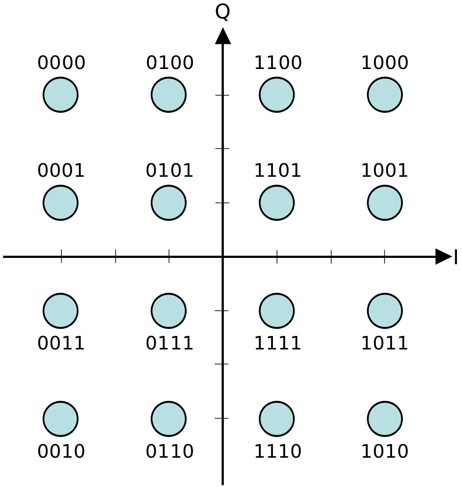

## Overview

### I & Q Data

Given the [trigonometric identity](https://en.wikipedia.org/wiki/Trigonometry): \$\$ \cos(\alpha)\cos(\beta) = \cos(\alpha)\cos(\beta) - \sin(\alpha)\sin(\beta) $$

We can describe a sinusoidal signal in component parts as: \$\$ A\cos(2\pi f t + \phi) = A\cos(2\pi f t)\cos(\phi) - A\sin(2\pi f t)\sin(\phi) $$

Setting **I** (the amplitude of the **I**n-Phase carrier) and **Q** (the amplitude of the **Q**uadrature-phase carrier) allows us to describe the magnitude and phase (polar coordinate) of a sinusoid by the simple amplitudes:
\$\$ I = A\cos(\phi) \$\$
\$\$ Q = A\sin(\phi) \$\$
\$\$ A\cos(2\pi f t + \phi) = I\cos(2\pi ft) - Q\sin(2\pi ft)\$\$

From the Euler identity of a sinusoidal signal $$ e^{\pm j \phi}=\cos \phi \pm j\sin \phi$$, we can see the relationship between the polar coordinate phasor notation of a signal vector (e.g. a signal described by its amplitude and phase) and its cartesian coordinate equivalent when described in the complex 2D plane, which shows the I/Q data format is the real and imaginary parts, respectively, of a given sinusiod:

<i><a href="https://web.archive.org/web/20200415113535/www.ni.com/tutorial/4805/en/">Source: What is I/Q Data?- NI</a></i>

The benefit of I/Q data, and why its a popular data representation when working with RF systems (e.x. communications devices), is that it makes phase modulated signals easier to work with; because a sine wave with a -90 degree phase offset is equal to a cosine wave, the above I/Q relationships mean that the same carrier can be used for both I & Q (just simply phase shifted for Q) _and_ that phase modulation can be achieved by simply modulating the amplitude of I & Q. This is much simpler (e.g. cost effective & performant) in real, digital implementations than direct phase modulation of a signal. For instance, a simple and common way to transform I/Q to RF can be shown in the following block diagram:

<i><a href="https://web.archive.org/web/20200415113535/www.ni.com/tutorial/4805/en/">Source: What is I/Q Data?- NI</a></i>

I/Q data can also be represented by a [Constellation Diagram](https://en.wikipedia.org/wiki/Constellation_diagram) which provides an intuitive mapping between a set of digital bits and I/Q symbols for a given modulation scheme, for example [16-ary Quadtrature Amplitude Modulation (QAM)](https://en.wikipedia.org/wiki/Quadrature_amplitude_modulation):

<i><a href="https://en.wikipedia.org/wiki/Constellation_diagram">Source: Constellation Diagram- Wikipedia</a></i>

## Waveforms

### Wi-Fi (IEEE 802.11)

* [How a Wifi chip works internally](https://media.ccc.de/v/gpn22-380-how-a-wifi-chip-works-internally)
* [gr-ieee802-11 - IEEE 802.11 a/g/p Transceiver in GNU Radio](https://github.com/bastibl/gr-ieee802-11)
* [open-sdr](https://github.com/open-sdr) manages open-source WiFI baseband stacks that use FPGAs and plug into Linux like [openwifi](https://github.com/open-sdr/openwifi)
* [Nuand/bladeRF-wiphy: bladeRF-wiphy is an open-source IEEE 802.11 compatible software defined radio VHDL modem](https://github.com/Nuand/bladeRF-wiphy)
* [Marsrocky/Awesome-WiFi-CSI-Sensing](https://github.com/Marsrocky/Awesome-WiFi-CSI-Sensing): a list of awesome papers and cool resources on WiFi CSI sensing.

### Cellular (LTE/3GPP, 4G/5G)

* [srsRAN - Open Source 4G/5G software](https://github.com/srsran)
* [open5G_phy](https://github.com/catkira/open5G_phy): A resource efficient, customizable, synthesizable 5G NR lower PHY written in Verilog
* [free5GRAN](https://github.com/free5G/free5GRAN): free5GRAN is an open-source 5G RAN stack. The current version includes a receiver which decodes MIB & SIB1 data. It also acts as a cell scanner. free5GRAN works in SA mode.
* [SysSec-KAIST/LTESniffer: An Open-source LTE Downlink/Uplink Eavesdropper](https://github.com/SysSec-KAIST/LTESniffer)
* [Private LTE with Analog ADALM-PLUTO](https://www.quantulum.co.uk/blog/private-lte-with-analog-adalm-pluto/)
* [LTE-Cell-Scanner](https://github.com/JiaoXianjun/LTE-Cell-Scanner): OpenCL, SDR, TDD/FDD LTE cell scanner, full stack from A/D samples to SIB ASN1 messages decoded in PDSCH, (optimized for RTL-SDR HACKRF and BladeRF board)
* [Evrytania/Matlab-Library](https://github.com/Evrytania/Matlab-Library): Miscellaneous Matlab functions that are useful for wireless communications. Primarily focused on LTE / 3GPP.

### Bluetooth

* [DEF CON 30 RF Village - Mike Ryan - Building a Modern Bluetooth Sniffer for SDRs - YouTube](https://www.youtube.com/watch?v=lpM9rnMfy2w)
* [JiaoXianjun/BTLE](https://github.com/JiaoXianjun/BTLE): Bluetooth Low Energy (BLE) packet sniffer and transmitter for both standard and non standard (raw bit) based on Software Defined Radio (SDR).
* [OpenHaystack](https://github.com/seemoo-lab/openhaystack): track personal Bluetooth devices via Apple's Find My network.
* [GitHub - newhouseb/onebitbt](https://github.com/newhouseb/onebitbt): A Bluetooth Low Energy Radio using FPGA SERDES: No ADC, AGC, filters, mixers, or amplifiers required.

### LoRaWAN

* [Meshtastic](https://meshtastic.org/): open source mesh network software running on low-power, affordable devices.
  + [Meshtastic SDR](https://gitlab.com/crankylinuxuser/meshtastic_sdr): This GnuRadio project aims at being a full transceiver stack (RX and TX) for a software defined radio to communicate with the Meshtastic LoRa network.
* [LoRaWAN On Helium Network](https://docs.helium.com/iot/lorawan-on-helium/)

### ZigBee

* [gr-ieee802-15-4 ZigBee Transceiver GNU Radio block](https://github.com/bastibl/gr-ieee802-15-4)

## Software Defined Radio (SDR)

### SDR Software/Frameworks

#### GNU Radio

[GNU Radio](https://www.gnuradio.org/) is an open-source SDR framework for prototyping communications systems.

* [Comprehensive GNU Radio Archive Network (CGRAN)](https://www.cgran.org/): list of GNU Radio blocks and repos.
* [gnuradio/volk: The Vector Optimized Library of Kernels](https://github.com/gnuradio/volk)
[Tutorials - GNU Radio](https://wiki.gnuradio.org/index.php/Tutorials)
        [SuggestedReading - GNU Radio](https://wiki.gnuradio.org/index.php/SuggestedReading)

#### Other SDR Software

* [SoapySDR](https://github.com/pothosware/SoapySDR): vendor and platform neutral SDR library.

### SDR Hardware

#### RTL-SDR

RTL-SDRs are cheap and omnipresent, RX-only SDRs.

- **[RTL-SDR Quick Start Guide](https://www.rtl-sdr.com/rtl-sdr-quick-start-guide/):** general guides to RTL-SDR features and dipole antenna usage.
- **[RTL-SDR for Linux Quick Start Guide](https://ranous.wordpress.com/rtl-sdr4linux/):** installation instructions for necessary drivers and libraries to get up and running.
- [osmocom rtl-sdr wiki](https://osmocom.org/projects/rtl-sdr/wiki)

#### Ettus Research SDRs

[Ettus](https://www.ettus.com/) has been a long time maker of high-quality SDR HW. They also open-source nearly all schematics, software, and [FPGA firmware/HDL](https://github.com/EttusResearch/fpga). They also maintain the [USRP Hardware Driver (UHD)](https://github.com/EttusResearch/uhd/), an open-source driver library across their devices, and well supported by other open-source frameworks, like GNU Radio.

#### Other SDR Hardware

* [A comprehensive list of SDR hardware supported by GNU Radio](https://wiki.gnuradio.org/index.php/Hardware).
* [LimeSDR Mini 2.0](https://www.crowdsupply.com/lime-micro/limesdr-mini-2): open-source, small form factor USB 3.0 SDR, utilizing the [Lime LMS7002M RF ASIC](https://limemicro.com/technology/lms7002m/).
  + There's also the original, slightly larger [LimeSDR](https://limemicro.com/products/boards/limesdr/)
  + [LimeRFE RF Front End](https://www.crowdsupply.com/lime-micro/limerfe)
* [AntSDR E200](https://www.crowdsupply.com/microphase-technology/antsdr-e200) small form factor with AD936x front end, similar to PlutoSDR and compatible with both UHD and ADI IIO driver stacks.
* [ADI CN0417 2.4GHz small amplifier eval board](https://wiki.analog.com/resources/eval/user-guides/circuits-from-the-lab/cn0417)
* [greatscottgadgets/hackrf: low cost software radio platform](https://github.com/greatscottgadgets/hackrf)
* [YARD Stick One - Great Scott Gadgets](https://www.greatscottgadgets.com/yardstickone/): half-duplex sub-1GHz SDR.
* [rpitx - RF transmitter for Raspberry Pi](https://github.com/F5OEO/rpitx)
* [osmo-fl2k VGA adapter transmitter](https://osmocom.org/projects/osmo-fl2k/wiki)
* [RFNM](https://rfnm.io/)

## References

- [ ] [Learn SDR with Prof Jason - YouTube Playlist](https://www.youtube.com/playlist?list=PLywxmTaHNUNyKmgF70q8q3QHYIw_LFbrX)
- [ ] [veeresht/CommPy](https://github.com/veeresht/CommPy)
- [Wireless Pi](https://wirelesspi.com/)
- MathWorks [Communications](https://www.mathworks.com/help/comm/index.html?s_tid=CRUX_lftnav), [SATCOM](https://www.mathworks.com/help/satcom/index.html?s_tid=CRUX_lftnav) and [Wireless HDL](https://www.mathworks.com/help/wireless-hdl/index.html?s_tid=CRUX_lftnav) Toolboxes

