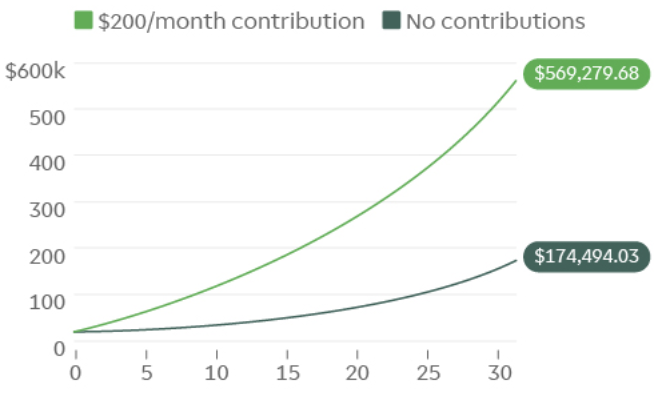

## Major Tenants of Personal Finance

### Set a Goal and Measure It Continuously

> "If you can not measure it, you can not improve it."- Lord Kelvin

First step is to create a plan and state the financial goals you want. Whether the goal is to maintain or elevate your lifestyle, save for a large purchase and/or retirement, make a plan and write it down. Some of the below tenants aid in developing such a plan. However, just making a goal is not enough; you have to make an effort to continuously track your financial efforts in order to maintain progress towards your goal. Tools & apps like [Mint](https://www.mint.com/) are very useful in tracking finances, though sometimes even a basic spreadsheet is sufficient. 

### Save More, Spend Less

> "It's not how much money you make, but how much money you keep..."- Robert T. Kiyosaki

The most basic tenant of personal finance is to seriously consider what's worth spending money on in your life and what you're willing to sacrifice to meet a certain goal. However, you don't have to live like a monk and never go out with friends to meet a savings goal. The amount you save per month should be a consideration of how much income you bring in, how much you spend on essential items (mortgage/rent, food, utilities, etc.) and how much of the difference between the two you're willing to stash away in savings (savings being a general term here for any investment or savings vehicle). Once that amount is figured out, it may be useful to automate the transfer to your savings every month to more easily stick to your goals.

### Savings Should At Least Counteract Inflation

You also need to know that just saving and putting aside money is usually not enough; if money is being kept in checking or low-APY savings accounts (or worse, cash stuffed under the bed...), you'll actually lose money in the long run due to [inflation](https://en.wikipedia.org/wiki/Inflation) (which slowly devalues the dollar as time goes on). Historically, inflation rates have averaged ~3% per year; that's not a large number but over 20 years, this means prices about double. Thus, even if someone wants to just save money, there exists a need to invest that money such that it at least bucks inflation.

### Contribute Early & Often

> "Compound interest is the eighth wonder of the world. He who understands it, earns it... He who doesn't... pays it."- Albert Einstein

One can achieve exponential growth with compounding interest simply by leaving money sit in moderately returning vehicles and continual reinvestment and contributions. For example, with a principal initial investment of \$10,000 and a 10% annual rate of return, the total balance of the investment after 30 years would be worth almost \$175,000 (not accounting for inflation). With continual \$200 per month contributions, the value jumps to over \$569,000:

So the other major factor that stands out to profitable investments is time; it's always better to save as much as you can when you're young (to give your investments more time to grow) but it's never too late to start. This also plays a factor into the opportunity cost of certain financial decisions.

### Minimize Fess & Taxes

Not only do fees take money away from your current savings, but more importantly they eat away from your potential earnings (similar compounding interest applies to profits and expenses equally). Some ways to minimize common fees and taxes:
* Utilize a brokerage that has low/no fees for trades and/or other investment operations (e.x. [Robinhood](https://robinhood.com/))
* Stay away from funds with high administrative fees or expenses
* Maximize employer-matched 401(k) plans as they are not only free money but are tax advantaged
* Minimize capital gain taxes by being long in most investments; for example, currently the IRS has a [1 year holding period](https://www.investopedia.com/terms/h/holdingperiod.asp), after which an investment is deemed a long-term investment and any gains are taxed at a much more favorable rate than short term gains. Even more extreme is to avoid pattern day trading practices as a normal investor.

### Diversify Your Investment Portfolio

Don't put your eggs all in one basket. If you had all money in one stock and that stock tanks, that's it, game over. An easy way to diversify is to invest in index funds that diversify across companies in a certain sector. As well, combining assets that are negatively correlated (as in they move in opposite directions during market nominal market conditions) is a wise move; for instance, owning both stocks and bonds are good as typically when stocks go down, bonds go up, and vice versa.

### Manage Risk

In general, risk is directly related to return; the higher the risk, the higher the possible return on an investment. However, risk is also directly related to potential loss. Strategies like portfolio diversification and statistical analysis are some tools to balance risk and return.

### Go Long

> “By periodically investing in an index fund…the know-nothing investor can actually outperform most investment professionals.”- Warren Buffett

Besides minimizing fees- as discussed above- holding onto investments for a long time (>1 year) is generally advisable as, statistically speaking, there is [regression toward the mean](https://en.wikipedia.org/wiki/Regression_toward_the_mean) with investment vehicles; this is the phenomenon where over time, the rate of return will come closer to the expected average, rather than an extreme high or low.

## References
