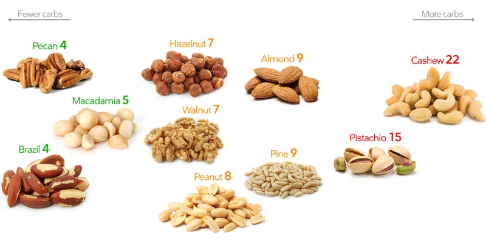

## General Tips

* Caloric restriction is the fundamental piece of weight loss
  + For instance, though not necessarily healthy, a [professor lost 27 pounds on a purely Twinkie diet](https://www.cnn.com/2010/HEALTH/11/08/twinkie.diet.professor/) to prove this point
  + [The average American diet](https://www.youtube.com/watch?v=Phq3xkZOchE) doesn't leave much room for calorie deficit, and to no one's surprise, [it's harder to burn calories than to eat them](https://www.youtube.com/watch?v=cQuh6ppyoew).
* Stress is the source of so many bad physiological factors, including weight gain. Try to reduce stress and be happy. Focus on your mental health before focusing on your physical health.
* Having a plan, and planning ahead, makes you more likely to be successful. Meal prepping, counting calories and logging progress are all keys to success.
* Get 7-8 hours of sleep per night
* Exercise is part of a healthy lifestyle. It's not only great for weight loss, general health or as a fun hobby, it can also help in unexpected ways like [treating depression](https://discover.dc.nihr.ac.uk/content/signal-000711/aerobic-exercise-is-an-effective-treatment-for-depression)
  + [General advice for adults](https://www.mayoclinic.org/healthy-lifestyle/fitness/expert-answers/exercise/faq-20057916) is to try and fit in 150 minutes of exercise per week (e.x. 3x days of 50 minutes of exercise). If aiming for weight loss, or muscle/performance increases, this should be increased to 300 minutes per week, or even more.
* Drink lots of water (between 1/2 - 1 gallon, or roughly 2 - 4 liters) for health & weight loss benefits
  + It was found that [drinking 17 oz (500 mL) of water at one time increased metabolism by 24-30%](https://www.healthline.com/nutrition/how-much-water-should-you-drink-per-day#section2)
  + Drinking cold water may be beneficial as your body needs to expend calories to heat it up
  + Drinking 17 oz (500 mL) of water before meals can also reduce the amount of calories you eat as you feel more satiated

## Exercise

### General Tips

* Intermix weight lifting, high-intensity interval training (HIIT), and low-intensity/long-duration cardio in your overall workout plan as each has its own benefits and changing things up shocks the body
  - Also for weight lifting, intermix heavy lift days/exercises (low repetition count but high weight) with high-rep/lower-weight
* Keep your heart rate up during exercise
  - Limiting rest between workouts/sets greatly helps here
  - Monitor your heart rate during cardio (long-duration and HIIT, or even weight lifting) to ensure you're within your goals
* Increasing physical activity can be greatly improved by your everyday, non-exercise choices like:
  - parking further away from work/shopping
  - skipping the elevator and taking the stairs
  - going out and walking more
  - getting a standing desk for work
  - fun outdoor activities

## Keto Diet

The Keto diet is essentially a diet where you severely reduce, or remove, carbohydrates from your diet to allow your body to start using fats as a fuel source; it's not just a low carb diet (where you're overall reducing your body's fuel source) its also a higher fat content to still have energy, but adapting your body to use fat as an energy source.

The goal is to be on a keto diet long enough to be fat adapted where your body preferentially uses fat as a fuel source. To become fat adapted, it can be as short as 6 weeks of following a keto diet to switch your body into that state.

### Keto Benefits

* Increased cognitive function
* Fat loss
* Increased physical endurance
* Lower insulin and stable blood sugar levels
* Muscle and metabolism preservation

### Macros

Macros are the ratios of protein, fat and carbs in your diet that you try to maintain to get into, or maintain, ketosis. Note for fat loss, keeping to these macros are not enough, you still need to follow the caloric restriction necessary for your body and goals. Some example macro ranges are:
- **Fat:** 70-80%
- **Protein:** 20-40%
- **Carbs:** 0-10%

However, it's suggested to set your goals more precisely using a [Keto calculator](https://www.ruled.me/keto-calculator/) which has more knobs for your certain scenario.

Also note that insoluble fiber is great for digestion, but soluble fiber can actually start to act like a carbohydrate, so don't go overboard with fiber and it's generally suggested to not count "Net Carbs" (where a food's fiber content can subtract the amount of carbohydrates it has) to keep a low carb count.

### Good Foods/Drinks for Keto

* Water, and lots of it. Since you usually store a lot of water with carbohydrates, you are likely losing a lot of water when on keto.
  + As well, you often lose a lot of electrolytes (leading to things like the "keto flu") so make sure to add salt to a lot of your food.
    - In fact, adding salt to the water you drink throughout the day can also help
* Caffeine and coffee are great, not only for the energy, but can stimulate the ketosis process
* Nuts are a healthy source of fat, but be careful on which kinds as some have lots of carbs:

_Image from: https://www.dietdoctor.com/low-carb/keto/nuts_
* **Vegetables:** Asparagus, bok choy, cabbage and broccoli

#### Mediterranean Keto


 

 

* `30 mL` of Olive Oil (no trans fats)
* High Omega-3's from non-predatory fish (e.g. avoiding fish like swordfish)
  + On non-fish days, supplement w/9G of salmon oil, 3x per day
* Unlimited calorie diet as long as carbs `< 30g` to simulate "free-living condition"

## Intermittent Fasting

Intermittent Fasting (IF) is when you have a set, extended period of time when you are not eating (fasting) and a consolidated period of consuming all of your calories. It can be used with any diet- like Keto, paleo, vegan, etc.- as IF is not a diet but a time frame for calorie consumption and restriction.

### Benefits


 

* Weight loss while not losing muscle
* [Less appetite](https://www.sciencedaily.com/releases/2019/07/190724103702.htm)
* Mental sharpness/focusing due to fasting "survival mode" and ketone production which is brain fuel
* Cellular rejuvenation and nutrient up-tick that can lead to healthier skin & nails
* All-around long lasting health benefits, see [Effects of Intermittent Fasting on Health, Aging, and Disease](https://www.nejm.org/doi/full/10.1056/NEJMra1905136) _The New England Journal of Medicine_

### IF Tips

* Fast at least 16 hours a day- 16 hours is the minimum to be in a fasted state and get benefits-, and work your way up to a 20 hour fast for exponential benefits
  + A common time-frame is to fast from when you wake up until dinner time, that way your feeding window ends around when you expect to go to bed
  + [Prolonged fasting](#long-term-fasting) (24+ hours) can have increased mental benefits but decreased physical benefits. These may be beneficial to do every other month or so for cellular rejuvenation purposes.
  + Dry fasting, where not drinking or eating during your fast, is extreme (don't do more often than every 3 or 6 months) but is where your body burns extra fat to create molecular water from the stored cells
* Work out in a fasted state rather than during your feeding window to burn a significant amount of fat
  + For instance, working out when you wake up in the morning when you're in the middle of your fast
    - Note you can also work out towards the end of your fasting window but you may see your performance/energy decrease, however this may increase your insulin sensitivity which can be beneficial if you're focused on gaining muscle
      + A good plan is to do your heaviest lifting day (e.g. deadlifts, squats, etc.) on a fasting day
    - Also working out right after you eat may not be as great either since a lot of your blood is being sent to your digestive system to break down the food you just ate
  + Weight lifting while fasting is also great, not only to buck any potential muscle loss, but more muscle means an increased metabolism
* IF does not lead to muscle loss, rather it can actually have an even greater effect. See [Effects of eight weeks of time-restricted feeding (16/8) on basal metabolism, maximal strength, body composition, inflammation, and cardiovascular risk factors in resistance-trained males](https://translational-medicine.biomedcentral.com/articles/10.1186/s12967-016-1044-0), _Journal of Translational Medicine_
* Shocking the body by not fasting some days- while still keeping to your overall diet & caloric goals- and then IF, you may increase results in fat loss
  + If IF becomes a norm, you're body's used to it and you may see plateaus. From there, you need to break up IF days with non-fasted days to shock your body.
  + Another shock would be to throw in a prolonged fast (24-48 hours) every month or so
  + Doing the hard way can yield the best benefits like [Why magician Penn Jillette fasts 23 hours a day to maintain his 100-pound weight loss](https://www.latimes.com/health/la-he-penn-jillette-weight-loss-20190615-story.html)
* Drinking alcohol while fasting can be bad as your body prioritizes metabolizing the alcohol before anything else, so you will at least see reduced results as your liver will not burn fat as effectively. Drink alcohol after you've already broken your fast.

### Long Term Fasting

* Fasting 48-72 hours at a frequency of once per month can be useful for long term health benefits _and_ weight loss
  + IF is mainly a caloric restriction mechanism
  + Long term fasting (> 48 hours) increases cell autophagy and other longevity effects. It even helps [with stretch marks when losing weight](https://youtu.be/xvxo77kSsjM).
* Before fasting it will be helpful to hydrate, sodium load, and do 4-5 days of keto/low-carb
* During long term fasting you can consume: water (+ salt to help revive electrolytes), black coffee, unsweetened tea, and apple cider vinegar.
  + Low intensity workouts during a long term fast are OK, but high intensity may negate some of the positive fasting effects
* To break a long fast, eat non-inflamatory things like lean meat

 

 

### Things You Can Eat/Drink While Fasting

* Lots of water, of course
* Black coffee or green tea with caffeine is great during fasts. However it should be with no sweeteners, creamers or additives. The caffeine also really helps the autophagy and overall feeling you have while fasting, see [Coffee induces autophagy in vivo](https://www.ncbi.nlm.nih.gov/pmc/articles/PMC4111762/), _Journal Cell Cycle_
  + Avoid supplements like pre-workout, BCAAs, vitamins in oil or anything with calories to not break a fast. Rather consume them during your feeding period to also be easier to digest

### How to Break Your Fast

* Fats & protein (e.g. keto) or carbs & proteins are fine, **however, don't mix fats & carbs after a fast** since you are hyper insulin sensitive after a fast
* Consume a higher fiber and higher fat meal before starting fast to feel more satiated but not affect metabolic effects
* Bone broth can help rebalance the gut biome after a fast
* Make sure to still get the right nutrients during your feeding period
* Still consistently stick to the amount of calories you otherwise would consume in whatever diet you're following (e.g. avoid binge eating) and not to eat too few calories
  + Sticking to the amount of required calories to your diet is also key to not slowing down your metabolism, which correlates directly with less calories eaten
  + In some cases, fasting actually increases metabolism, see [A controlled trial of reduced meal frequency without caloric restriction in healthy, normal-weight, middle-aged adults](https://academic.oup.com/ajcn/article/85/4/981/4648934), _The American Journal of Clinical Nutrition_

## Videos


 

 
