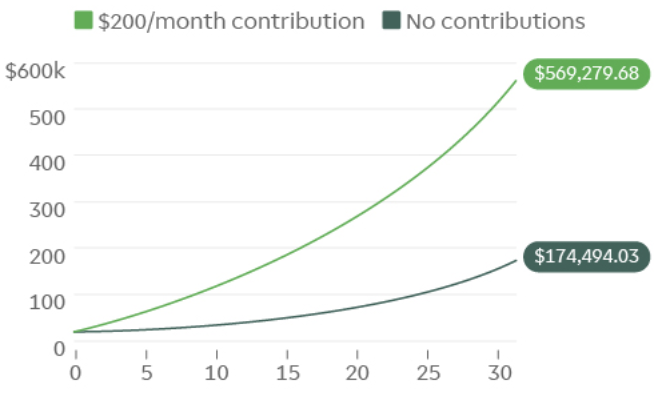

## Major Tenants of Savings and Investment

### tl;dr

* [Set a Goal and Measure It Continuously](#set-a-goal-and-measure-it-continuously)
* [Save More, Spend Less](#save-more-spend-less)
* [Savings Should At Least Counteract Inflation](#savings-should-at-least-counteract-inflation)
* [Contribute Early & Often](#contribute-early--often)
* [Minimize Fess & Taxes](#minimize-fess--taxes)
* [Diversify Your Investment Portfolio](#diversify-your-investment-portfolio)
* [Manage Risk](#manage-risk)
* [Go Long](#go-long)
* [Remove Emotions From Investing](#remove-emotions-from-investing)

### Set a Goal and Measure It Continuously

> "If you can not measure it, you can not improve it."- Lord Kelvin

First step is to create a plan and state the financial goals you want. Whether the goal is to maintain or elevate your lifestyle, save for a large purchase and/or retirement, make a plan and write it down. Some of the below tenants aid in developing such a plan. However, just making a goal is not enough; you have to make an effort to continuously track your financial efforts in order to maintain progress towards your goal. Tools & apps like [Mint](https://www.mint.com/) are very useful in tracking finances, though sometimes even a basic spreadsheet is sufficient.

An example goal could be to retire early, in which case you might want your savings assets to reach a point where they are worth 25x your average yearly expenses (e.g. known as the [Trinity Study](https://en.wikipedia.org/wiki/Trinity_study)).

### Save More, Spend Less

> "It's not how much money you make, but how much money you keep..."- Robert T. Kiyosaki

The most basic tenant of personal finance is to seriously consider what's worth spending money on in your life and what you're willing to sacrifice to meet a certain goal. However, you don't have to live like a monk and never go out with friends to meet a savings goal. The amount you save per month should be a consideration of how much income you bring in, how much you spend on essential items (mortgage/rent, food, utilities, etc.) and how much of the difference between the two you're willing to stash away in savings (savings being a general term here for any investment or savings vehicle). Once that amount is figured out, it may be useful to automate the transfer to your savings every month to more easily stick to your goals.

### Savings Should At Least Counteract Inflation

You also need to know that just saving and putting aside money is usually not enough; if money is being kept in checking or low-APY savings accounts (or worse, cash stuffed under the bed...), you'll actually lose money in the long run due to [inflation](https://en.wikipedia.org/wiki/Inflation) (which slowly devalues the dollar as time goes on). Historically, inflation rates have averaged ~3% per year; that's not a large number but over 20 years, this means prices about double. Thus, even if someone wants to just save money, there exists a need to invest that money such that it at least bucks inflation.

### Contribute Early & Often

> "Compound interest is the eighth wonder of the world. He who understands it, earns it... He who doesn't... pays it."- Albert Einstein

One can achieve exponential growth with compounding interest simply by leaving money sit in moderately returning vehicles and continual reinvestment and contributions. For example, with a principal initial investment of \$10,000 and a 10% annual rate of return, the total balance of the investment after 30 years would be worth almost \$175,000 (not accounting for inflation). With continual \$200 per month contributions, the value jumps to over \$569,000:

Besides saving money and personally contributing money into your investments, its also wise to consider investments that have high dividend yields; besides the opportunity for fixed income investing (where your income can come directly from dividend payouts), high dividends can be reinvested into more investments, further accelerating compounding returns.

So the other major factor that stands out to profitable investments is time; it's always better to save as much as you can when you're young (to give your investments more time to grow) but it's never too late to start. This also plays a factor into the opportunity cost of certain financial decisions. In essence, it's moot to try and "time" the market when buying or selling (it's been proven time and again that even professionals cannot accurately time the market, and even if you did, holding investments for the long run [shows little deviation in overall returns, so market timing barely matters even for the perfect investor](https://www.schwab.com/resource-center/insights/content/does-market-timing-work)); it's generally advisable to just make contributions as early as possible.

### Minimize Fess & Taxes

Not only do fees take money away from your current savings, but more importantly they eat away from your potential earnings (similar compounding interest applies to profits and expenses equally). Some ways to minimize common fees and taxes:
* Utilize a brokerage that has low/no fees for trades and/or other investment operations (e.x. [Robinhood](https://robinhood.com/))
* Stay away from investments (e.x. mutual funds, ETFs, managed accounts, etc.) with high administrative fees or expenses
  + Double-check the Expense Ratio (the % per year of your holdings in the fund you have to pay to cover "management") before buying and other factors of a vehicle such as dividend yield (which may offset expenses in some cases).
* Maximize employer-matched 401(k) plans as they are not only free money but are tax advantaged
  + Also on the topic of 401(k)'s- or even IRAs- is whether to contribute to a traditional (tax deferred to when distributed) or Roth (tax paid immediately on contribution); the choice is usually down to your expected future tax rate. If you think you'll pay a _lower_ tax rate in retirement (e.g. less income than present or speculation on tax rates) than a _traditional_ account might be better. If you think you'll pay a _higher_ tax rate in retirement (e.x. someone who's currently younger and thinks they will be in a higher tax bracket later in life) than a _Roth_ account might be better. Either way, the important part is to continually contribute, and some people even contribute to both kinds, further hedging risk or tax outcomes.
* Minimize capital gain taxes by being long in most investments; for example, currently the IRS has a [1 year holding period](https://www.investopedia.com/terms/h/holdingperiod.asp), after which an investment is deemed a long-term investment and any gains are taxed at a much more favorable rate than short term gains. Even more extreme is to avoid pattern day trading practices as a normal investor. Those who trade the most often [have been found to have lower returns than those who just stay long](https://onlinelibrary.wiley.com/doi/10.1111/0022-1082.00226).

### Diversify Your Investment Portfolio

Don't put your eggs all in one basket. If you had all money in one stock and that stock tanks, that's it, game over. An easy way to diversify is to invest in index funds that diversify across companies in a certain sector. As well, combining assets that are negatively correlated (as in they move in opposite directions during market nominal market conditions) is a wise move; for instance, owning both stocks and bonds are good as typically when stocks go down, bonds go up, and vice versa.

### Manage Risk

In general, risk is directly related to return; the higher the risk, the higher the possible return on an investment. However, risk is also directly related to potential loss. Strategies like portfolio diversification and statistical analysis are some tools to balance risk and return. In order of risk- and thus potential return-, from highest to lowest, typical investment vehicles range from individual stocks -> ETFs/mutual funds -> bonds/bond-ETFs -> cash. An aggressive portfolio might have 90%-10% mix of stocks to bonds respectively, whereas a very conservative portfolio (say an older person nearer retirement) might have a mix of 40% stocks, 55% bonds and 5% cash.

### Go Long

> “By periodically investing in an index fund…the know-nothing investor can actually outperform most investment professionals.”- Warren Buffett

Besides minimizing fees- as discussed above- holding onto investments for a long time (>1 year) is generally advisable as, statistically speaking, there is [regression toward the mean](https://en.wikipedia.org/wiki/Regression_toward_the_mean) with investment vehicles; this is the phenomenon where over time, the rate of return will come closer to the expected average, rather than an extreme high or low.

### Remove Emotions From Investing

> “(Be) fearful when others are greedy and greedy when others are fearful”- Warren Buffett

It's important to keep a clear head in this investment strategy; it's pretty much guaranteed that, at some point, some stocks- or even your entire portfolio- will see a large decline. In those scenarios do not let emotions or fears take precedence over sound financial decisions. The folly of many investors is in [prematurely reacting to market dips and leaving markets/investments in a lower state than if they just waited out whatever event was happening](https://www.fool.com/investing/2018/03/28/this-is-precisely-why-timing-the-market-isnt-worth.aspx). Again, don't try and time the market but [just give your investments time to grow](https://www.putnam.com/literature/pdf/II508-ac37f7ad02b2d8889f7e5361f0e8ac86.pdf)! There will always seem like there's some doomsday recession coming around the corner, yet [time and again the market shows returns that counteract](https://books.google.com/books?id=wAblMinB3UMC&pg=PA77&lpg=PA77&dq=stock+market+performance+watergate+cuban+missile&source=bl&ots=lXZmz3h8HB&sig=ACfU3U3VBwAdXbACZVpE23FKsbV58xBNyg&hl=en&sa=X&ved=2ahUKEwiNrY3lxP7jAhWKLHwKHbhAD2U4ChDoATAAegQICRAB#v=onepage&q&f=false) so don't react to market volatility.

## References

* TD Ameritrade Education Resources
