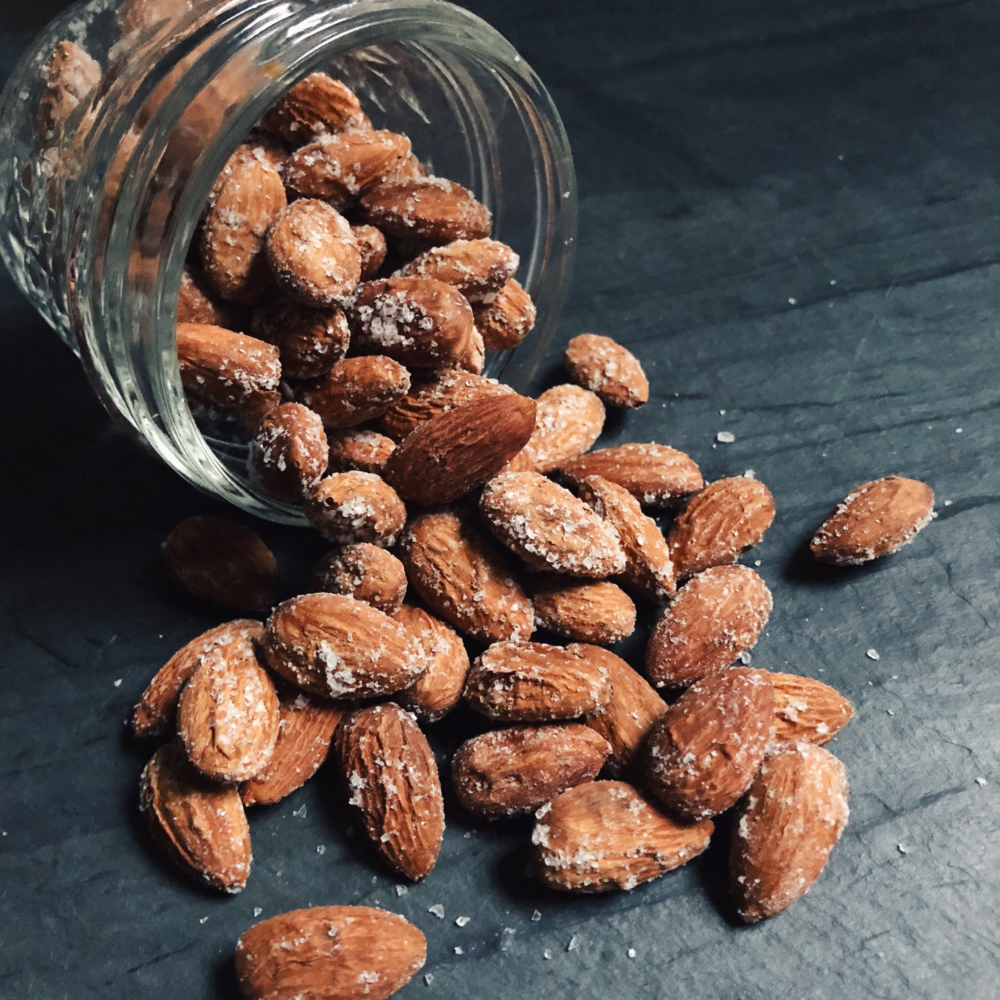

## Basics

### Sauces

#### Best Grocery Store Sauces & Condiments

* Marie's Super Blue Cheese Dressing (in the refrigerated/veggie section)

## Snacks

### Salt and Vinegar Nuts

 

  
<b>Ingredients</b>

Makes 4 servings:
* [ ] 1 cup raw almonds (or other nuts like cashews)
* [ ] 1/2 cup distilled vinegar
* [ ] Salt

**Nutrition (Per Serving)**

| Calories | Carbs | Protein | Fat   |
|----------|-------|---------|-------|
| 170      | 6.0g  |  6.0g   | 15.0g |

  
<b>Instructions</b>

1. Combine nuts and vinegar in a bowl, and soak for 3-4 hours.
2. Remove nuts from bowl and dry with paper towel (save soaking vinegar for later). Place on a baking sheet.
3. Roast nuts in a 350 °F oven for 20-25 minutes (or until golden brown), stirring half way through.
4. Let nuts cool for 5 minutes then quickly place nuts in soaking vinegar, and drain once more.
5. Pat nuts dry with paper towel. Sprinkle nuts with salt to taste.

## Breakfast

### Hard Boiled Eggs & Turkey Bacon

 

  
<b>Ingredients</b>

Makes 1 serving:
* [ ] 4 large eggs
* [ ] 4 slices of thick Turkey Bacon

**Nutrition (Per Serving)**

| Calories | Carbs | Protein | Fat   |
|----------|-------|---------|-------|
| 400      | 0.0g  | 48.0g   | 24.0g |

  
<b>Instructions</b>

1. Add eggs to a pot and cover with 1-2" of cold water (use more water if boiling more eggs at once).
2. Bring water to rolling boil, then turn off the heat.
3. Let the pot sit for 10-12 minutes, then remove eggs and cool (run cold water or add to ice bath).
4. Pan fry (or even microwave) turkey bacon slices.

### Simple Egg, Cheese & Sausage Breakfast Casserole

 

  
<b>Ingredients</b>

Makes 5 servings:
* [ ] 2 cup shredded cheese (e.g. cheddar, colby jack, etc.)
* [ ] 18 large eggs
* [ ] 1 lb ground breakfast/pork sausage
* [ ] Salt & pepper for seasoning

**Nutrition (Per Serving)**

| Calories | Carbs | Protein | Fat   |
|----------|-------|---------|-------|
| 770      | 7.8g  | 46.6g   | 62.7g |

  
<b>Instructions</b>

1. Preheat oven to 375 °F. Cook breakfast sausage for about 10 min, breaking apart while cooking.
2. In large bowl, whisk together eggs, heavy cream, 1/4 cup of cheese, sausage and seasoning.
3. Add mixture to greased casserole dish and bake for 30 minutes, or until eggs are set and cheese is melted.

## Sandwiches

### Italian Hoagie

 

  
<b>Ingredients</b>

Makes 1 serving/sandwich:
* [ ] 1 hoagie roll (~8-10 in)
* [ ] 2 tbs mayo
* [ ] 3 slices provolone cheese
* [ ] 3 slices each of pepperoni, salami & capocollo (can sub any other 3 italian meats as well)
* [ ] 1/2 cup thinly sliced iceberg lettuce
* [ ] 1/2 cup thinly sliced red onion
* [ ] 2 thin tomato slices
* [ ] 5 pickle chips
* [ ] 7 pickled banana pepper slices
* [ ] 1 tbs dried oregano
* [ ] 1 tbs olive oil
* [ ] 3 tbs vinegar
* [ ] Pinch of salt & pepper

**Nutrition (Per Serving)**

| Calories | Carbs | Protein | Fat   |
|----------|-------|---------|-------|
| 1121     | 57.5g | 51.6g   | 75.3g |

  
<b>Instructions</b>

1. Slice the roll in the middle, lengthwise, but not all the way through. Take some of the soft, inner bread out to make more room for the ingredients.
2. Spread mayo on one side of the bread, and then layer cheese, and then all meats evenly across the inside of the bread. At this point if you wanted a hot sub, you could bake in a 350 °F oven for 10-15 min (until cheese is melted and bread is toasted).
3. Add tomato & onion slices, pickles and pepper slices in even layers in the sub.
4. In a separate bowl, mix together the lettuce, oregano, olive oil, vinegar, salt and pepper. Then layer inside of sub.

## Chicken

### Greek Lemon Chicken & Potatoes


 

  
<b>Ingredients</b>

Makes 4 servings:
* [ ] 1 whole chicken (cut up) or 4 pounds bone-in, skin-on chicken thighs
* [ ] 3 russet potatoes, quartered
* [ ] 1 tbs salt
* [ ] 1 tps ground pepper
* [ ] 1 tps dried rosemary
* [ ] 1 tbs dried oregano
* [ ] 1 pinch cayenne
* [ ] 6 garlic cloves, minced
* [ ] 2 tbs capers (optionally added)
* [ ] 1/2 cup lemon juice
* [ ] 1/2 cup olive oil
* [ ] 2/3 cup chicken broth (can substitute with water)

**Nutrition (Per Serving)**

| Calories | Carbs | Protein | Fat   |
|----------|-------|---------|-------|
| 512      | 32.3g | 17.5g   | 35.7g |

  
<b>Instructions</b>

1. Add all ingredients but the chicken broth to a large bowl and combine to sauce & season the chicken and potatoes.
2. Place chicken (skin side up) and potatoes in large roasting pan. Drizzle left-over sauce from bowl on top.
3. Bake in 425 °F oven for 45 minutes, or until chicken is cooked, tossed halfway through (keep skin side up).
4. Transfer chicken to serving pan. Toss potatoes in sauce then return pan to oven to broil for a few minutes to form crust.
5. Transfer potatoes to serving pan. Add chicken broth (or water) to roasting pan and mix to create sauce, taste for seasoning. Drizzle sauce over chicken and potatoes.

### Buffalo Chicken Dip (Party Size)

  
<b>Ingredients</b>

Makes **16** servings:
* [ ] 2 package (8 oz) cream cheese, softened
* [ ] 1 rotisserie chicken shredded (discard bones & skin)
* [ ] 1 cup buffalo wing hot sauce
* [ ] 1 cup blue cheese salad dressing
* [ ] 4 cups shredded Colby-Monterey Jack cheese (can substitute with any other cheese)

**Nutrition (Per Serving)**

| Calories | Carbs | Protein | Fat   |
|----------|-------|---------|-------|
| 431      |    4g | 19.1g   | 37.4g |

  
<b>Instructions</b>

1. Preheat oven to 350 °F. Spread cream cheese on bottom of shallow baking pan.
2. In a separate bowl mix together the chicken, buffalo sauce, blue cheese, and 1/4 of the shredded cheese.
3. Spread the bowl mixture evenly into the baking pan and cover with the remainder of shredded cheese.
4. Bake uncovered in oven for 20-25 minutes, or until cheese topping is browned.

## Beef 

### Beef & Broccoli 



  
<b>Ingredients</b>

Makes **4** servings:
* [ ] 2 lbs flank steak
* [ ] 1/2 cup beef stock 
* [ ] 4 cups chopped broccoli 
* [ ] 1 tsp baking soda
* [ ] 2 tsp cornstarch 
* [ ] 3 cloves garlic 
* [ ] 2 tbs vegetable oil
* [ ] 1/4 cup Oyster sauce 
* [ ] 2 oz rice wine 
* [ ] 2 tbs sesame oil 
* [ ] 2 tbs soy sauce 
* [ ] 4 cups cooked white rice

**Nutrition (Per Serving)**

| Calories | Carbs | Protein | Fat   |
|----------|-------|---------|-------|
| 747.9    | 58.4g | 56.1g   | 28.4g |

  
<b>Instructions</b>

1. Microwave broccoli for 1-2 min 
2. In a small bowl, whisk together soy sauce, sesame oil, 1 tsp of cornstarch, and baking soda.
3. Slice beef into strips, against the grain. Add to bowl with marinade from previous step, and let sit for at least 20 min.
4. In another bowl, stir together the beef stock, rice wine, oyster sauce and the remaining teaspoon of cornstarch, until dissolved to create the sauce.
5. Heat a wok or large skillet on high heat and add vegetable oil. Once hot, add marinated beef and garlic to pan. Stir fry for 1 min.
6. Add broccoli and stir fry for another minute.
7. Add the sauce and cook for one more minute, then serve.

## Soups, Stews & Chilis

### Chicken & Rice Soup 

  
<b>Ingredients</b>

Makes **5** servings:
* [ ] 2 tbs butter 
* [ ] 1 yellow onion
* [ ] 4 carrots 
* [ ] 1 celery bunch 
* [ ] 6 cloves garlic 
* [ ] 3.5 lbs chicken breast 
* [ ] 4 cups chicken stock (or water with bouillon)
* [ ] 2 cups dry long grain brown rice
* [ ] 2 Bay leaves
* [ ] Salt and pepper to taste

**Nutrition (Per Serving)**

| Calories | Carbs | Protein | Fat   |
|----------|-------|---------|-------|
| 710.8    | 68.1g | 80.1g   | 10.9g |

  
<b>Instructions</b>

1. Dice onion, carrots and celery in large chunks. Slice garlic thinly.
2. Add butter to a large stock pot and heat on medium-high heat. Once melted, add chicken.
3. Once chicken is slightly browned, add vegetables to pot, add salt & pepper, and mix.
4. After sweating vegetables, add stock to pot. Add the rice, bay leaves and turn the heat up to high.
5. Once the pot reaches a boil, turn the heat to low and simmer for 40 min, or until rice is fully cooked.

### Turkey Chili with Beans

  
<b>Ingredients</b>

Makes **5** servings:
* [ ] 2 tbs extra virgin olive oil
* [ ] 1.5 cups dry Red Kidney Beans
* [ ] 2 lbs 99% lean ground turkey 
* [ ] 1 yellow onion
* [ ] 6 cloves garlic 
* [ ] 4 tbs tomato paste
* [ ] 4 cups beef stock (or water with bouillon)
* [ ] 2 tbs cumin 
* [ ] 2 tbs red pepper flakes
* [ ] 2 tbs chili powder
* [ ] 1 tbs ground chipotle chili
* [ ] 1 tsp ground coriander
* [ ] 1 packet Goya Sazon
* [ ] 2 tbs hot sauce
* [ ] Salt and pepper to taste

**Nutrition (Per Serving)**

| Calories | Carbs | Protein | Fat   |
|----------|-------|---------|-------|
| 426.8    | 41.2g | 57.6g   |  7.9g |

  
<b>Instructions</b>

1. Add beans to a large bowl, cover with at least an inch of water, and soak overnight.
2. Dice onion and thinly slice garlic.
3. Add olive oil to a large stock pot and heat on medium-high heat. Once hot, add turkey to pot. Break up the ground turkey into golf-ball sized chunks.
4. Once turkey is browned, add vegetables, seasonings, hot sauce, and tomato paste to pot and cook until vegetables have softened.
5. Add beef stock and beans to pot, and bring to a boil, then lower heat to maintain a simmer.
6. Simmer for one hour, or until beans are cooked through.

### Egg Drop Soup



  
<b>Ingredients</b>

Makes **4** servings:
* [ ] 12 large eggs
* [ ] 4 cloves garlic, peeled and smashed
* [ ] 1 knob ginger, thick sliced
* [ ] 1 cup green onions, finely chopped
* [ ] 2 stalks green onion, chopped in a couple inch pieces
* [ ] 4 cups chicken stock (or water with bouillon)
* [ ] 2 tbs fish sauce 
* [ ] 4 tbs soy sauce
* [ ] 2 tbs cornstarch
* [ ] 1 tsp MSG
* [ ] Salt and white pepper to taste

**Nutrition (Per Serving)**

| Calories | Carbs | Protein | Fat   |
|----------|-------|---------|-------|
| 260.1    |  7.6g | 22.7g   | 15.8g |

  
<b>Instructions</b>

1. Crack eggs into a bowl, and beat well.
2. Add stock, garlic, ginger and the large cut green onion to a stock pot. Heat on medium-high.
3. While stock is heating, add cornstarch to a small bowl, with some water. Mix well to create a slurry.
4. Once stock is heated, add slurry mixture and mix well.
5. Season stock to taste with salt and white pepper. Add MSG.
6. Remove garlic, ginger and green onion from stock.
7. Once stock is almost boiling, slowly whisk in beaten eggs. Stir constantly for finer egg whisps.
8. Turn off heat and add finely chopped green onions.

### Korean Cabbage Soup

  
<b>Ingredients</b>

Makes 8 servings:
* [ ] 1 whole head of Napa Cabbage, chopped into 1" square pieces
* [ ] 2 leeks, chopped into 1" square pieces
* [ ] 1 yellow onion, cut into large chunks
* [ ] 8 cloves of garlic, minced
* [ ] 4 green onions, diced into 1" length pieces
* [ ] 4 tbs Better Than Bouillon Beef Base
* [ ] 4 tbs fish sauce
* [ ] 2 tbs sesame oil
* [ ] 2 tbs soy sauce
* [ ] 4 tbs gochujang

**Nutrition (Per Serving)**

| Calories | Carbs | Protein | Fat   |
|----------|-------|---------|-------|
| 81       | 16.8g |  3.4g   | 0.5g  |

  
<b>Instructions</b>

1. Add all cut vegetables to a large stock pot and add enough water to cover vegetables 1".
2. Bring to a boil and then add the rest of the ingredients.
3. Turn heat down to a simmer and cook for 30 more min or until cabbage is soft.

### One Pot Texas Chili

  
<b>Ingredients</b>

Makes 4 servings:
* [ ] 1 lb ground beef (80/20 ground chuck)
* [ ] 1 lb ground pork sausage
* [ ] 1 tbs olive oil
* [ ] 4 cups (32 oz) chicken broth
* [ ] 1 cup crushed tomatoes
* [ ] 2 poblano peppers, diced
* [ ] 3 jalapeno peppers, diced
* [ ] 3 garlic cloves, minced
* [ ] 2 tbs Goya Sofrito base
* [ ] 1 tbs onion powder
* [ ] 4 tbs hot chili powder
* [ ] 1 tbs cayenne powder
* [ ] 1 tbs Tajin
* [ ] 1 tbs cumin
* [ ] 10 shakes of hot sauce
* [ ] salt & pepper to taste

**Nutrition (Per Serving)**

| Calories | Carbs | Protein | Fat   |
|----------|-------|---------|-------|
| 843      | 14.9g | 49.5g   | 65g   |

  
<b>Instructions</b>

1. Add olive oil to large stock pot and brown meat. As meat cooks, break up into golf-ball sized chunks. Add onion powder, hot chili powder, cayenne powder, Tajin, cumin, hot sauce, some salt and pepper while cooking.
2. Once meat is browned, add peppers, garlic and Sofrito and cook for 4 min.
3. Add chicken broth and crushed tomatoes and bring to boil.
4. Reduce to simmer and cook uncovered for 1 hr.
5. Break up meat and taste for spice and salt.

### Greek Lemon Chicken Orzo Soup

  
<b>Ingredients</b>

Makes 8 servings:
* [ ] Greek seasoning (see below or use off the shelf)
* [ ] 1 rotisserie chicken shredded (discard bones & skin)
* [ ] 1 package (16 oz) of Orzo pasta
* [ ] 4 cans (10-3/4 oz each) condensed cream of chicken soup
* [ ] 5 cups whole milk (adjust to 2% if preferred)
* [ ] 1/4 cup lemon juice

Greek Seasoning:
* [ ] 2 tsp salt
* [ ] 2 tsp garlic powder
* [ ] 2 tsp dried basil
* [ ] 2 tsp dried oregano
* [ ] 1 tsp black pepper
* [ ] 1 tsp dried parsley
* [ ] 1 tsp dried rosemary
* [ ] 1 tsp dried marjoram
* [ ] 1/2 tsp dried thyme
* [ ] 1/2 tsp ground nutmeg

**Nutrition (Per Serving)**

| Calories | Carbs | Protein | Fat   |
|----------|-------|---------|-------|
| 569      | 61.1g | 34.4g   | 20.2g |

  
<b>Instructions</b>

1. Cook orzo according to package directions.
2. In separate medium sized stock pot, add cream of chicken and milk (pour portions of milk into each can to help get any leftovers) and bring to simmer over medium heat.
3. Add Greek seasoning mixture, shredded chicken and cooked orzo to pot.
4. Mix in lemon juice, adjust for taste and seasoning.

## Fish & Shellfish

### Salmon, Rice & Broccoli

  
<b>Ingredients</b>

Makes **1** serving:
* [ ] 1 cup broccoli florets 
* [ ] 1 cup cooked brown rice
* [ ] 6.5 oz wild caught Sockeye Salmon fillet
* [ ] Seasoning of choice (e.g. Old Bay, salt & pepper, curry powder, etc.)

**Nutrition (Per Serving)**

| Calories | Carbs | Protein | Fat   |
|----------|-------|---------|-------|
| 489.8    | 50.5g | 48.2g   | 10.2g |

  
<b>Instructions</b>

1. Season salmon and cook in a 350 °F oven or air fryer for 12-15 minutes, or until salmon is cooked through.
2. Plate with brown rice and broccoli.

### Italian Tuna Salad

  
<b>Ingredients</b>

Makes 5 servings:
* [ ] 5 (5 oz) Tuna cans in water, drained (skipjack preferred over albacore due to mercury content)
* [ ] 1.5 cup [avocado mayo](https://www.youtube.com/watch?v=r8Kixk74bwo) (regular mayo can be substituted)
* [ ] 1 small red onion, minced
* [ ] 6 pickle spears, diced
* [ ] 1 cup pickled banana pepper rings, diced
* [ ] 1 lemon, juiced
* [ ] 5 tbs extra virgin olive oil
* [ ] 2 tbs balsamic (or red wine) vinegar
* [ ] 2 tbs garlic powder
* [ ] 2 tbs dried oregano
* [ ] Salt and pepper to taste

**Nutrition (Per Serving)**

| Calories | Carbs | Protein | Fat   |
|----------|-------|---------|-------|
| 780      | 4.0g  | 36.4g   | 67.5g |

  
<b>Instructions</b>

1. Combine all ingredients in bowl.

## Vegetables

### Greek Salad



  
<b>Ingredients</b>

Makes **4** servings:
* [ ] 4 cups lettuce, chopped
* [ ] 2 large English cucumbers
* [ ] 4 Roma tomatoes, cut into eighths
* [ ] 2 cups halved cherry tomatoes
* [ ] 1 red onion, thinly sliced
* [ ] 1 cup banana peppers
* [ ] 1 cup sliced olives
* [ ] 1/4 cup capers
* [ ] 6 oz crumbled feta cheese
* [ ] 1/4 cup extra virgin olive oil
* [ ] 3 tbs red wine vinegar
* [ ] 2 garlic clove, minced
* [ ] 1 teaspoon Dijon mustard
* [ ] 2 tbs oregano
* [ ] Salt and pepper to taste

**Nutrition (Per Serving)**

| Calories | Carbs | Protein | Fat   |
|----------|-------|---------|-------|
| 260.1    |  7.6g | 22.7g   | 15.8g |

  
<b>Instructions</b>

1. Combine olive oil, vinegar, garlic, mustard, oregano, salt and pepper in a small bowl to form the dressing.
2. Combine all other ingredients in a large bowl and top with dressing.

