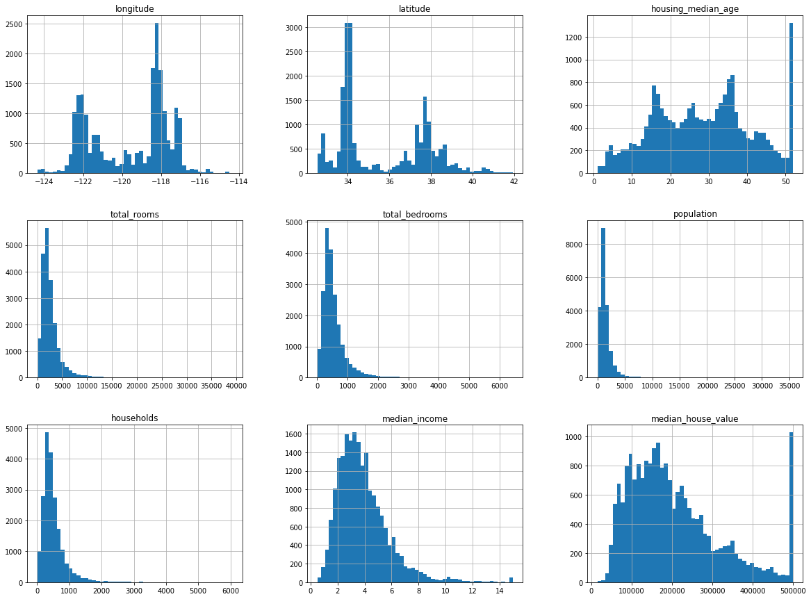

Here we'll use housing price dataset from the 1990 CA census from StatLib repository which contains metric such as population, income, and housing price for each block group (the smallest geographical unit for which the census publishes sample data, typically 600 to 3,000 people). Our goal is for our ML model to accurately predict the median housing price in any district, given all other metrics.

## Model Approach

Since we are given _labeled_ training examples (accurate census sample data which gives the expected output- median housing price- for each set of features), we can conclude that this is definitely a **supervised learning** task. Since we are looking to predict a value, it is a regression task, but more specifically, a **multiple regression** proble, since we need to consider multiple features to make the output prediction (e.g. features like population, median income, etc.). It is also considered a _univariate regression_ problem since we only need to predict a single value for each district; conversely if we needed to predict multiple values, it would be a _multivariate regression_ problem. Finally, since data is not continuously streaming into the system and the dataset is small enough to fit in memory, **batch learning** is fine for this model.

### Performance Measure

Typical for regression problems, we will use the Root Mean Square Error (RMSE) measurement to give an idea of how much error the system is making with predictions at any given time. RMSE is calculated by:
$$ RMSE(\boldsymbol{X},h) = \sqrt{ \frac{1}{m} \sum^{m}_{i=1} \left (h(\boldsymbol{x}^{(i)}) - y^{(i)} \right )^{2} } $$

Where: 
* $m$ is the number of samples in the dataset being currently measured
* $\boldsymbol{x^{(i)}}$ is a vector of all feature values (excluding label, $y^{(i)}$) of the i-th instance in the dataset
  + For instance, if a district in the dataset has a longitude location of -118.29deg, latitude of 33.91deg, population of 1416, and a median income of \\$38,372 - with the label/median house value of \\$156,400- then the vector and label would look like:
  $$ \boldsymbol{x^{(i)}} = \begin{pmatrix}
  -118.29 \\
  33.91 \\
  1416 \\
  38372
  \end{pmatrix} $$
  $$ y^{(1)} = 156400 $$
* $\boldsymbol{X}$ is the matrix containing all feature values (excluding labels) for all instances in the dataset, which with the above example values, looks like:
$$ \boldsymbol{X} = \begin{bmatrix}
<p style="font-family:monospace; white-space:pre-wrap">
 \left ( \boldsymbol{x^{(1)}} \right )^{T} \\
 \left ( \boldsymbol{x^{(2)}} \right )^{T} \\
 \vdots \\
 \left ( \boldsymbol{x^{(N)}} \right )^{T} \\
</p>
   \end{bmatrix}
   = \begin{pmatrix} -118.29 & 33.91 & 1416 & 38372 \\
<p style="font-family:monospace; white-space:pre-wrap">
                  \vdots & \vdots & \vdots & \vdots \end{pmatrix} $$
</p>
* $h$ is the system's prediction function (aka _hypothesis_); it's the system's output given a feature vector $\boldsymbol{x}^{(i)}$, $\hat{y}^{(i)}=h(\boldsymbol{x}^{(i)})$

Once could use another performance function which measures deltas between the prediction vectors and target value vectors, called Mean Absolute Error (MAE):
$$ MAE(\boldsymbol{X},h) = \frac{1}{m}\sum^{m}_{i=1}\left | h(\boldsymbol{x}^{(i)} - y^{(i)}  \right | $$

These various distance measures are also called _norms_:
* Computing RMSE corresponds to the _Euclidean norm_, or the $\ell_{2}$ norm, denoted colloquially as $\begin{Vmatrix} \cdot \end{Vmatrix}$ (or $\begin{Vmatrix} \cdot \end{Vmatrix}_{2}$ more specifically)
* Computing MAE correspongs to the _Manhattan norm_ (because it can measure the distance between two city points where you can only travel in orthogonal blocks), or the $\ell_{1}$ norm, denoted $\begin{Vmatrix} \cdot \end{Vmatrix}_{1}$

In general, the $\ell_{k}$ norm of a vector $\boldsymbol{v}$ containing $n$ elements is defined as:
$$ \begin{Vmatrix} v \end{Vmatrix}_{k} = \left ( |v_{0}|^{k} + |v_{1}|^{k} + \dotsb + |v_{n}|^{k} \right )^{1/k} $$
The higher the norm index, the more it focuses on large values and neglects small ones, hence why RMSE is more sensitive to outliers than MAE, however when outliers are exponentially rare, RMSE performs very well and is preferred.


## Dataset Creation


### Dataset Download

Here we will download the comma-separated values (CSV) file that contains our housing dataset, and load it into memory using `pandas`.


```python
import os
import tarfile
import urllib
import pandas as pd

DL_FOLDER    = "https://raw.githubusercontent.com/ageron/handson-ml2/master/"
HOUSING_PATH = os.path.join("datasets", "housing")
HOUSING_URL  = DL_FOLDER + "datasets/housing/housing.tgz"

# create function to easily download & extract housing dataset tarball
def fetch_housing_data(housing_url=HOUSING_URL, housing_path=HOUSING_PATH):
    os.makedirs(housing_path, exist_ok=True)
    tgz_path = os.path.join(housing_path, "housing.tgz")
    urllib.request.urlretrieve(housing_url, tgz_path)
    housing_tgz = tarfile.open(tgz_path)
    housing_tgz.extractall(path=housing_path)
    housing_tgz.close()
    
def load_housing_data(housing_path=HOUSING_PATH):
    csv_path = os.path.join(housing_path, "housing.csv")
    return pd.read_csv(csv_path)
    
fetch_housing_data() # download now
housing = load_housing_data()
housing.describe() # show a summary of the numerical attributes
```


<div>
<style scoped>
<p style="font-family:monospace; white-space:pre-wrap">
.dataframe tbody tr th:only-of-type {
    vertical-align: middle;
}
</p>

<p style="font-family:monospace; white-space:pre-wrap">
.dataframe tbody tr th {
    vertical-align: top;
}
</p>

<p style="font-family:monospace; white-space:pre-wrap">
.dataframe thead th {
    text-align: right;
}
</p>
</style>
<table border="1" class="dataframe">
  <thead>
<p style="font-family:monospace; white-space:pre-wrap">
<tr style="text-align: right;">
  <th></th>
  <th>longitude</th>
  <th>latitude</th>
  <th>housing_median_age</th>
  <th>total_rooms</th>
  <th>total_bedrooms</th>
  <th>population</th>
  <th>households</th>
  <th>median_income</th>
  <th>median_house_value</th>
</tr>
</p>
  </thead>
  <tbody>
<p style="font-family:monospace; white-space:pre-wrap">
<tr>
  <th>count</th>
  <td>20640.000000</td>
  <td>20640.000000</td>
  <td>20640.000000</td>
  <td>20640.000000</td>
  <td>20433.000000</td>
  <td>20640.000000</td>
  <td>20640.000000</td>
  <td>20640.000000</td>
  <td>20640.000000</td>
</tr>
<tr>
  <th>mean</th>
  <td>-119.569704</td>
  <td>35.631861</td>
  <td>28.639486</td>
  <td>2635.763081</td>
  <td>537.870553</td>
  <td>1425.476744</td>
  <td>499.539680</td>
  <td>3.870671</td>
  <td>206855.816909</td>
</tr>
<tr>
  <th>std</th>
  <td>2.003532</td>
  <td>2.135952</td>
  <td>12.585558</td>
  <td>2181.615252</td>
  <td>421.385070</td>
  <td>1132.462122</td>
  <td>382.329753</td>
  <td>1.899822</td>
  <td>115395.615874</td>
</tr>
<tr>
  <th>min</th>
  <td>-124.350000</td>
  <td>32.540000</td>
  <td>1.000000</td>
  <td>2.000000</td>
  <td>1.000000</td>
  <td>3.000000</td>
  <td>1.000000</td>
  <td>0.499900</td>
  <td>14999.000000</td>
</tr>
<tr>
  <th>25%</th>
  <td>-121.800000</td>
  <td>33.930000</td>
  <td>18.000000</td>
  <td>1447.750000</td>
  <td>296.000000</td>
  <td>787.000000</td>
  <td>280.000000</td>
  <td>2.563400</td>
  <td>119600.000000</td>
</tr>
<tr>
  <th>50%</th>
  <td>-118.490000</td>
  <td>34.260000</td>
  <td>29.000000</td>
  <td>2127.000000</td>
  <td>435.000000</td>
  <td>1166.000000</td>
  <td>409.000000</td>
  <td>3.534800</td>
  <td>179700.000000</td>
</tr>
<tr>
  <th>75%</th>
  <td>-118.010000</td>
  <td>37.710000</td>
  <td>37.000000</td>
  <td>3148.000000</td>
  <td>647.000000</td>
  <td>1725.000000</td>
  <td>605.000000</td>
  <td>4.743250</td>
  <td>264725.000000</td>
</tr>
<tr>
  <th>max</th>
  <td>-114.310000</td>
  <td>41.950000</td>
  <td>52.000000</td>
  <td>39320.000000</td>
  <td>6445.000000</td>
  <td>35682.000000</td>
  <td>6082.000000</td>
  <td>15.000100</td>
  <td>500001.000000</td>
</tr>
</p>
  </tbody>
</table>
</div>


```python
# render plots within notebook itself
%matplotlib inline 
import matplotlib.pyplot as plt

housing.hist(bins=50, figsize=(20,15))
plt.show()
```


    

    


Note that in the above histogram plots, there are a couple important points:
* `median_income` values were normalized to values between 0.5 and 15 (e.g. a value of 3 is equivalent to about \\$30k). This preprocessing is fine, and common in ML tasks.
* `housing_median_age` and `median_house_value` values are capped, which may cause an issue since the house value is our target attribute (label), and you don't want the ML model to learn that prices never go above that limit.
* Attributes have very different scales, which we'll need to tackle with feature scaling.
* Many of the plots are _tail-heavy_ (the distribution of values is not symmetrical about the mean) which can be difficult for some ML algorithms to detect patterns.

### Creating Test Set

Creating a test set could be as simple as picking some random subset of the dataset (usually around 20%, or less with larger datasets) and set them aside:


```python
import numpy as np

def split_train_test(data, test_ratio):
    shuffled_idx  = np.random.permutation(len(data))
    test_set_size = int(len(data) * test_ratio)
    test_idx      = shuffled_idx[:test_set_size]
    train_idx     = shuffled_idx[test_set_size:]
    return data.iloc[train_idx], data.iloc[test_idx]
```


```python
train_set, test_set = split_train_test(housing, 0.2)
print("Training dataset size: %d" % len(train_set))
print("Testing dataset size: %d" % len(test_set))
```

<p style="font-family:monospace; white-space:pre-wrap">
Training dataset size: 16512
Testing dataset size: 4128
</p>


While the above works, each time you run the code, a different test data set is generated; over time this means your model will see the whole dataset, which you want to avoid. One way to prevent this would be to set the random number generator's seed (e.x. `np.random.seed()`) before calling `np.random.permutation()`.


