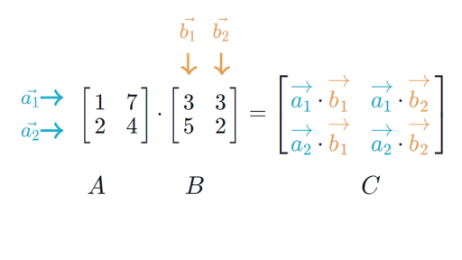

## Overview

### Notation and Types

- **Scalars:** a single value/number, usually denoted with lowercase variable letters, also specified with what type of number; for instance, a real-valued scalar $$s$$ can be shown as: $$ s \in \mathbb{R} $$

- **Vectors:** a one-dimensional array of numbers, typically shown in bold lowercase variables like:
$$ \boldsymbol{x} = \begin{bmatrix}
  x_{1} \\
  x_{2} \\
  \vdots \\
  x_{n}
\end{bmatrix} $$
  + To say each element of the above vector is real, with $$n$$ elements, the vector lies in the set formed by $$n$$ times the Cartesian product or $$ \boldsymbol{x} \in \mathbb{R}^{n} $$
  + To index a set of elements of the vector- for instance elements $$x_{1}, x_{3} \text{ and } x_{6}$$- we can define a set $$ S = {1,3,6}$$ and denote the subset of $$\boldsymbol{x}$$ for those elements as $$\boldsymbol{x}_{S}$$. As an inverse, to exclude a set of indices of a vector with a given set, one can denote $$\boldsymbol{x}_{-S}$$ which is the vector containing all elements except $$x_{1}, x_{3} \text{ and } x_{6}$$.
- **Matrices:** a 2-D array of numbers, denoted by a variable with bold & capitalized typeface such as:
$$\boldsymbol{A}= \begin{bmatrix}
  A_{1,1} & A_{1,2} \\
  A_{2,1} & A_{2,2}
\end{bmatrix}$$
where the subscript numbers of each element identify the 2-D position within the matrix.
  + A real-valued matrix $$\boldsymbol{A}$$ with a height of $$m$$ and width $$n$$ can be shown as $$\boldsymbol{A} \in \mathbb{R}^{m\times n}$$
  + A "$$:$$" symbol can be used to identify a cross section of a matrix in one dimension; for instance, to index all elements in the first row of the matrix $$\boldsymbol{A}$$, we can use the notation $$\boldsymbol{A}_{1,:}$$
  + $$f\left( \boldsymbol{A} \right)_{i,j}$$ gives element $$(i,j)$$ of the matrix computed by applying the function $$f$$ to $$\boldsymbol{A}$$
- **Tensors:** in arrays with more than two dimensions/axes, tensors can be used with the typeface $$\boldsymbol{\mathsf{A}}$$
  + The element at coordinates $$(i,j,k)$$ of the tensor $$\boldsymbol{\mathsf{A}}$$ is $$\mathsf{A}_{i,j,k}$$

### Vector and Matrix Operations

- **Transpose:** for a matrix, the transpose is the mirror image of the matrix across the _main diagonal_ line, running from the top left corner to the bottom right. The transpose operation of a matrix $$\boldsymbol{A}$$ is shown as $$\boldsymbol{A}^\intercal$$
  + Since vectors are essentially 1-D matrices with one column, the transpose of a vector is a matrix with only one row. Similarly, we can write a vector as a row vector, and then turn it into a column vector with a transpose, as $$\boldsymbol{x} = \left[ x_{1}, x_{2}, x_{3} \right]^\intercal$$

<i><a href="https://en.wikipedia.org/wiki/Transpose">Source: Transpose- Wikipedia</a></i>

- **Scalar Addition/Multiplication:** scalars can be simply added, subtracted, multiplied or divided into a matrix by performing the operation with the scalar on each element of the matrix. For instance, to multiply a matrix $$\boldsymbol{D}$$ by scalar $$a$$ and add by scalar $$c$$:

$$ a \cdot D_{i,j} + c $$

- **Matrix Addition:** matrices can be added together if they have the same dimensions/shape by simply adding their corresponding elements:

$$ \boldsymbol{C} = \boldsymbol{A} + \boldsymbol{B} \text{ where } C_{i,j} = A_{i,j} + B_{i,j}$$

- **Vector Broadcasting:** a simplification found in some deep learning writings shows the simple addition of a matrix and a vector, yielding another matrix, for instance $$ \boldsymbol{C} = \boldsymbol{A} + \boldsymbol{b} \text{, where } C_{i,j} = A_{i,j} + b_{j}$$. This denotes the vector $$\boldsymbol{b}$$ is added to each row of the matrix $$\boldsymbol{A}$$, which is shorthand for an implicit step of defining another intermediate matrix with vector $$\boldsymbol{b}$$ copied in each row before performing the addition.

- **Dot Product:**

- **Vector & Matrix Multiplication:**
  + In matrix multiplication, the order of operations matter, as well as the matrix sizes; given two matrices, $$\boldsymbol{A} \in \mathbb{R}^{m\times n}$$ and $$\boldsymbol{B} \in \mathbb{R}^{n\times p}$$, the matrix multiplication $$\boldsymbol{C} = \boldsymbol{A} \times \boldsymbol{B}$$ results in output matrix $$\boldsymbol{C} \in \mathbb{R}^{m\times p}$$. This shows two important properties of matrix multiplication:
    1. The inner dimensions of both matrices (number of columns in first matrix operand, and number of rows in second matrix operand) must be equal.
    2. The output matrix size matches the dimensions of the outer sizes of both matrix arguments (the number of rows in first matrix operand by the number of columns in the second matrix operand).
  + As another example, when multiplying a 1x3 row vector with a 3x1 column vector, a scalar (1x1) is the result, but when the operands are reversed, a 3x3 matrix is the result:

$$\begin{bmatrix} 2 & 3 & 4 \end{bmatrix} \times \begin{bmatrix} 6 \\ 4 \\ 3 \\ \end{bmatrix} = 36, \quad \begin{bmatrix} 2 \\ 3 \\ 4 \end{bmatrix} \times \begin{bmatrix} 6 & 4 & 3 \end{bmatrix} = \begin{bmatrix} 12 & 8 & 6 \\ 18 & 12 & 9 \\ 24 & 16 & 12 \end{bmatrix}$$

<i><a href="https://www.khanacademy.org/math/precalculus/x9e81a4f98389efdf:matrices/x9e81a4f98389efdf:multiplying-matrices-by-matrices/a/multiplying-matrices">Source: Multiplying matrices- Khan Academy</a></i>

## References

* [Deep Learning Book- Linear Algebra](https://www.deeplearningbook.org/contents/linear_algebra.html)
* [The Matrix Cookbook](https://www.math.uwaterloo.ca/~hwolkowi/matrixcookbook.pdf)
