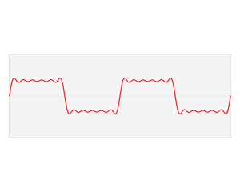

## Overview

**Digital Signal Processing (DSP)** provides a means for analyzing & constructing signals in the digital domain, often done in digital hardware or in software; as opposed to the analog domain, the continual progression of smaller and faster digital hardware allows for signal processing systems that are often cheaper, more reliable and even more adaptable than their hard-wired analog counterpart. Albeit practical, these benefits can sometimes come at the cost of precision due to the nature of converting between analog and digital domains. In practice though, intelligent application of DSP concepts can reduce these distortion effects, and in some cases, actually improve & condition the signal for an intended purpose.

### Signals

A **signal** is a pretty general term; it can describe a set of data pertaining to almost any sort of application or industry- from the electrical signal passing internet bits around to stock ticker prices driving world markets. **Systems** process signals by modifying, passing and/or extracting information from them.

$$ E_{x} = \int_{-\infty}^{\infty} \left | x(t) \right | ^{2} dt $$

Fundamentally a **signal** is any quantity that varies with one or more independent variables- like voltage changing over time. A signal may or may not be able to be mathematically or functionally defined; for example, the natural waveform from recorded music. In the rest of the discussion time is used for discussion of common signals but can be replaced with any other independent variable. **Frequency** is inversely related to the period of a signal ($$f=1/T$$). Common periodic signals that vary with time ($$t$$) can be described with three time-varying attributes: amplitude ($$A$$), frequency ($$f$$) and phase ($$\theta$$). For example a basic sinusoid: \$\$x(t)=A\cos(\Omega t + \theta ),  -\infty < t < \infty $$

Where $$\Omega$$ is the frequency in (radians/sec) and related to Hz frequency, $$f$$, (cycles/sec) by the simple conversion $$\Omega=2\pi f$$. Note a periodic signal satisfies the criteria $$x(t)=x(t \pm nT)$$ where $$n$$ is any integer number. It's also important to describe sinusoids in complex exponential form, also known as a **phasor**: \$\$x(t)=Ae^{j(\Omega t + \theta)} $$ 

Which given the Euler identity \$\$ e^{\pm j \phi}=\cos \phi \pm j\sin \phi$$

Gives \$\$ x(t)=A\cos (\Omega t + \theta) = \frac{A}{2}e^{j(\Omega t + \theta)} + \frac{A}{2}e^{-j(\Omega t + \theta)} $$

Since the goal of DSP is to operate on signals within the digital domain, to deal with real/natural, analog signals we must digitize them; the common component that accomplishes this is unsurprisingly called an **Analog to Digital Converter** (ADC or A/D Converter). Most ADCs operate on electrical signals which come from a transducer or other electrical source. The inverse of an ADC is a **Digital to Analog Converter** (DAC or D/A Converter) which takes digital signals and produces an analog signal as an output. The conversion chain from analog to digital also provides an opportunity to explain further signal classifications, starting with continuous time vs discrete time signals.

### Continuous Time vs Discrete Time

**Continuous Time** signals are synonymous with real analog signals. They take on defined values for the continuous interval $$-\infty < t < \infty$$ such as the signal $$x(t)=\cos(\pi t)$$. **Discrete Time** signals have value only in certain instances of time, usually as a finite set of equidistant time intervals for easier calculations. For example the previous continuous time signal can be represented as a discrete time signal $$x(n)=\cos(\pi n)$$ where $$n = 0, \pm 1, \pm 2,...$$

Similarly to the periodic definition of continuous time signals, a discrete time signal is periodic when $$x(n)=x(n + N)$$ where the smallest value of $$N$$ that holds true is the fundamental period. A sinusoidal signal with frequency $$f_{0}$$ is periodic when: \$\$ \cos \left [ 2\pi f_{0}(N+n) + \theta \right ] = \cos ( 2\pi f_{0} n + \theta ) $$

Since there's the trigonetric identity that any sinusoid shifted by an integer multiple of $$2\pi$$ is equal to itself (e.g. $$\cos(x)=cos(x \pm 2\pi N)$$, we can reduce the discrete time sinusoid relation to having some integer $$k$$ such that: \$\$2\pi f_{0} N = 2\pi k \therefore f_{0}=\frac{k}{N}$$

The same identity (sinusoids seperated by an integer multiple of $$2\pi$$ are identical) expressed $$\cos(\omega_{0}n + \theta)=\cos(\omega_{0}n + 2\pi n + \theta)$$ means that when frequency
$$ \left | \omega  \right | > \pi $$ 
(or $$ \left | f \right | > \frac{1}{2} $$) the sequence is indistinguishable- called an **alias**- from a sinusoid with frequency $$ \left | \omega \right | < \pi $$. Thus discrete time sinusoids have the finite fundamental range of a single cycle $$1f$$ or $$2\pi$$ radians; usually this is given as a range $$ -\pi \leq \omega \leq \pi $$, $$ 0 \leq \omega \leq 2\pi $$, $$ -\frac{1}{2} \leq f \leq \frac{1}{2}$$, or $$ 0 \leq f \leq 1$$.

In an ADC, the process of converting a signal from continuous time to discrete time is **sampling** and is commonly done at some regular sampling interval $$T$$ which is inverse of the sampling frequency $$ f_{s}=1/T $$. Continuous and discrete time are related in ideal, uniform sampling via $$ t = nT = \frac{n}{f_{s}} $$
Thus, sampling a sinusoidal signal gives: \$\$ x(t) = A\cos(2\pi f_{0}t + \theta) \overset{sampled}{\rightarrow} x(nT) \equiv x(n) = A\cos(\frac{2\pi f_{0}n}{f_{s}} + \theta) $$

Given the expression for this discrete time sampled sinusoid, the frequency $$f = \frac{f_{0}}{f_{s}}$$; substituting this frequency into the aforementioned fundamental range $$-\frac{1}{2} \leq f \leq \frac{1}{2}$$ yields: \$\$ -\frac{f_{s}}{2} \leq f_{0} \leq \frac{f_{s}}{2}$$.

This is an important assertion that means the frequency of a continuous time analog signal must be $$\leq$$ half the sampling frequency to be uniquely distinguished (and not aliased). Furthermore, the highest frequency discernible $$f_{max}=\frac{f_{s}}{2}$$.

The problem with alias signals can be demonstrated with the sinusoids:

\$\$ x_{1}(t) = \cos(10\pi t) $$

\$\$ x_{2}(t) = \cos(50\pi t) $$

Sampled at $$f_{s}=20 Hz$$, the discrete time output signals are:

\$\$ x_{1}(n) = \cos(\frac{10}{20}\pi n) = \cos(\frac{\pi}{2}n)$$

\$\$ x_{2}(n) = \cos(\frac{50}{20}\pi n) = \cos(\frac{5\pi}{2}n)$$

Given $$ \cos(5\pi n /2) = \cos(2\pi n + \pi n/2) $$, and again, integer multiples of $$2\pi n$$ can be reduced out, $$x_{1}(n) \equiv x_{2}(n)$$ and thus $$x_{2}(n)$$ is aliased as an indistinguishable signal from $$x_{1}(n)$$. Therefore, to prevent the problem of aliasing, a proper sampling frequency must be chosen to satisfy the highest frequency content found in a signal: \$\$ f_{s} > 2f_{max} $$

This is known as the **Nyquist Sampling Criterion**.

### Continuous Value vs Discrete Value

Similarly to continuous time, a signal is of **Continuous Value** if it can have any value, whether in a finite or infinite range; for instance, a certain voltage may realistically fall within the finite range of 0V to 5V but would be continuous value signal if it can take the value of _any_ real voltage within that range (e.g. 2.31256...V). Conversely, a **Discrete Value** signal can only be within a finite set of values within a finite range (e.g. 1V integer levels within a 10V range). The process in an ADC of converting a continuous value, discrete time signal (output from the sampler) into a discrete value, discrete time signal is called **quantization**. A signal that is discrete in both time and value is considered a **digital signal**.

## Linear Convolution

> Visual comparison of convolution, cross-correlation and autocorrelation. From [Wikipedia](https://en.wikipedia.org/wiki/Convolution#Properties)

### Continuous-Time Convolution 

A fundamental operation in signal processing is [**convolution**](https://en.wikipedia.org/wiki/Convolution). When a function $$f$$ is convolved with another function $$g$$, a third output function $$f*g$$ expresses how the shape of one is modified by the other. Convolution is defined as the integral of the product of both functions, after one function is reversed and shifted; for example, in continuous time this is written as:

$$ (f * g)(t) = \int_{-\infty}^{\infty} f(\tau)g(t - \tau) \, d\tau $$

Convolution is also [_commutative_](https://en.wikipedia.org/wiki/Commutative_property), thus the above equation can also be expressed as:

$$ (f * g)(t) = \int_{-\infty}^{\infty} f(t - \tau)g(\tau) \, d\tau $$

A common convolution is that of a signal, $$f(t)$$, with a filter $$g(t)$$, to form a filtered output signal $$y(t)$$. 

$$ y(t) = f(t) * g(t) $$

Geometrically, the convolution process can be seen as:
1. Forming a time-reversed image $$g(-\tau)$$ of the filter function $$g(\tau)$$, where $$\tau$$ is a dummy variable.
2. Sliding $$g(-\tau)$$ across the signal function $$f(\tau)$$ with a specific delay $$t$$.
3. At each delay position $$t$$, the integral of the product of $$g(t - \tau)$$ and the part of the signal $$f(\tau)$$ covered by the filter. This integral is also called the _inner-product_ (or dot product).

Another property of convolution is that it is a _linear_ operation; the _superposition principle_ means that the convolution of the sum of input signals is equal to the sum of the individual convolutions. For instance, the equivalence can be shown with two input signals $$s_{1}(t)$$ and $$s_{2}(t)$$ to be convolved with a filter $$h(t)$$, where $$\alpha$$ and $$\beta$$ are arbitrary constants:

$$\left[ \alpha s_{1}(t) + \beta s_{2}(t) \right] * h(t) = \alpha s_{1}(t) * h(t) + \beta s_{2}(t) * h(t) $$

### Continuous-Time Correlation

[**Correlation**](https://en.wikipedia.org/wiki/Cross-correlation) (or sometimes noted as **cross-correlation**) is similar to convolution; it has the same geometrical property of a sliding inner-product, however the sliding function is not time reversed but instead, complex conjugated ($$^{*}$$).

$$ (f * g)(t) = \int_{-\infty}^{\infty} f^{*}(t)g(t + \tau) \, dt $$

Correlation is _not commutative_, however the equivalent of the above is:

$$ (f * g)(t) = \int_{-\infty}^{\infty} \overline{f(t - \tau)}g(t) \, dt $$

**NOTE:** the second equation shows another way to denote the complex conjugate operation, thus $$f^{*}(t)$$ and $$\overline{f(t)}$$ are equivalent.

Cross-correlation is commonly used for searching a long signal for a shorter, known feature.

## Transforms

### Fourier Series
The time domain function $$s(x)$$ is shown here as a sum of six sinusoids at different amplitudes but odd harmonic frequencies (approximating a square wave). The resulting Fourier transform $$S(f)$$ can be shown where the component sinusoiuds lie in the frequency domain and their relative amplitudes:

<i><a href="https://en.wikipedia.org/wiki/Trigonometry">Source: Trigonometry- Wikipedia</a></i>

## References

* [Linear Systems and Signals, Second Edition- B.P. Lathi](https://www.amazon.com/Linear-Systems-Signals-2nd-Lathi/dp/0195158334/ref=sr_1_3?ie=UTF8&qid=1541558585&sr=8-3&keywords=linear+signals+and+systems+lathi)
* [Digital Signal Processing Principles, Algorithms, and Applications, Fourth Edition- John G. Proakis, Dimitris G. Manolakis](https://www.amazon.com/Digital-Signal-Processing-John-Proakis-dp-0131873741/dp/0131873741/ref=mt_hardcover?_encoding=UTF8&me=&qid=1541468761)
* [Digital Signal Processing- MIT OCW](https://ocw.mit.edu/resources/res-6-008-digital-signal-processing-spring-2011/)
* [Linear Systems and Signals, 2nd Edition - B.P. Lathi](https://www.amazon.com/Linear-Systems-Signals-2nd-Lathi/dp/0195158334/ref=sr_1_3?ie=UTF8&qid=1541558585&sr=8-3&keywords=linear+signals+and+systems+lathi)
