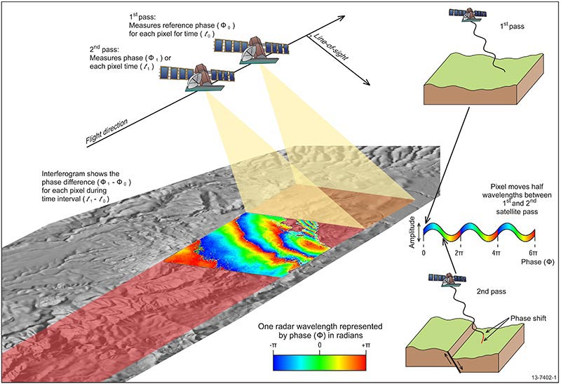

[](https://colab.research.google.com/github/JohnnyGOX17/john-gentile-website/blob/master/./kb/radar/00_Intro_to_SAR.ipynb)


Synthetic Aperture Radar (SAR) is the process of using specialized radar processing techniques for imaging. The "Synthetic Aperture" in SAR is so called due to the concept of creating the effect of a very long antenna using signal processing, along with aperture techniques similar to other optical engineering domains.

SAR is popular for remote sensing due to its four distinct principles:
1. An active SAR carries it's own illumination which means it can work equally well day or night.
2. Most common SAR frequencies can pass through clouds, smoke, and precipitation allowing imaging in adverse conditions. As well, some frequencies can even penetrate foliage or other materials.
3. Radio Frequency (RF) energy used in a SAR system scatters off materials in different ways than light; SAR can then be used as a complementary, or more discriminatory, information source with optical imaging.
4. SAR systems rely on complex phase information of the returned signals; not only can images be formed, but other important information such as target motion can be garnered from this data as well.

## SAR History

The most basic form of radar measures _range_ (by measuring time delay between signal transmission and reception of reflection from target/scatterer) and _direction_ (given knowledge of an antenna's pointing angle and directivity). The received Doppler shift can be used to measure a target's relative speed, but it was also found that Doppler could also be used to obtain finer resolution perpendicular to the beam direction. This concept is often credited to Carl Wiley of Goodyear Aerospace in 1951.

Since the raw collected radar data in a SAR system is unfocused, it takes further signal processing to turn into a usable image. Like a hologram, the essential information is contained in the phase of the data (a.k.a. phase history). Early systems used the principles of Fourier optics to transform phase history data recorded on film into images using lens that performed two-dimensional Fourier transforms and focusing. While novel, this analog process has been since replaced with digital processing and collection methods.

## Platforms

Most of the heritage of SAR technology was developed on aircraft, however it is commonly in use on spacecraft like [Capella Space satellites](https://www.capellaspace.com/):


## SAR Modes

**NOTE:** images from [Radartutorial website](https://www.radartutorial.eu/20.airborne/ab08.en.html)

- **Stripmap:** Here the antenna is held in a constant pointing direction, usually perpendicular to the path of travel. The beam sweeps across the ground in a contiguous strip. The length of the imaged strip is related to how far the sensor platform moves. The azimuth resolution is directly related to antenna length.

- **Scan:** In this mode, the antenna is scanned (either mechanically or electrically) in range several times during a synthetic aperture. This creates a wider image swath at the cost of degraded azimuth resolution. Azimuth resolution is equal to Stripmap mode's azimuth resolution times the number of swaths scanned.

- **Spotlight:** This is the highest resolution mode, however it images the least area during a given time interval. The azimuth resolution is improved by increasing the angular extent during a synthetic aperture by scanning the antenna to hold on a given area of interest.

- **Bistatic:** When the transmitter and receiver are co-located, or are part of the same platform, this is known as _monostatic_ operation. When the transmitter and receiver are at different locations, or on different platforms, this is known as _bistatic_.

- **Inverse SAR (ISAR):** In the above modes, it's assumed the target is stationary and the SAR platform is moving. However the principles of SAR also work in "inverse" where the target is in motion, while the radar system is static. An example is tracking satellites from a fixed ground-based radar. This can also be generalized to where both target and SAR platform are moving, such as on a ship in heavy seas being imaged by an airborne SAR.

- **Interferometric SAR (InSAR):** here extra post-processing is performed to extract features such as terrain height, or displacement, from complex SAR images. Commonly this is done as two complex SAR images acquired at the same spatial positions (differential InSAR) or slightly different positions (terrain height InSAR). These two complex images are then conjugate multiplied which gives an interferogram with contours of equal displacement/elevation.



```python

```
