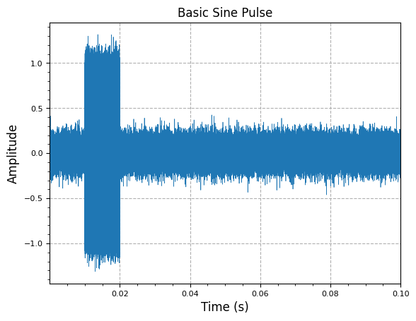
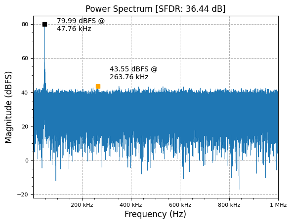

[](https://colab.research.google.com/github/JohnnyGOX17/john-gentile-website/blob/master/./kb/radar/Basic_Radar.ipynb)


```python
import random
import numpy as np

from rfproto import plot, impairments, sig_gen
```

Basic pulse of the form:

$$
 y(t) = A \cos ( 2\pi f t  + \phi) 
$$


```python
# time vector based on sampling frequency
fs       = 1e6  # sampling frequency (Hz)
rx_swath = 1e-1 # RX Swath length (seconds)
num_samp = int(np.ceil(fs * rx_swath))  # number of RX samples

# fast time vector
t = np.linspace(1,num_samp,num_samp)/fs
y = impairments.gaussian_noise(0.1, t)
y[int(0.1*num_samp):int(0.2*num_samp)] += sig_gen.cmplx_ct_sinusoid(1, 3e5, t[:int(0.1*num_samp)])
plot.time_sig(t, y.real, "Basic Sine Pulse")
plot.spec_an(y, fs, title="Power Spectrum")
```


<p style="font-family:monospace; white-space:pre-wrap">
(<Figure size 640x480 with 1 Axes>,
 <Axes: title={'center': 'Power Spectrum [SFDR: 36.44 dB]'}, xlabel='Frequency (Hz)', ylabel='Magnitude (dBFS)'>)
</p>


    

    


    

    


## References

* [Introduction to Radar Using Python and MATLAB](https://github.com/RadarBook/software)
