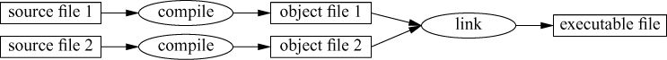



## The C++ Language

C++ has language facilities similar to the C language such as being a procedural programming language but is vastly different in many ways.


 

*[CppCon](https://www.youtube.com/channel/UCMlGfpWw-RUdWX_JbLCukXg) has great talks on new C++ features as well.*

### The Basics

The proverbial "Hello, World!" implementation in C++ introduces a few basic parts of the language:


#include <iostream>

int main()
{
  std::cout << "Hello, World!\n";
}


## Building C++ Programs

C++ must be compiled from source files into object files and then linked into an executable file.

C++ is a statically typed language in that every entity (i.e. object, name, value, etc.) must be known to the compiler at compile-time.

## C++ Libraries

* [Boost](http://www.boost.org/)
        + [The Boost C++ Libraries by Boris Schaling](https://theboostcpplibraries.com/)

## References

* [The Standard](https://isocpp.org/std/the-standard): website for the current and draft ISO C++ standards
* [The C++ Annotations by Frank B. Brokken](http://www.icce.rug.nl/documents/cplusplus/)
