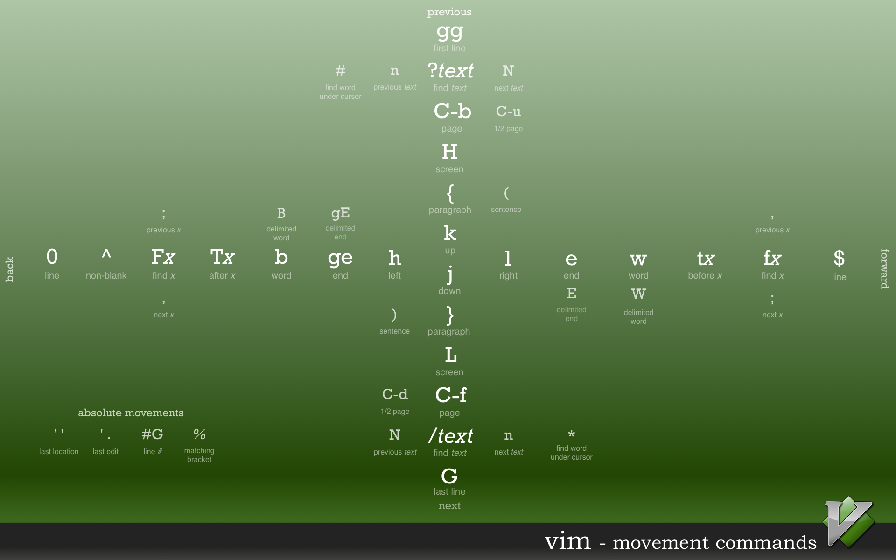

## Overview

> "Your problem with Vim is that you don't grok vi."- [StackOverflow (User Jim Dennis)](https://stackoverflow.com/questions/1218390/what-is-your-most-productive-shortcut-with-vim)

Vim is a modal text editor, meaning keystrokes and operations have different actions depending on the mode.

| Mode | Key(s) | Description |
|------|--------|-------------|
| Normal | <kbd>Esc</kbd> | Normal mode |
| Insert | <kbd>i</kbd> | **--INSERT--** Insert/edit text in traditional text editor sense|
| Command | <kbd>:</kbd> | Enter commands to execute |
| Visual | <kbd>v</kbd> | Enter visual mode |

_Note: You must be in Normal mode before going into other modes_

### Launching Vim

From the command line, one can open a set of files in a vertical (`-O`) or a horizontal (`-o`) split, and specify how many panes to split across by appending that to the command parameter; for instance, if a directory has 5 text files and we want to open them in 3 vertical panes, we can do so with:
`$ vim -O3 *.txt`

### Learning Vim

A good way to learn Vim is by launching the built-in `vimtutor` in your shell. Another is to play [VimGolf](http://www.vimgolf.com/) to try and optimize how few keystrokes are made to accomplish a given text processing task.


## Normal Mode

Typing a number before a motion repeats the motion that many times (i.e typing <kbd>3</kbd><kbd>w</kbd> moves the cursor 3 words forward and <kbd>d</kbd><kbd>2</kbd><kbd>w</kbd> deletes next 2 words).

### Navigation


_Credit for picture to [Ted Naleid](http://www.naleid.com/2010/10/04/vim-movement-shortcuts-wallpaper.html)_


Other common movement commands:

| Operation | Key(s) | Description |
|-----------|--------|-------------|
| Left/Down/Up/Right | <kbd>h</kbd>/<kbd>j</kbd>/<kbd>k</kbd>/<kbd>l</kbd> | Move cursor left, down, up or right respectively |
| Scroll Screen Up/Down | <kbd>Ctrl</kbd>+<kbd>b</kbd>/<kbd>Ctrl</kbd>+<kbd>f</kbd> |  |
| Scroll Half-Screen Up/Down | <kbd>Ctrl</kbd>+<kbd>u</kbd>/<kbd>Ctrl</kbd>+<kbd>d</kbd> |  |
| Move Screen Up/Down | <kbd>Ctrl</kbd>+<kbd>y</kbd>/<kbd>Ctrl</kbd>+<kbd>e</kbd> | Screen moves 1 line at a time w/o moving cursor |
| Current Line to Middle of Screen | <kbd>z</kbd><kbd>z</kbd> |  |
| Current Line to Top of Screen | <kbd>z</kbd><kbd>t</kbd> |  |
| Current Line to Bottom of Screen | <kbd>z</kbd><kbd>b</kbd> |  |
| Next Word Beginning/End | <kbd>w</kbd>/<kbd>e</kbd> | Move cursor to beginning/end of next word |
| Back a Word | <kbd>b</kbd> | Moves cursor back to start of last word |
| Move to Start of Line | <kbd>0</kbd> or <kbd>Home</kbd> | Move to Start of Line |
| Move to 1st Non-Blank Character in Line | <kbd>^</kbd> | Move to 1st Non-Blank Character in Line |
| Move to End of Line | <kbd>$</kbd> or <kbd>End</kbd> | Move to End of Line |
| Append After Cursor | <kbd>a</kbd> | Moves into Insert mode _after_ the cursor (whereas <kbd>i</kbd> inputs text before the cursor) |
| Append End of Line | <kbd>Shift</kbd>+<kbd>a</kbd> | Moves cursor to end of line and puts Vim in Insert mode |
| Insert at Start of Line | <kbd>Shift</kbd>+<kbd>i</kbd> | Moves cursor to beginning of line and puts Vim in Insert mode |
| Insert New Line Above/Below | <kbd>Shift</kbd>+<kbd>o</kbd>/<kbd>o</kbd> | Inserts a new line above/below the cursor and puts Vim in Insert mode |
| Display location in File and Status | <kbd>Ctrl</kbd>+<kbd>g</kbd> | Display location in file|
| Move to bottom of file | <kbd>Shift</kbd>+<kbd>g</kbd> | |
| Move to start of file | <kbd>g</kbd>,<kbd>g</kbd> | |
| Move to line number | `line_number`,<kbd>Shift</kbd>+<kbd>g</kbd> | Move to line number `line_number` |
| Exit & Write | <kbd>Shift</kbd>+<kbd>z</kbd>,<kbd>Shift</kbd>+<kbd>z</kbd> | Write file, if modified, and quit Vim |

### Copy/Paste

Copy commands start with <kbd>y</kbd>, and keys typed after designate what to copy, similar to navigation commands; for example, use <kbd>y</kbd>,<kbd>w</kbd> to yank a word. One can also enter Visual Mode (<kbd>v</kbd>) to select desired text to copy before hitting <kbd>y</kbd>. After which, text can be pasted using the put (<kbd>p</kbd>) command.

Other copy & paste examples:

| Operation | Key(s) | Description |
|-----------|--------|-------------|
| Copy (yank) Current Line | <kbd>y</kbd>,<kbd>y</kbd> | Copies current line |
| Put/Paste Text from Register | <kbd>p</kbd> | Put text in Vim's register (such as previously deleted or yanked text) after the cursor |
|  | <kbd>g</kbd>,<kbd>p</kbd> | Just like "p", but leave the cursor just after the new text. |

### Deletion

Delete commands start with <kbd>d</kbd>, and operate similar to other basic operations where keys after designate what to delete.

Other delete examples:

| Operation | Key(s) | Description |
|-----------|--------|-------------|
| Delete Character | <kbd>x</kbd> | Deletes character under cursor |
| Delete until Found Character | <kbd>d</kbd>,<kbd>f</kbd>,<kbd>character</kbd> | Deletes text until _character_ is found |
| Delete Word | <kbd>d</kbd>,<kbd>w</kbd> | Deletes until start of the next word (excluding first character) after cursor |
| Delete Word | <kbd>d</kbd>,<kbd>e</kbd> | Deletes until end of current word (including last character) after cursor |
| Delete Line | <kbd>d</kbd>,<kbd>d</kbd> | Delete entire line at cursor |
| Delete to End of Line | <kbd>d</kbd>,<kbd>$</kbd> | Delete to end of line after cursor |

### Changes and Reversals

Change commands start with <kbd>c</kbd>, and operate similar to other basic operations where keys after designate what to delete.

Other change examples:

| Operation | Key(s) | Description |
|-----------|--------|-------------|
| Change Word | <kbd>c</kbd>,<kbd>w</kbd> | Change rest of word after cursor and place in Insert mode |
| Change Inner Word | <kbd>c</kbd>,<kbd>i</kbd>,<kbd>w</kbd> | Change whole word (regardless of cursor position in word) and place in Insert mode |
| Change to End of Line | <kbd>Shift</kbd>+<kbd>c</kbd> | Same as <kbd>c</kbd>,<kbd>$</kbd> |
| Change Case | <kbd>~</kbd> | If in normal mode, changes the case of character at cursor but in visual mode with multiple selections changes the case of selected characters |


### Search, Find & Replace

| Operation | Key(s) | Description |
|-----------|--------|-------------|
| Find Character | <kbd>f</kbd>,<kbd>character</kbd> | Finds and positions cursor at _character_ |
| Search in File | <kbd>/</kbd> or <kbd>?</kbd> to search backwards| This opens a command line at the bottom of Vim where you can enter text, or regular expressions, to search for. Hit <kbd>n</kbd> to go to next find and <kbd>Shift</kbd>+<kbd>n</kbd> to search in the opposite direction. <kbd>Ctrl</kbd>+<kbd>o</kbd> goes back to original cursor position and <kbd>Ctrl</kbd>+<kbd>i</kbd> goes forward |
| See Search History | <kbd>q</kbd>,<kbd>/</kbd> | Shows past searches that you can select through and search again |
| _Search Commands_ | `:set ic hls is` | These commands allow for search to ignore exact case matching, to highlight matching values and to increment search respectively. Use `:set noic nohlsearch` to disable ignoring case and highlighting of matches respectively |
| Find Matching Bracket | <kbd>%</kbd> | Place cursor at any bracket and hit key to find matching bracket for types (), [], or {} |
| Replace Mode | <kbd>Shift</kbd>+<kbd>r</kbd> | Acts like Insert mode in other text editors in that every typed character is inserted and delets an existing character |

_For find & replace, see **Substitution** under the Command section_

### Undo, Reverse and Recording Commands

| Operation | Key(s) | Description |
|-----------|--------|-------------|
| Undo Last Edit | <kbd>u</kbd> | Undoes last operation (like <kbd>Ctrl</kbd>+<kbd>z</kbd> in other text editors) |
| Undo Edits on Line | <kbd>Shift</kbd>+<kbd>u</kbd> | Undoes all changes made on the last line that was edited |
| Reverse Preceding Command | <kbd>Ctrl</kbd>+<kbd>r</kbd> | Reverses actions taken until reaching most recent edit |
| Repeat Last Change | <kbd>.</kbd> | Repeat last command that made a change to the text |
| Replace Character | <kbd>r</kbd>,<kbd>character</kbd> | Replace character after cursor with `character` |
| Record Commands to Register | <kbd>q</kbd>,<kbd>character</kbd> | Records a set of commands to register `character` and stops recording after hitting <kbd>q</kbd> again |
| Play command held in register | <kbd>@</kbd>,<kbd>character</kbd> | Repeats recorded command(s) held in that registers `character` |
| Pipe Command to Shell and Pipe Output into Current File | <kbd>!</kbd>,<kbd>!</kbd> | i.e. `!!ls` pipes the listing of files in your current directory into your current file |


### Folding

Folding is useful to visually compress files based on their structure, syntax or indentation (depending on the `set foldmethod` setting). Some useful default key combinations for folding are:
* `za`: toggle open/close a fold under the current cursor.
  - `zc`/`zo`: close/open a fold, respectively.
* `zR`/`zM`: open/close _all_ folds in a buffer, respectively.


## Command Mode

All commands are assumed to start with <kbd>:</kbd> while in Normal mode

| Operation | Command | Description |
|-----------|---------|-------------|
| Save Current Buffer | `w` _(filename)_ | Write any modifications to existing file or if given a _filename_ write to that file|
| Save All Open Buffers | `wa` | Write any modifications to existing files in all open buffers |
| Quit | `q` | Quit if no modifications since last write |
| Quit & Save Changes | `wq` | Write changes to file and quit Vim |
| Quit & Discard Changes | `q!` | Override warnings and quit without writing to file |
| **Substitution / Search & Replace** | `s/old/new` | Replace first occurrence of old with new |
| | `s/old/new/g` | Replace all occurrences of old with new in the current line |
| | `1,4s/old/new/g` | Same as above but change occurrences in range between line numbers 1 and 4 (inclusive) |
| | `%s/old/new/g` or `%s/old/new/gcI` | Change every occurrence of old with new in entire file. Add `c` to prompt to replace at each occurrence and `I` to match case sensitive |
| | `%s/\<old\>/new/g` | Change only _whole_ words exactly matching `old` to `new` |
| | `%s//new/g` | Replace each match of the last search pattern with `new` |
| | `%s/old/<c-r><c-w>/g` | Replace each occurrence of `old` with the word under the cursor. Replace `<c-w>` with `<c-a>` to use the white space delimited word under the cursor |
| | `%s/old/<c-r>0/g` | Replace each match of `old` with contents of register `0` which contains the text from the most recent yank command |
| Execute External Command | `!`_command_ | Type `!` at the command line to execute any operation that can be run in your shell |
| Pipe/Retrieve Input to Vim | `r` | This allows for operations such as piping `|` in Unix so that an operation such as `r FILE` places the contents of FILE after the cursor and `r !ls` reads output of the `ls` shell command and puts it below the cursor; similar to `!!` command in Normal mode |
| Edit another File | `e FILE` | Close current file and opens `FILE` for edit |
| Open Help | `help` | Opens help menu in Vim |

### Working with Multiple Files

| Operation | Key(s) | Description |
|-----------|--------|-------------|
| Edit a file in a new buffer | `:e` _filename_ | |
| Go to next open buffer | `:bnext`/`:bn` | |
| Go to previously open buffer | `:bprev`/`:bp` | |
| Delete buffer (close the file) | `:bd` | |
| Open a file in a new buffer and split window | `:sp` _filename_ | |
| Split Windows Horizontally | <kbd>Ctrl</kbd>+<kbd>ws</kbd> | |
| Split Windows Vertically | <kbd>Ctrl</kbd>+<kbd>wv</kbd> | |
| Switch between open Windows | <kbd>Ctrl</kbd>+<kbd>ww</kbd> | |
| Quit a Window | <kbd>Ctrl</kbd>+<kbd>wq</kbd> | |

You can also use `:b[uffer]` with tab-completion to show and navigate all currently open buffers (for instance if you have a lot openend).


## Visual Mode

Once in visual mode, navigation causes text to be highlighted. Most normal mode operations, like yank and delete, carry over to visual mode as well and operate on the visually selected text.

| Operation | Command | Description |
|-----------|---------|-------------|
| Select by line | <kbd>Shift</kbd>+<kbd>V</kbd> | Select line by line |
| Block Select | <kbd>Ctrl</kbd>+<kbd>v</kbd> | Select text by block |
| Select Text and Do Stuff | <kbd>:</kbd> | After selecting/highlighting some text, this will enter command mode so you can do things like write selection to another file |
| Delete Selection | <kbd>x</kbd> or <kbd>d</kbd> | Deletes selection |
| Join Text | <kbd>Shift</kbd>+<kbd>J</kbd> | If selecting text that spans multiple lines, join puts the lines into a single line seperated by spaces |
| Enter Block Visual Mode | <kbd>Ctrl</kbd>+<kbd>v</kbd> | Select visual block; useful for tables or multiple line selection |
| Insert text across a block | <kbd>Shift</kbd>+<kbd>i</kbd> | Useful when in Visual Block mode to do things like insert text across multiple lines |
| Delete selected text and insert across a block | <kbd>c</kbd> | Deletes selected text and then goes into multiple insert mode, similar to above command |
| Indent Selected Lines | <kbd>></kbd>/<kbd><</kbd> | Indents/De-indents selected lines by amount specified by `shiftwidth`. `=` indents the text by what Vim thinks is appropriate |
| Jump to definition | <kbd>Ctrl</kbd>+<kbd>j</kbd> | Jump to definition of function highlighted | 


## Regular Expressions

Regular expressions (aka regex) are not a Vim-specific feature, they are a sequence of characters that define a search (or even search and replace) pattern and can be found in languages like Perl and other Unix tools like `sed` and `awk`. Vim does have regex features that make it very powerful though, and a great overview and tutorial of using regex in Vi(m) can be found at [vimregex.com](http://vimregex.com/).


## Advanced Vim Techniques & Customization

### Vim Config File

The _.vimrc_ file (usually found in the home folder, but can be placed in other directories for per project custom features) is useful for enabling extended features of Vim and for personalization/customization of Vim. To see an example _.vimrc_ with comments on what-does-what, see [this GitHub link](https://github.com/JohnnyGOX17/configs/blob/master/configs/.vimrc).

Also tools like [EditorConfig](http://editorconfig.org/) can be used to keep consistent configurations on a project-to-project basis for things like tab vs. spaces, line endings, etc.

#### Vimscript and Plugins

Vim can also be further extended with plugins and plugin managers such as [vim-plug](https://github.com/junegunn/vim-plug) that execute Vimscript (scripting language within Vim) to execute unique features. [Learn Vimscript the Hard Way](http://learnvimscriptthehardway.stevelosh.com/) is a useful site for learning more about customizing Vim as well as developing custom Vim plugins.

Browse for Vim plugins using GitHub or sites like [Vim Awesome](https://vimawesome.com/) and [awesome-neovim](https://github.com/rockerBOO/awesome-neovim).

### Techniques for Development

#### C/C++ Development

Here are some useful tips when working with Vim for code development:

* `:set filetype=c` when you are working with a file with a non-standard file extension, you cna use this to set the syntax highlighting for the "C" filetype
    - Use `:set cindent` to enable C-style indentation automatically
* Search for definitions:
    * <kbd>[</kbd>,<kbd>Ctrl</kbd>+<kbd>i</kbd> to search for word under cursor, including files that are brought in by #include directives
    * Use <kbd>g</kbd>,<kbd>d</kbd> to search for a local declaration of a variable under the cursor and <kbd>g</kbd>,<kbd>Shift</kbd>+<kbd>d</kbd> to search for the global definition
    * <kbd>[</kbd>,<kbd>Ctrl</kbd>+<kbd>d</kbd> to search for first definition of macro under cursor and <kbd>]</kbd>,<kbd>Ctrl</kbd>+<kbd>d</kbd> to search for next definition of macro under cursor
        - Use <kbd>[</kbd>/<kbd>]</kbd>,<kbd>d</kbd> to display the same thing
        - Use <kbd>[</kbd>/<kbd>]</kbd>,<kbd>Shift</kbd>+<kbd>d</kbd> to display all definitions of macro
* For compiling and checking for errors right from Vim, you can call `:make [args]` to call the Make program with the local Makefile. This has benefits as any generated errors can be immediately stepped through and changed via:
    - `:cnext`/`:cprevious` moves to the next/previous error (`:clast`/`:crewind` go to last/first errors)
    - `:cnfile` goes to the first error message in the next file
    - `:cc` shows current error and `:clist` gives a list of errors (`:clist!` shows all informational messages)
* To search a regular expression across files, you can use vimgrep such as `:vi /hack/ /usr/src/linux**/*.c`; in this example, we search for the regex _hack_ in all files that match the wildcard `*.c` in the directory _/usr/src/linux_ and all directories below it
    - You can use the same navigational commands for tags to navigate search matches from vimgrep
* Open file under cursor with <kbd>g</kbd><kbd>f</kbd>; this is very useful for opening referenced `#include` files in a C/C++ file
    - <kbd>Ctrl</kbd>+<kbd>Shift</kbd>+<kbd>o</kbd> to go back
    - <kbd>Ctrl</kbd>+<kbd>Shift</kbd>+<kbd>f</kbd> to open file in new window
* When working with source files edited/made in Windows/DOS, you'll often come across the issue of line ending mismatches when developing in Unix based systems. Vim can simply change line endings with a command such as `:set ff=unix` (to convert a DOS file to Unix line endings) or `:set ff=dos` for the opposite
* Get creative with autocommands and abbreviations to insert commonly used sections of code/text automagically
* Use plugins to help aid in quicker, more effecient development (see .vimrc linked above for an example) but not those that add bloat and distraction to your development flow
    - For example, [YouCompleteMe](https://github.com/Valloric/YouCompleteMe) is an intelligent code-completion engine for Vim that can accelerate development and makes Vim more IDE-like
* You can easily remove trailing whitespace with `:%s/\s\+$//` (or macro to a keyboard shortcut for easier use)
* `vim -d [file1] [file2]` (or `vim diff`) is an easy way to diff two files
* `:sort` is a powerful sort feature within Vim, use often
* Open the last edited file with <kbd>Ctrl</kbd>+<kbd>o</kbd>+<kbd>o</kbd>
* Interactive command history window `q:`
* Open, edit and save compressed files with vim such as `$ vim archive.tar.gz`
* Launch the man page for a command under the cursor when hitting <kbd>K</kbd>

#### Tags

To use tags in Vim, you can generate tags for your source (i.e. using [exuberant ctags](http://ctags.sourceforge.net/) `$ ctags *.c`) which acts as a lookup for important parts/definitions of code in a project (function definitions, constants, classes, etc.). Then use either `:tag FUNCTION` or a keyboard shortcut- if the function you are looking for is under your cursor- to search across multiple files to find the tag's definition and jump to it:
- <kbd>Ctrl</kbd>+<kbd>]</kbd>: Jump to definition
- <kbd>Ctrl</kbd>+<kbd>t</kbd>: Jump back from definition
- <kbd>Ctrl</kbd>+<kbd>W</kbd>+<kbd>}</kbd>: Preview definition
- <kbd>g</kbd>+<kbd>]</kbd>: List all definitions

Ctag options can be defined globably (to ignore common directories for instance) by making a config file in your home directory `~/.ctags` like:
```
--recurse=yes
--exclude=.git
--exclude=vendor/*
--exclude=node_modules/*
--exclude=db/*
--exclude=log/*
```
If there's multiple definitions of a tag, you can:
- `:tn` move to next definition
- `:tp` move to previous definition
- `:tr` goes to first definition
- `:tl` goes to last definition
- `:ts` list all definitions for a tag
- `:tj` jump to tag if only one exists

Tags can also use regular expressions to search and find definitions; any tag command starting with a `/` is assumed to use regular expressions (i.e `:tag /regex_function`). You can similarly use `:stag FUNCTION` and <kbd>Ctrl</kbd>+<kbd>w</kbd>+<kbd>j</kbd> to split the current screen with your original screen and with where the tag function is defined.

Since tags are generally large and a byproduct of the development process, it's often a good idea to ignore the generated `tags` file in repos under source control.

Plugins like [tagbar](https://github.com/majutsushi/tagbar) and [gutentags](https://bolt80.com/gutentags/) are great for making Vim feel more like an IDE with tags integration.

### Techniques for Writing

* To turn on spell check, use `:set spell spelllang=en_us`
   + To spell check only the local buffer use `:setlocal spell spelllang=en_us`
   + To turn off spell checking, use `:set nospell`

### Other Tricks

#### Search & Replace Across Buffers

Using the `bufdo` command applies a command across all open buffers. For example to search & replace across multiple buffers:
```
:bufdo %s/pattern/replace
```

#### Fix Long Line Lengths

In normal mode, you can format a long commented line to fit within your set textwidth with:
```
gqip
```


## References

* [Learning the vi and Vim Editors, 7th Edition by Arnold Robbins, Elbert Hannah, Linda Lamb](http://shop.oreilly.com/product/9780596529833.do)
* [VIM Book by Steve Oualline](http://www.oualline.com/vim-book.html)
* [Neovim from Scratch - chris@machine YouTube Series](https://www.youtube.com/playlist?list=PLhoH5vyxr6Qq41NFL4GvhFp-WLd5xzIzZ)
* [How I Setup Neovim On My Mac To Make it AMAZING in 2024](https://www.josean.com/posts/how-to-setup-neovim-2024)
* [Improving Vim Speed - YouTube](https://www.youtube.com/watch?v=OnUiHLYZgaA)

