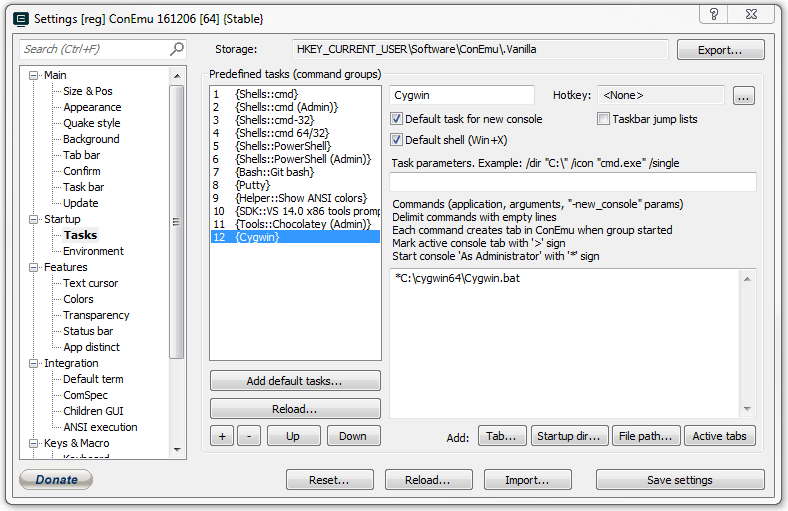



## Setting Up Windows for Use With *NIX Tools

### Cygwin

* Install [Cygwin](https://cygwin.com/install.html) and select the *minimum* amount of packages required for your setup
    - Some suggestions are to at least install _git_, _vim_, _tmux_, _openssh_, and _wget_
* Install [apt-cyg](https://github.com/transcode-open/apt-cyg/), a nice Cygwin package manager
    - To install, just grab the the bash script `apt-cyg` and `install apt-cyg /bin`

### ConEmu

* Install [ConEmu](http://conemu.github.io/)
* Create a Cygwin task that targets the main `Cygwin.bat` script

### Vim

If you have Vim configuration files, make sure they are put in the correct Windows directory to be found; this can be found in Vim by using the command `:echo $HOME` or `:echo $VIM` to find the home (`~` UNIX equivalent) or Vim system directory

## Native Windows Tools

### Sublime Text

#### Packages

* Vintageous: Vim emulator for Sublime Text
* SublimeLinter: Linter framework for multiple languages in Sublime Text
* Git Gutter: Shows git diff information in side bar of file
* All Autocomplete: Find autocompletions in any open file
* Base16 Color Scheme: Variety of color schemes
* MarkdownEditing: Completion and editing features for working with Markdown (*.md) files
* Markdown Preview: Preview and compile Markdown files in internet browser as well as advanced features such as YAML and MathJax support (set `enable_mathjax` to `true` in your settings)
* VHDL: VHDL language markup and syntax

### Visual Studio

#### Plugins

* [VsVim](https://marketplace.visualstudio.com/items?itemName=JaredParMSFT.VsVim): Emulates Vim controls and keys to Visual Studio
* [MarkdownEditor](https://github.com/madskristensen/MarkdownEditor)
* [Trailing Whitespace Visualizer](https://marketplace.visualstudio.com/items?itemName=MadsKristensen.TrailingWhitespaceVisualizer): Visualize trailing whitespace with red blocks to easily remove them from source files

### Utilities

* [Search Everything](https://www.voidtools.com/): Fast fuzzy search of everything on disk
* [Git for Windows](https://git-scm.com/download/win)
* [AutoHotkey](https://autohotkey.com/)
* [Win32 OpenSSH](https://github.com/PowerShell/Win32-OpenSSH/wiki/Install-Win32-OpenSSH) allows remote SSH access from other computers, especially useful if trying to SSH from a Unix system to a Windows system
